# RUNNERS – PLATAFORMA MÓVIL DE SERVICIOS, DOMICILIOS Y TIENDA LOCAL

**Trabajo académico presentado como parte del desarrollo de un proyecto de software**

**Presentado por:**  
Equipo de Desarrollo – Runners

**Institución:** Universidad del Valle  
**Fecha:** 2025

---

## Tabla de Contenido

1. [Runners](#1-runners)
2. [Planteamiento del problema](#2-planteamiento-del-problema)
3. [Justificación](#3-justificación)
4. [Objetivo general](#4-objetivo-general)
   - 4.1. Objetivos específicos
5. [Antecedentes](#5-antecedentes)
6. [Marco legal](#6-marco-legal)
7. [Marco teórico](#7-marco-teórico)
8. [Requerimientos funcionales y no funcionales](#8-requerimientos-funcionales-y-no-funcionales)
    - 8.1. Introducción
    - 8.2. Requisitos Funcionales a Nivel del Sistema
    - 8.3–8.28. Requisitos por módulo
    - 8.29. Requerimientos no funcionales
9. [Cualidades del Sistema](#9-cualidades-del-sistema)
10. [Interfaces del Sistema](#10-interfaces-del-sistema)
11. [Reglas de Negocio](#11-reglas-de-negocio)
12. [Restricciones del Sistema](#12-restricciones-del-sistema)
13. [Documentación del Sistema](#13-documentación-del-sistema)
14. [Marco metodológico](#14-marco-metodológico)
15. [Casos de uso (detallados)](#15-casos-de-uso-detallados)
16. [Estructura de carpetas](#16-estructura-de-carpetas)
17. [Plan de Gestión de Riesgos](#17-plan-de-gestión-de-riesgos)
18. [Tareas de Gestión de Riesgos](#18-tareas-de-gestión-de-riesgos)
19. [Organización y Responsabilidades](#19-organización-y-responsabilidades)
20. [Presupuesto](#20-presupuesto)
21. [Herramientas y Técnicas](#21-herramientas-y-técnicas)
22. [Elementos de Riesgo Por Gestionar](#22-elementos-de-riesgo-por-gestionar)
23. [Diagrama de paquetes](#23-diagrama-de-paquetes)
24. [Cronograma](#24-cronograma)
25. [Resultados Esperados](#25-resultados-esperados)
26. [Recomendaciones y Sugerencias a Futuro](#26-recomendaciones-y-sugerencias-a-futuro)
27. [Conclusiones](#27-conclusiones)
28. [Bibliografía](#28-bibliografía)

---

## 1. Runners

**Plataforma Móvil Integral para la Gestión de Servicios Locales, Domicilios y Tienda Comunitaria**

Runners es una aplicación móvil desarrollada en Flutter que conecta a usuarios de una comunidad con tres servicios clave: una **tienda local** (comercios y productos), un módulo de **domicilios** (envíos con asignación automática de repartidores) y un directorio de **servicios profesionales** (prestadores de servicios del hogar, técnicos, profesionales independientes). Además, cuenta con un **directorio de contactos** de emergencia y utilidad, así como un panel de **administración** para la gestión global de la plataforma.

---

## 2. Planteamiento del problema

Las comunidades locales enfrentan dificultades para:

- Conectar a sus habitantes con comercios, productos y servicios locales de forma digitalizada.
- Gestionar y asignar repartidores de forma eficiente y transparente para servicios de domicilio.
- Centralizar en un único canal la oferta de prestadores de servicios profesionales del hogar y de otro tipo.
- Mantener un directorio de contactos de emergencia y utilidad actualizado y accesible.
- Ofrecer a los administradores visibilidad sobre las operaciones financieras, de servicio y de reparto.

Los prestadores de servicios independientes, tenderos y repartidores carecen de una herramienta unificada que les permita gestionar su oferta, disponibilidad y relación con clientes. Del mismo modo, los clientes no tienen acceso a un canal único, confiable y moderno que integre compra en tienda, solicitud de domicilios y contratación de servicios.

Sin una solución unificada, la experiencia del usuario se fragmenta: se depende de llamadas telefónicas, grupos de mensajería informal y procesos manuales que generan errores, retrasos e informalidad en las transacciones locales.

---

## 3. Justificación

Este proyecto busca dar solución a la necesidad de digitalizar la economía local a través de una plataforma móvil que integre múltiples módulos de servicio en una sola experiencia. Con ello, se busca:

- **Mejorar la experiencia del cliente**, brindando acceso rápido a tiendas, servicios y domicilios desde un solo lugar.
- **Incrementar la competitividad** de los prestadores y comercios locales frente a plataformas informales.
- **Optimizar los procesos de asignación** de domicilios mediante un sistema automático basado en disponibilidad.
- **Formalizar la oferta de servicios profesionales**, validando a los prestadores antes de aparecer en el directorio.
- **Centralizar la información operativa** en un panel administrativo con reportes en tiempo real.
- **Reducir errores humanos** al automatizar flujos de solicitud, aprobación y seguimiento.
- **Fomentar la confianza** entre usuarios mediante perfiles verificados, estados de solicitud y seguimiento transparente.
- **Escalar y extender** la plataforma fácilmente gracias a una arquitectura Clean Architecture con separación clara de responsabilidades.

---

## 4. Objetivo general

Desarrollar una aplicación móvil integral para comunidades locales que proporcione una experiencia interactiva, moderna y eficiente, permitiendo a los usuarios acceder a servicios de tienda, domicilios y prestadores profesionales desde una única plataforma, con un sistema de autenticación seguro basado en roles, gestión de estado en tiempo real y panel administrativo completo.

El sistema deberá incorporar autenticación JWT con roles diferenciados (CLIENTE, PRESTADOR, DOMICILIARIO, ADMIN), un módulo de tienda con carrito de compras Hive, un módulo de domicilios con asignación automática de repartidores, un módulo de servicios con validación y aprobación de prestadores, un directorio de contactos de utilidad pública y un dashboard de administración con reportes.

Desde el punto de vista técnico, se plantea una arquitectura cliente-servidor basada en un backend desarrollado en Django REST Framework (DRF) con autenticación JWT y un frontend implementado en Flutter con Clean Architecture, Riverpod para gestión de estado, GoRouter para navegación y Dio con interceptores para comunicación HTTP asíncrona.

### 4.1. Objetivos específicos

- Diseñar y desarrollar un backend robusto utilizando Django y DRF que gestione de manera eficiente los módulos de usuarios, tienda, domicilios, servicios, contactos y reportes.
- Implementar un frontend móvil moderno e interactivo en Flutter que consuma los endpoints del backend mediante llamadas HTTP asíncronas con interceptores JWT.
- Desarrollar un sistema de autenticación y gestión de usuarios basado en tokens JWT con soporte para roles múltiples y refresco automático de tokens.
- Diseñar e implementar un modelo de base de datos relacional en Django optimizado para representar correctamente las entidades y relaciones del dominio de servicios locales.
- Implementar un sistema de asignación automática de domiciliarios disponibles a solicitudes de domicilio entrantes.
- Desarrollar un flujo completo de compra en tienda, donde el usuario pueda agregar productos al carrito (Hive), confirmar la orden y hacer seguimiento de su estado.
- Implementar un sistema de validación y aprobación de prestadores de servicios, donde el administrador pueda aprobar o rechazar solicitudes de incorporación.
- Desarrollar un panel de administración con dashboard, reportes de domicilios, servicios y tienda, y gestión global de usuarios.
- Aplicar una metodología de desarrollo ágil con historias de usuario, sprints planificados y control de versiones en GitHub.
- Realizar pruebas integrales del sistema tanto en el backend (API con Postman) como en el frontend (flujo completo de usuario).
- Definir una estrategia tecnológica sólida para el despliegue, incluyendo configuración de entorno de producción, base de datos PostgreSQL y variables de entorno.
- Documentar exhaustivamente todo el proceso de desarrollo, incluyendo arquitectura, modelo relacional, diagramas de casos de uso, diseño de interfaces y guías de instalación.

---

## 5. Antecedentes

Plataformas de servicios locales y domicilios (Rappi, Domicilios.com, TaskRabbit, aplicaciones propias de municipios) muestran que:

- La digitalización de servicios locales reduce la intermediación y mejora la transparencia en los precios.
- Los sistemas de asignación automática de repartidores (basados en disponibilidad) reducen tiempos de espera y mejoran la satisfacción del cliente.
- Los directorios de prestadores de servicios verificados generan mayor confianza y uso recurrente de la plataforma.
- Las arquitecturas mobiles nativas o híbridas (Flutter, React Native) son ampliamente adoptadas para proyectos con múltiples módulos y roles de usuario.
- Tech stacks como Django/DRF y Flutter son reconocidos por su productividad, escalabilidad y comunidad activa; JWT es el estándar para autenticación sin estado en APIs REST.
- El patrón Clean Architecture en Flutter permite un mantenimiento ágil, pruebas unitarias efectivas y separación clara de responsabilidades (dominio, datos, presentación).

Estos antecedentes justifican la elección tecnológica y el diseño modular propuesto para Runners.

---

## 6. Marco legal

Consideraciones principales aplicadas al proyecto:

- **Protección de datos personales:** Se respetan principios de minimización, finalidad y consentimiento. Los datos de usuarios (nombre, correo, teléfono, rol) se almacenan únicamente para fines operativos de la plataforma. Se debe adaptar la implementación a la legislación local (Ley 1581 de 2012 en Colombia – Habeas Data).
- **Políticas y Términos:** La plataforma debe contar con textos legales de uso del servicio y política de privacidad antes de su despliegue público.
- **Derechos de autor:** Se utilizan imágenes propias o con licencia libre para comercios, productos y prestadores. Los documentos adjuntos de prestadores (hoja de vida, foto) son responsabilidad del prestador.
- **Seguridad:** Las contraseñas se almacenan con hash (Django), los tokens JWT se gestionan en almacenamiento seguro (FlutterSecureStorage), y no se almacenan datos bancarios en la plataforma.
- **Nota:** El módulo de pagos es simulado en la fase actual. Cualquier integración real de pagos requiere evaluación legal y técnica adicional conforme a la normativa de pagos electrónicos.

---

## 7. Marco teórico

- **Arquitectura cliente/servidor:** el frontend Flutter consume el backend RESTful Django/DRF.
- **REST & JSON:** diseño de endpoints con recursos y verbos HTTP estándar (GET, POST, PUT, PATCH, DELETE).
- **JWT (JSON Web Tokens):** flujo access/refresh para autenticación stateless; el cliente envía `Authorization: Bearer <token>` en cada petición protegida; el interceptor Dio renueva el token automáticamente ante respuestas 401.
- **Clean Architecture (Flutter):** separación en capas — `domain` (entidades, casos de uso, repositorios abstractos), `data` (repositorios concretos, datasources, modelos), `presentation` (Riverpod providers, pantallas, widgets).
- **Riverpod:** gestión de estado reactiva para Flutter; los `StateNotifierProvider` y `FutureProvider` orquestan el estado de autenticación, carrito, solicitudes y paneles.
- **GoRouter:** enrutamiento declarativo con guardias de rol; redirige automáticamente según el rol del usuario autenticado.
- **Hive:** base de datos NoSQL local en Flutter para persistencia offline del carrito de compras.
- **Modelo relacional:** uso de tablas normalizadas, relaciones 1:N y N:M con tablas intermedias en Django ORM.
- **MVC en Django:** modelos (ORM), vistas (ViewSets DRF), serializadores (capa de transformación), URLs (enrutamiento).
- **UX centrado en el usuario:** interfaces simples con feedback visual (loading states, empty states, error messages), navegación por roles y accesos directos contextuales.

---

## 8. Requerimientos funcionales y no funcionales

### 8.1 Introducción

En esta sección se describe el desarrollo del sistema Runners, una plataforma móvil diseñada para conectar a usuarios de una comunidad con servicios de tienda, domicilios y profesionales independientes. El sistema gestiona cuatro tipos de usuarios (CLIENTE, PRESTADOR, DOMICILIARIO, ADMIN) con flujos diferenciados por rol, un backend API REST en Django y un frontend Flutter con arquitectura limpia.

El sistema facilita la gestión interna de la plataforma mediante la automatización de la asignación de domiciliarios, la aprobación de prestadores y la generación de reportes operativos. En este documento se especifican los requisitos funcionales, no funcionales, las restricciones, las reglas de negocio y los diagramas del sistema.

### 8.2 Requisitos Funcionales a Nivel del Sistema

| ID | Módulo | Requisito |
|---|---|---|
| REQ-01 | Autenticación | Registro de usuario con nombre, correo, contraseña y rol |
| REQ-02 | Autenticación | Inicio de sesión con JWT (access + refresh token) |
| REQ-03 | Tienda | Listado de comercios y productos por categoría |
| REQ-04 | Tienda | Carrito de compras persistido localmente (Hive) |
| REQ-05 | Tienda | Creación y seguimiento de órdenes de compra |
| REQ-06 | Domicilios | Solicitud de domicilio con dirección origen y destino |
| REQ-07 | Domicilios | Asignación automática de domiciliario disponible |
| REQ-08 | Domicilios | Seguimiento del estado del domicilio |
| REQ-09 | Servicios | Registro de prestadores con perfil, foto y hoja de vida |
| REQ-10 | Servicios | Aprobación/rechazo de prestadores por el administrador |
| REQ-11 | Servicios | Solicitud de servicio por parte del cliente |
| REQ-12 | Contactos | Directorio de contactos de emergencia y utilidad |
| REQ-13 | Admin | Dashboard con métricas de operación |
| REQ-14 | Admin | Reportes de domicilios, servicios y tienda |
| REQ-15 | Admin | Gestión de usuarios, comercios y configuración |
| REQ-16 | Domicilios | Registro y gestión de domiciliarios |
| REQ-17 | Domicilios | Registro de ingresos y egresos de domiciliarios |
| REQ-18 | Autenticación | Cierre de sesión seguro |
| REQ-19 | Autenticación | Roles diferenciados y control de acceso |
| REQ-20 | Servicios | Búsqueda de prestadores por categoría |
| REQ-21 | Servicios | Cambio de estado del prestador (Disponible/Ocupado/Inactivo) |
| REQ-22 | Domicilios | Cambio de estado del domiciliario (Disponible/Ocupado/Inactivo) |
| REQ-23 | Domicilios | Solicitud directa de domicilio a un domiciliario disponible |
| REQ-24 | Contactos | Filtrado de contactos por disponibilidad |
| REQ-25 | Admin | Reporte financiero agregado de domiciliarios |
| REQ-26 | Infraestructura | Uso de variables de entorno (.env) para configuraciones sensibles |
| REQ-27 | Infraestructura | Configuración de PostgreSQL como base de datos de producción |
| REQ-28 | Seguridad API | Configuración de CORS para el backend de Runners |

### 8.3 REQ-01 — Registro de usuario

| | | |
|---|---|---|
| **Código** | REQ-01 | |
| **Nombre** | Registro de usuario | |
| **Descripción** | Permite que un nuevo usuario cree una cuenta proporcionando nombre, correo y contraseña, quedando registrado por defecto como CLIENTE (o como el rol permitido que seleccione). | |
| **Actores** | Usuario (cliente, prestador, domiciliario, admin), App (Flutter/Web), API Django | |
| | | |
| **Precondición** | El usuario no debe estar registrado previamente con el mismo correo electrónico. | |
| | | |
| | **Paso** | **Descripción** |
| **Secuencia normal** | 1 | El usuario ingresa nombre, correo y contraseña en el formulario de registro. |
| | 2 | La app envía `POST /api/v1/auth/register/` (o endpoint equivalente) con los datos diligenciados. |
| | 3 | El backend valida formato de correo y requisitos mínimos de contraseña. |
| | 4 | El backend verifica que el correo no exista en la base de datos. |
| | 5 | Si la validación es exitosa, crea el usuario con rol inicial (CLIENTE por defecto) y estado ACTIVO. |
| | 6 | El sistema retorna respuesta estándar indicando éxito y, según el flujo, puede permitir iniciar sesión de inmediato. |
| | |
| **Secuencia alterna** | 4A | Si el correo ya existe, el backend retorna error de validación indicando que el correo ya está registrado. |
| | |
| **Excepciones** | E1 | Error de conexión con la base de datos: el sistema retorna código 500 con mensaje genérico de fallo técnico. |
| | E2 | Datos de entrada malformados (JSON inválido o campos faltantes): el sistema retorna 400/422 con detalle de los campos inválidos. |
| | |
| **Postcondición** | El usuario queda creado en la base de datos con rol y estado inicial definidos. | |
| | El usuario puede continuar al flujo de inicio de sesión (REQ-02). | |
| | |
| **Comentarios** | La contraseña se almacena usando el mecanismo de hash seguro de Django. El correo se marca como único en el modelo de usuario. | |

---

### 8.4 REQ-02 — Inicio de sesión y gestión de tokens JWT

| | | |
|---|---|---|
| **Código** | REQ-02 | |
| **Nombre** | Inicio de sesión y gestión de tokens JWT | |
| **Descripción** | Permite a los usuarios autenticarse con correo y contraseña para obtener tokens de acceso y refresco, gestionando la renovación automática mientras la sesión siga vigente. | |
| **Actores** | Cliente, Prestador, Domiciliario, Admin, App Flutter/Web, API Django | |
| | | |
| **Precondición** | El usuario debe estar registrado y activo en el sistema. | |
| | | |
| | **Paso** | **Descripción** |
| **Secuencia normal** | 1 | El usuario ingresa correo y contraseña en la pantalla de login. |
| | 2 | La app envía `POST /api/v1/auth/login/` con las credenciales. |
| | 3 | El backend valida las credenciales y retorna `access_token` (vida corta) y `refresh_token` (vida más larga). |
| | 4 | La app almacena los tokens de forma segura (`flutter_secure_storage` en móvil o mecanismo seguro en web). |
| | 5 | La app consulta el perfil del usuario (`GET /api/v1/auth/profile/`) y lo guarda en el estado global. |
| | 6 | La app redirige al Home correspondiente según el rol (CLIENTE, PRESTADOR, DOMICILIARIO o ADMIN). |
| | |
| **Secuencia alterna** | 3A | Si las credenciales son incorrectas, el backend retorna 401 y la app muestra "Correo o contraseña incorrectos" sin especificar cuál falló. |
| | 6A | Si el usuario está suspendido, el backend lo indica y la app muestra "Cuenta suspendida. Contacta al administrador." |
| | |
| **Excepciones** | E1 | `access_token` expirado en una petición: el interceptor HTTP intenta renovarlo automáticamente usando el `refresh_token`. |
| | E2 | `refresh_token` expirado o inválido: la app limpia el almacenamiento local y redirige al login. |
| | |
| **Postcondición** | El usuario queda autenticado con tokens válidos almacenados y su perfil cargado en la app. | |
| | El backend reconoce al usuario en peticiones subsecuentes mediante el JWT. | |
| | |
| **Comentarios** | Se utiliza `djangorestframework-simplejwt` en el backend. En el frontend se recomienda usar interceptores (Dio en Flutter) y guards de ruta para manejar expiración y redirecciones. | |

---

### 8.5 REQ-03 — Visualización de tienda por categorías

| | | |
|---|---|---|
| **Código** | REQ-03 | |
| **Nombre** | Exploración del catálogo de tienda por categorías | |
| **Descripción** | Permite al cliente explorar la tienda, filtrar por categorías y ver el catálogo de comercios y productos disponibles con su información básica. | |
| **Actores** | Cliente, App Flutter/Web, API Django | |
| | | |
| **Precondición** | El cliente debe estar autenticado. | |
| | Deben existir categorías, comercios y productos registrados y activos en el backend. | |
| | | |
| | **Paso** | **Descripción** |
| **Secuencia normal** | 1 | El cliente navega a la sección "Tienda" desde el menú principal. |
| | 2 | La app consulta las categorías (`GET /api/v1/store/categories/`) y las muestra como filtros. |
| | 3 | El cliente selecciona una categoría; la app consulta y muestra los comercios asociados. |
| | 4 | El cliente selecciona un comercio y la app muestra el catálogo de productos con nombre, descripción, precio e imagen. |
| | 5 | Desde el detalle de producto, el cliente puede agregar ítems al carrito (REQ-04). |
| | |
| **Secuencia alterna** | 2A | Si no hay conexión, la app puede intentar mostrar datos en caché local (si existen). |
| | 3A | Si la categoría no tiene comercios, se muestra un estado vacío informativo. |
| | |
| **Excepciones** | E1 | Error de API o timeout: la app muestra un mensaje de error y opción de reintentar. |
| | |
| **Postcondición** | El cliente puede visualizar el catálogo de comercios y productos disponibles y seleccionar productos para el carrito. | |
| | |
| **Comentarios** | Se recomienda usar paginación en listados grandes y `cached_network_image` (en Flutter) para optimizar carga de imágenes. | |

---

### 8.6 REQ-04/REQ-05 — Carrito y orden de compra

| | | |
|---|---|---|
| **Código** | REQ-04 / REQ-05 | |
| **Nombre** | Carrito de compras y generación de orden | |
| **Descripción** | Permite al cliente agregar productos al carrito, ajustar cantidades y confirmar un pedido, generando una orden en el backend con estado inicial `PENDIENTE`. | |
| **Actores** | Cliente, App Flutter/Web, API Django, Comercio | |
| | | |
| **Precondición** | El cliente debe estar autenticado y haber seleccionado productos válidos. | |
| | Deben existir productos disponibles asociados a un comercio. | |
| | | |
| | **Paso** | **Descripción** |
| **Secuencia normal** | 1 | El cliente, desde el catálogo, agrega uno o varios productos al carrito. |
| | 2 | La app almacena el carrito localmente (por ejemplo, en Hive en Flutter) con cantidades y referencias de producto. |
| | 3 | El cliente accede a la vista de carrito, revisa el resumen e incrementa/disminuye cantidades o elimina ítems. |
| | 4 | El cliente confirma el pedido; la app envía `POST /api/v1/store/orders/` con el contenido del carrito y datos necesarios. |
| | 5 | El backend valida stock básico y crea una Orden con estado `PENDIENTE` y los ítems asociados. |
| | 6 | El backend retorna la orden creada y la app muestra confirmación al cliente. |
| | |
| **Secuencia alterna** | 3A | El cliente puede vaciar completamente el carrito antes de confirmar. |
| | |
| **Excepciones** | E1 | Producto inactivo o no encontrado al confirmar: el backend rechaza la orden con mensaje indicando los productos inválidos. |
| | E2 | Datos de carrito inconsistentes (cantidades negativas, carrito vacío): el backend retorna error de validación. |
| | |
| **Postcondición** | La orden queda registrada en la base de datos con estado inicial `PENDIENTE` y productos asociados. | |
| | El cliente puede ver la orden en su historial de compras. | |
| | |
| **Comentarios** | El carrito persiste localmente mientras el usuario no lo vacíe. En versiones futuras puede integrarse con pagos en línea. | |

---

### 8.7 REQ-06/REQ-07 — Solicitud de domicilio y asignación automática

| | | |
|---|---|---|
| **Código** | REQ-06 / REQ-07 | |
| **Nombre** | Solicitud de domicilio y asignación de domiciliario | |
| **Descripción** | Permite al cliente solicitar un domicilio indicando datos de recogida y entrega, mientras el sistema asigna automáticamente un domiciliario disponible siguiendo una regla de negocio definida. | |
| **Actores** | Cliente, Domiciliario, App Flutter/Web, API Django | |
| | | |
| **Precondición** | El cliente debe estar autenticado. | |
| | Debe existir al menos un domiciliario con estado `DISPONIBLE`. | |
| | | |
| | **Paso** | **Descripción** |
| **Secuencia normal** | 1 | El cliente accede al módulo de Domicilios y selecciona "Nueva solicitud". |
| | 2 | El cliente ingresa dirección de origen, destino y descripción del encargo. |
| | 3 | La app envía `POST /api/v1/deliveries/requests/` con la información de la solicitud. |
| | 4 | El backend crea la solicitud con estado inicial `PENDIENTE`. |
| | 5 | El backend ejecuta la lógica de asignación automática y selecciona el domiciliario `DISPONIBLE` con menor número asignado o criterio equivalente. |
| | 6 | El backend actualiza la solicitud con el domiciliario asignado y cambia su estado a `ACEPTADO` o equivalente. |
| | 7 | La app notifica al cliente y al domiciliario sobre la nueva solicitud. |
| | |
| **Secuencia alterna** | 5A | Si no hay domiciliarios `DISPONIBLE`, la solicitud queda en espera y se notifica al cliente que será atendida cuando haya disponibilidad. |
| | |
| **Excepciones** | E1 | Direcciones inválidas o campos obligatorios vacíos: el backend retorna error de validación. |
| | E2 | Fallo en la asignación automática (error inesperado): la solicitud se mantiene en `PENDIENTE` y se registra el error para revisión. |
| | |
| **Postcondición** | La solicitud de domicilio queda registrada y, si hay disponibilidad, asociada a un domiciliario para su ejecución. | |
| | |
| **Comentarios** | La lógica de asignación puede evolucionar a criterios más complejos (distancia, carga de trabajo). Actualmente se basa en domiciliarios con estado `DISPONIBLE`. | |

---

### 8.8 REQ-08 — Seguimiento de domicilio

| | | |
|---|---|---|
| **Código** | REQ-08 | |
| **Nombre** | Seguimiento del estado del domicilio | |
| **Descripción** | Permite a cliente y domiciliario consultar y actualizar el estado de una solicitud de domicilio a lo largo de su ciclo de vida. | |
| **Actores** | Cliente, Domiciliario, Administrador, App Flutter/Web, API Django | |
| | | |
| **Precondición** | Debe existir una solicitud de domicilio registrada (REQ-06/07). | |
| | El cliente y el domiciliario deben estar autenticados para ver/actualizar su información respectiva. | |
| | | |
| | **Paso** | **Descripción** |
| **Secuencia normal** | 1 | El cliente consulta el detalle de su solicitud y ve el estado actual (por ejemplo, `PENDIENTE`, `ACEPTADO`, `EN_CAMINO`, `ENTREGADO`, `CANCELADO`). |
| | 2 | El domiciliario puede cambiar el estado según avance la entrega (por ejemplo, de `ACEPTADO` a `EN_CAMINO` y luego a `ENTREGADO`). |
| | 3 | Cada actualización de estado se registra mediante un endpoint específico (por ejemplo, `PATCH /api/v1/deliveries/requests/{id}/status/`). |
| | 4 | La app refleja los cambios de estado en tiempo casi real al cliente. |
| | |
| **Secuencia alterna** | 2A | Si el cliente decide cancelar la solicitud antes de ser atendida, puede enviar una cancelación que cambia el estado a `CANCELADO` según reglas de negocio. |
| | |
| **Excepciones** | E1 | Intento de actualizar estado por un usuario no autorizado (otro cliente o domiciliario): el backend retorna 403. |
| | E2 | Transición de estado inválida (por ejemplo, `ENTREGADO` a `EN_CAMINO`): el backend rechaza el cambio con mensaje de error. |
| | |
| **Postcondición** | El historial de estado del domicilio queda registrado en la base de datos y visible para las partes autorizadas. | |
| | |
| **Comentarios** | Las transiciones permitidas deben estar definidas claramente en la lógica de negocio para evitar estados inconsistentes. | |

---

### 8.9 REQ-09 — Perfil de prestador de servicios

| | | |
|---|---|---|
| **Código** | REQ-09 | |
| **Nombre** | Gestión de perfil de prestador de servicios | |
| **Descripción** | Permite a un usuario con rol PRESTADOR completar y actualizar su perfil profesional, incluyendo foto, descripción, categoría y hoja de vida. | |
| **Actores** | Prestador de Servicio, Administrador, App Flutter/Web, API Django | |
| | | |
| **Precondición** | El usuario debe estar registrado con rol PRESTADOR y autenticado en la app. | |
| | | |
| | **Paso** | **Descripción** |
| **Secuencia normal** | 1 | El prestador accede a la sección "Mi perfil" → "Completar perfil". |
| | 2 | Completa campos de descripción, categoría, experiencia y adjunta hoja de vida (PDF o imagen). |
| | 3 | La app envía los datos y archivos al backend mediante `multipart/form-data`. |
| | 4 | El backend guarda el perfil con estado de aprobación `PENDIENTE`. |
| | 5 | El administrador podrá revisar este perfil en el flujo de aprobación (REQ-10). |
| | |
| **Secuencia alterna** | 2A | El prestador puede actualizar posteriormente su perfil (ej. cambiar foto o descripción) manteniendo la asociación con su usuario. |
| | |
| **Excepciones** | E1 | Archivo de hoja de vida con formato o tamaño no permitido: el backend retorna error de validación. |
| | |
| **Postcondición** | El perfil de prestador queda registrado y listo para ser revisado por un administrador. | |
| | |
| **Comentarios** | Los tipos y tamaño máximo de archivo permitidos se definen en la configuración del backend. | |

---

### 8.10 REQ-10 — Aprobación de prestadores

| | | |
|---|---|---|
| **Código** | REQ-10 | |
| **Nombre** | Aprobación o rechazo de prestadores de servicios | |
| **Descripción** | Permite al administrador revisar los perfiles de prestadores y decidir si aprueba o rechaza su participación en la plataforma. | |
| **Actores** | Administrador, Prestador de Servicio, API Django, App Flutter/Web | |
| | | |
| **Precondición** | Deben existir perfiles de prestadores en estado `PENDIENTE` (REQ-09). | |
| | El administrador debe estar autenticado con rol ADMIN. | |
| | | |
| | **Paso** | **Descripción** |
| **Secuencia normal** | 1 | El administrador accede al panel de administración y abre la lista de prestadores `PENDIENTES`. |
| | 2 | Selecciona un prestador y revisa su información y hoja de vida. |
| | 3 | Decide aprobar o rechazar el perfil. |
| | 4 | El backend actualiza el estado del prestador a `APROBADO` o `RECHAZADO` y registra, si aplica, el motivo de rechazo. |
| | 5 | El prestador ve el resultado de la revisión cuando consulta su perfil en la app. |
| | |
| **Secuencia alterna** | 3A | Si rechaza, el administrador puede registrar un comentario explicando el motivo. |
| | |
| **Excepciones** | E1 | Intento de aprobación por un usuario sin rol ADMIN: el backend retorna 403. |
| | E2 | Prestador inexistente o ya procesado: el backend retorna 404 o error de estado inválido. |
| | |
| **Postcondición** | Los prestadores aprobados quedan visibles para los clientes en el módulo de servicios. | |
| | Los prestadores rechazados conocen el motivo (si fue registrado). | |
| | |
| **Comentarios** | Este flujo se apoya en endpoints dedicados de aprobación/rechazo en el backend (por ejemplo, `/approve_provider/`). | |

---

### 8.11 REQ-11 — Solicitud de servicio

| | | |
|---|---|---|
| **Código** | REQ-11 | |
| **Nombre** | Solicitud de servicio a prestador aprobado | |
| **Descripción** | Permite al cliente solicitar un servicio a un prestador aprobado, definiendo los detalles básicos y permitiendo su aceptación o rechazo por parte del prestador. | |
| **Actores** | Cliente, Prestador de Servicio, App Flutter/Web, API Django | |
| | | |
| **Precondición** | Debe existir al menos un prestador en estado `APROBADO` para la categoría de servicio requerida. | |
| | Cliente y prestador deben estar autenticados para crear y gestionar solicitudes. | |
| | | |
| | **Paso** | **Descripción** |
| **Secuencia normal** | 1 | El cliente navega al módulo de Servicios y filtra por categoría. |
| | 2 | Selecciona un prestador aprobado y crea una solicitud con descripción, fecha/hora estimada y datos de contacto. |
| | 3 | La app envía la solicitud al backend (`POST /api/v1/services/requests/`). |
| | 4 | El backend crea la solicitud con estado inicial `PENDIENTE` asociada al cliente y al prestador. |
| | 5 | El prestador visualiza sus solicitudes `PENDIENTES` en su panel. |
| | 6 | El prestador acepta o rechaza la solicitud; el backend actualiza el estado (`ACEPTADA`, `RECHAZADA`, etc.). |
| | 7 | El cliente ve el resultado (aceptación o rechazo) en la app. |
| | |
| **Secuencia alterna** | 2A | El cliente puede cancelar una solicitud `PENDIENTE` antes de que el prestador responda, según reglas de negocio. |
| | |
| **Excepciones** | E1 | Intento de crear solicitud hacia un prestador no aprobado o inactivo: el backend retorna error de validación. |
| | E2 | Intento de actualizar la solicitud por un usuario distinto del cliente o prestador asociado: el backend retorna 403. |
| | |
| **Postcondición** | La solicitud de servicio queda registrada y con un estado coherente (`PENDIENTE`, `ACEPTADA`, `RECHAZADA`, etc.). | |
| | |
| **Comentarios** | Este flujo se implementa sobre el módulo de servicios del backend, que define modelos y endpoints para solicitudes y prestadores. | |

---

### 8.12 REQ-12 — Directorio de contactos

| | | |
|---|---|---|
| **Código** | REQ-12 | |
| **Nombre** | Directorio de contactos de emergencia y utilidad | |
| **Descripción** | Permite a los usuarios consultar un directorio de contactos relevantes (emergencias, profesionales, comercios) y al administrador gestionar su contenido. | |
| **Actores** | Cliente, Prestador, Domiciliario, Admin, API Django, App Flutter/Web | |
| | | |
| **Precondición** | Los usuarios deben estar autenticados para ver el directorio completo (según políticas definidas). | |
| | Deben existir contactos registrados en el backend. | |
| | | |
| | **Paso** | **Descripción** |
| **Secuencia normal** | 1 | El usuario accede al módulo de Contactos desde el menú. |
| | 2 | La app consulta la lista de contactos (`GET /api/v1/contacts/`) opcionalmente con filtros o búsqueda. |
| | 3 | El usuario puede filtrar por tipo de contacto o buscar por nombre/descripción. |
| | 4 | El administrador, desde su panel, puede crear, editar o desactivar contactos mediante endpoints de administración. |
| | |
| **Secuencia alterna** | 3A | Si no hay contactos que coincidan con el filtro/búsqueda, se muestra una lista vacía con mensaje informativo. |
| | |
| **Excepciones** | E1 | Intento de creación/edición por usuario sin rol ADMIN: el backend retorna 403. |
| | |
| **Postcondición** | El directorio de contactos se mantiene actualizado y accesible para los usuarios autorizados. | |
| | |
| **Comentarios** | El módulo de contactos es transversal y puede crecer con nuevos tipos de contacto según las necesidades de la comunidad. | |

---

### 8.13 REQ-13 — Dashboard administrativo

| | | |
|---|---|---|
| **Código** | REQ-13 | |
| **Nombre** | Panel de métricas administrativas | |
| **Descripción** | Proporciona al administrador un panel con indicadores clave sobre usuarios, órdenes, domicilios y servicios para el monitoreo operativo. | |
| **Actores** | Administrador, API Django, App Flutter/Web | |
| | | |
| **Precondición** | El administrador debe estar autenticado con rol ADMIN. | |
| | Deben existir datos registrados (usuarios, órdenes, domicilios, servicios). | |
| | | |
| | **Paso** | **Descripción** |
| **Secuencia normal** | 1 | El administrador accede al módulo de Administración y abre el dashboard. |
| | 2 | La app consulta el endpoint de resumen (`GET /api/v1/reports/dashboard/` o similar). |
| | 3 | El backend calcula o recupera métricas como: usuarios por rol, órdenes activas, domicilios del día, servicios en curso. |
| | 4 | La app presenta las métricas en tarjetas y gráficos simples. |
| | |
| **Secuencia alterna** | 3A | Si no hay datos para algún indicador (por ejemplo, ningún servicio en curso), se muestra valor 0 sin error. |
| | |
| **Excepciones** | E1 | Error al consultar métricas o al acceder a base de datos: el backend retorna 500 y la app muestra mensaje de error. |
| | |
| **Postcondición** | El administrador visualiza el estado general de operación de la plataforma. | |
| | |
| **Comentarios** | Este panel se apoya en el módulo de reportes del backend y puede ampliarse con nuevas métricas. | |

---

### 8.14 REQ-14 — Reportes de operación

| | | |
|---|---|---|
| **Código** | REQ-14 | |
| **Nombre** | Generación de reportes de tienda, servicios y domicilios | |
| **Descripción** | Permite al administrador consultar reportes filtrados sobre domicilios realizados, servicios prestados y ventas de tienda para periodos definidos. | |
| **Actores** | Administrador, API Django, App Flutter/Web | |
| | | |
| **Precondición** | El administrador debe estar autenticado con rol ADMIN. | |
| | Deben existir datos históricos suficientes para generar los reportes. | |
| | | |
| | **Paso** | **Descripción** |
| **Secuencia normal** | 1 | El administrador accede al módulo de reportes. |
| | 2 | Selecciona el tipo de reporte (domicilios, servicios, tienda) y define filtros (rango de fechas, estado, categoría, etc.). |
| | 3 | La app envía la consulta al backend mediante endpoints específicos de reportes. |
| | 4 | El backend ejecuta consultas agregadas sobre la base de datos y construye el reporte. |
| | 5 | El backend retorna los datos en formato tabular o agregados; la app los muestra en tablas y/o gráficos. |
| | |
| **Secuencia alterna** | 5A | Si no hay datos que cumplan los filtros, se retorna lista vacía con mensaje informativo. |
| | |
| **Excepciones** | E1 | Parámetros de filtro inválidos (fechas invertidas, estado desconocido): el backend retorna error de validación. |
| | |
| **Postcondición** | El administrador obtiene una vista detallada o resumida del comportamiento de la plataforma en el periodo consultado. | |
| | |
| **Comentarios** | Estos reportes pueden servir como base para decisiones administrativas y evaluación de desempeño de domiciliarios y prestadores. | |

---

### 8.15 REQ-15 — Gestión administrativa

| | | |
|---|---|---|
| **Código** | REQ-15 | |
| **Nombre** | Gestión administrativa de usuarios, comercios y configuración | |
| **Descripción** | Permite al administrador gestionar usuarios, comercios, parámetros de configuración y registros financieros asociados a domiciliarios. | |
| **Actores** | Administrador, API Django, App Flutter/Web | |
| | | |
| **Precondición** | El administrador debe estar autenticado con rol ADMIN. | |
| | | |
| | **Paso** | **Descripción** |
| **Secuencia normal** | 1 | El administrador accede al módulo de administración. |
| | 2 | En la sección de usuarios, puede activar/desactivar cuentas y ajustar roles según necesidad. |
| | 3 | En la sección de comercios, puede registrar nuevos comercios, editar información o desactivar comercios existentes. |
| | 4 | En la sección de configuración, puede gestionar parámetros clave-valor (SystemConfig) que afectan el comportamiento del sistema. |
| | 5 | En la sección de domiciliarios/finanzas, puede consultar y registrar movimientos financieros asociados a los domicilios realizados. |
| | |
| **Secuencia alterna** | 3A | En lugar de eliminar definitivamente registros, el administrador puede marcarlos como inactivos para preservar el historial. |
| | |
| **Excepciones** | E1 | Intento de acceso o modificación por usuario sin rol ADMIN: el backend retorna 403. |
| | E2 | Datos inválidos en altas/bajas de usuarios y comercios: el backend retorna errores de validación detallados. |
| | |
| **Postcondición** | La plataforma mantiene un catálogo coherente de usuarios, comercios y configuraciones, así como registros de gestión financiera para domiciliarios. | |
| | |
| **Comentarios** | Las operaciones administrativas se apoyan en vistas y endpoints específicos en los módulos de usuarios, tienda, domicilios y configuración. | |

---

### 8.16 REQ-16 — Registro y gestión de domiciliarios

| | | |
|---|---|---|
| **Código** | REQ-16 | |
| **Nombre** | Registro y gestión de domiciliarios | |
| **Descripción** | Permite registrar domiciliarios con sus datos básicos y gestionar su estado (DISPONIBLE/OCUPADO/INACTIVO), de modo que puedan participar en el módulo de domicilios. | |
| **Actores** | Administrador, Domiciliario, API Django, App (panel de domiciliarios/web) | |
| | | |
| **Precondición** | El administrador debe estar autenticado con rol ADMIN para registrar domiciliarios. | |
| | Debe existir un usuario base (User) asociado al domiciliario o crearse como parte del flujo. | |
| | | |
| | **Paso** | **Descripción** |
| **Secuencia normal** | 1 | El administrador accede al módulo de Domicilios y selecciona "Registrar domiciliario". |
| | 2 | Completa nombre, teléfono, número asignado y tipo de trabajo del domiciliario. |
| | 3 | El sistema valida que el número asignado sea único y que los datos requeridos estén completos. |
| | 4 | El backend crea el registro Deliverer asociado al usuario correspondiente, con estado inicial `DISPONIBLE` e is_active = True. |
| | 5 | El domiciliario aparece en la lista de domiciliarios disponibles para el módulo de domicilios. |
| | |
| **Secuencia alterna** | 4A | Si el número asignado ya existe para otro domiciliario, el sistema muestra error de validación y solicita un número diferente. |
| | |
| **Excepciones** | E1 | Error al crear el usuario o el domiciliario en base de datos: el backend retorna código 500 con mensaje genérico y no crea el registro incompleto. |
| | |
| **Postcondición** | El domiciliario queda registrado, activo y listo para ser asignado en solicitudes de domicilio. | |
| | |
| **Comentarios** | En esta versión la creación se gestiona principalmente desde el panel Django Admin, pero el API está preparado para una interfaz propia de gestión. | |

---

### 8.17 REQ-17 — Registro de ingresos y egresos de domiciliarios

| | | |
|---|---|---|
| **Código** | REQ-17 | |
| **Nombre** | Registro de ingresos y egresos de domiciliarios | |
| **Descripción** | Permite a los domiciliarios registrar ingresos por servicios realizados y egresos (gastos), para llevar control de su balance y de la comisión que corresponde a Runners. | |
| **Actores** | Domiciliario, Administrador, API Django, App (panel de domiciliarios/web) | |
| | | |
| **Precondición** | Debe existir un domiciliario registrado (REQ-16) asociado al usuario autenticado. | |
| | | |
| **Secuencia normal** | | El domiciliario accede a su panel de control financiero, selecciona tipo de registro (INGRESO/EGRESO), ingresa monto y descripción, la app envía la solicitud al backend y este guarda el FinancialRecord y actualiza los totales. |
| **Secuencia alterna** | | En registros de tipo EGRESO, la comisión de Runners se establece en 0 y solo se descuenta del balance. |
| **Excepciones** | | Monto no válido (<= 0) o falta de domiciliario asociado generan errores de validación o inconsistencias que el backend retorna al cliente. |
| **Postcondición** | | El registro financiero queda almacenado y el balance del domiciliario se refleja en los cálculos agregados y reportes. |
| **Comentarios** | | Sobre estos registros se construyen los reportes financieros de domiciliarios consultados por el administrador. |

---

### 8.18 REQ-18 — Cierre de sesión seguro

| | | |
|---|---|---|
| **Código** | REQ-18 | |
| **Nombre** | Cierre de sesión seguro | |
| **Descripción** | Permite al usuario cerrar sesión de forma segura, eliminando los tokens almacenados y evitando que permanezcan activos en el dispositivo. | |
| **Actores** | Usuario autenticado, App Flutter/Web | |
| | | |
| **Precondición** | El usuario debe estar autenticado y tener tokens activos almacenados en el cliente. | |
| | | |
| **Secuencia normal** | | El usuario selecciona la opción de cerrar sesión, la app elimina los tokens de acceso y refresco del almacenamiento seguro y redirige a la pantalla de inicio de sesión. |
| **Secuencia alterna** | | Si la app no encuentra tokens almacenados, simplemente redirige al login sin error crítico. |
| **Excepciones** | | Errores locales al limpiar almacenamiento se manejan mostrando un mensaje genérico, pero no afectan al backend. |
| **Postcondición** | | No quedan tokens válidos almacenados en el dispositivo y el usuario debe autenticarse nuevamente para acceder al sistema. |
| **Comentarios** | | Este requisito complementa los flujos de autenticación con JWT descritos en REQ-02. |

---

### 8.19 REQ-19 — Roles diferenciados y control de acceso

| | | |
|---|---|---|
| **Código** | REQ-19 | |
| **Nombre** | Roles diferenciados y control de acceso | |
| **Descripción** | Define y aplica roles de usuario (CLIENTE, PRESTADOR, DOMICILIARIO, ADMIN) para controlar el acceso a pantallas del frontend y a endpoints del backend. | |
| **Actores** | Todos los usuarios, Backend Django, Frontend Flutter/Web | |
| | | |
| **Precondición** | El usuario debe estar autenticado con un rol válido asignado en su perfil. | |
| | | |
| **Secuencia normal** | | El backend incluye el rol en el token o en el perfil consultado, el frontend lee ese rol y muestra solo las pantallas permitidas, mientras el backend aplica permisos por rol en cada endpoint protegido. |
| **Secuencia alterna** | | Si un usuario intenta acceder a una ruta o endpoint no permitido para su rol, el sistema redirige a una pantalla autorizada o responde con código 403. |
| **Excepciones** | | Inconsistencias en la configuración de permisos o roles desconocidos se tratan como errores de configuración y deben corregirse por el equipo técnico. |
| **Postcondición** | | Cada usuario solo puede ejecutar acciones y ver información correspondiente a su rol, reduciendo riesgos de acceso indebido. |
| **Comentarios** | | Este requisito se implementa con guards en GoRouter y permisos/permissions en Django REST Framework. |

---

### 8.20 REQ-20 — Búsqueda de prestadores por categoría

| | | |
|---|---|---|
| **Código** | REQ-20 | |
| **Nombre** | Búsqueda de prestadores por categoría | |
| **Descripción** | Permite a los clientes buscar prestadores de servicios filtrando por categoría para encontrar al profesional adecuado. | |
| **Actores** | Cliente, App Flutter/Web, API Django | |
| | | |
| **Precondición** | Debe existir al menos un prestador aprobado asociado a categorías de servicios. | |
| | | |
| **Secuencia normal** | | El cliente accede al módulo de servicios, selecciona una categoría o aplica filtros, la app consulta el backend y muestra la lista de prestadores aprobados que cumplen los criterios. |
| **Secuencia alterna** | | Si no hay prestadores que cumplan los filtros, la app muestra un estado vacío informando que no se encontraron resultados. |
| **Excepciones** | | Errores de conexión o parámetros inválidos en la búsqueda se notifican mediante mensajes de error en la interfaz. |
| **Postcondición** | | El cliente obtiene un listado filtrado de prestadores relevantes para su necesidad. |
| **Comentarios** | | Este requisito se apoya en las entidades ServiceCategory y ServiceProvider del backend. |

---

### 8.21 REQ-21 — Cambio de estado del prestador

| | | |
|---|---|---|
| **Código** | REQ-21 | |
| **Nombre** | Cambio de estado del prestador | |
| **Descripción** | Permite actualizar el estado del prestador (DISPONIBLE/OCUPADO/INACTIVO) para reflejar su disponibilidad en el módulo de servicios. | |
| **Actores** | Prestador, Administrador, API Django, App Flutter/Web | |
| | | |
| **Precondición** | El prestador debe existir y estar aprobado en la plataforma. | |
| | | |
| **Secuencia normal** | | El prestador o el administrador cambia el estado desde su panel, la app envía la actualización al backend y este modifica el registro afectando su visibilidad y disponibilidad en las búsquedas. |
| **Secuencia alterna** | | Si el prestador se marca como INACTIVO, deja de aparecer en el directorio aunque se conserve su historial. |
| **Excepciones** | | Intentos de cambio de estado por usuarios no autorizados se responden con código 403 y mensaje de error. |
| **Postcondición** | | El estado del prestador queda actualizado y coherente con su disponibilidad real. |
| **Comentarios** | | Este requisito se relaciona con reglas de negocio sobre visibilidad de prestadores (RN-10). |

---

### 8.22 REQ-22 — Cambio de estado del domiciliario

| | | |
|---|---|---|
| **Código** | REQ-22 | |
| **Nombre** | Cambio de estado del domiciliario | |
| **Descripción** | Permite actualizar el estado del domiciliario (DISPONIBLE/OCUPADO/INACTIVO) para controlar su participación en la asignación automática de domicilios. | |
| **Actores** | Domiciliario, Administrador, API Django, App Flutter/Web | |
| | | |
| **Precondición** | El domiciliario debe estar registrado y activo en el sistema (REQ-16). | |
| | | |
| **Secuencia normal** | | El domiciliario o el administrador modifica el estado desde el panel correspondiente, la app envía la solicitud al backend y el registro se actualiza, afectando su inclusión en la lógica de asignación. |
| **Secuencia alterna** | | Si el domiciliario se marca como INACTIVO, no será tenido en cuenta en nuevas asignaciones pero se conserva su historial de servicios. |
| **Excepciones** | | Cambios de estado inválidos o realizados por usuarios no autorizados se rechazan con errores de validación o permisos. |
| **Postcondición** | | El estado del domiciliario refleja correctamente su disponibilidad para tomar nuevos domicilios. |
| **Comentarios** | | Este requisito complementa la lógica de asignación automática descrita en REQ-06/REQ-07. |

---

### 8.23 REQ-23 — Solicitud directa de domicilio a un domiciliario disponible

| | | |
|---|---|---|
| **Código** | REQ-23 | |
| **Nombre** | Solicitud directa de domicilio a domiciliario disponible | |
| **Descripción** | Permite que el administrador o un flujo específico envíe una solicitud de domicilio dirigida a un domiciliario disponible en particular. | |
| **Actores** | Administrador, Domiciliario, API Django, App Flutter/Web | |
| | | |
| **Precondición** | Debe existir un domiciliario en estado DISPONIBLE y un cliente o necesidad concreta de servicio. | |
| | | |
| **Secuencia normal** | | Se selecciona un domiciliario disponible desde la interfaz administrativa o un flujo de negocio, se crea la solicitud de domicilio asociada a él y el backend registra el vínculo y el estado inicial correspondiente. |
| **Secuencia alterna** | | Si durante la creación la disponibilidad cambia, el sistema puede reasignar automáticamente o dejar la solicitud en espera según reglas definidas. |
| **Excepciones** | | Errores al identificar al domiciliario o conflictos de estado se manejan con mensajes de error y sin crear solicitudes inconsistentes. |
| **Postcondición** | | La solicitud queda registrada y asociada explícitamente al domiciliario seleccionado. |
| **Comentarios** | | Este requisito es una especialización de los flujos generales de domicilios de REQ-06/REQ-07. |

---

### 8.24 REQ-24 — Filtrado de contactos por disponibilidad

| | | |
|---|---|---|
| **Código** | REQ-24 | |
| **Nombre** | Filtrado de contactos por disponibilidad | |
| **Descripción** | Permite filtrar el directorio de contactos por estado de disponibilidad o tipo para facilitar la búsqueda de información útil. | |
| **Actores** | Usuario, App Flutter/Web, API Django | |
| | | |
| **Precondición** | Deben existir contactos con distintos tipos o estados registrados. | |
| | | |
| **Secuencia normal** | | El usuario aplica filtros sobre el directorio (por tipo o estado), la app consulta el backend o filtra localmente y muestra solo los contactos que cumplen los criterios. |
| **Secuencia alterna** | | Si no hay contactos que cumplan los filtros seleccionados, se muestra una lista vacía con mensaje informativo. |
| **Excepciones** | | Parámetros de filtro inválidos se manejan con errores de validación y mensajes claros al usuario. |
| **Postcondición** | | El usuario ve un subconjunto del directorio ajustado a sus filtros de disponibilidad. |
| **Comentarios** | | Este requisito detalla capacidades adicionales sobre el módulo de contactos descrito en REQ-12. |

---

### 8.25 REQ-25 — Reporte financiero agregado de domiciliarios

| | | |
|---|---|---|
| **Código** | REQ-25 | |
| **Nombre** | Reporte financiero agregado de domiciliarios | |
| **Descripción** | Permite al administrador consultar un reporte agregado de ingresos, egresos y comisiones de los domiciliarios. | |
| **Actores** | Administrador, API Django, App Flutter/Web | |
| | | |
| **Precondición** | Deben existir registros financieros asociados a domiciliarios (REQ-17). | |
| | | |
| **Secuencia normal** | | El administrador accede al módulo de reportes financieros, selecciona filtros de fecha y otros parámetros, la app consulta el backend y este agrega los FinancialRecord por domiciliario retornando los totales. |
| **Secuencia alterna** | | Si no existen registros para el periodo consultado, se muestra un reporte vacío con totales en cero. |
| **Excepciones** | | Errores en las consultas o parámetros inválidos generan mensajes de error y no afectan la integridad de los datos. |
| **Postcondición** | | El administrador obtiene una visión consolidada del comportamiento financiero de los domiciliarios. |
| **Comentarios** | | Este requisito se apoya en el módulo de reportes y en la tabla FinancialRecord. |

---

### 8.26 REQ-26 — Uso de variables de entorno (.env)

| | | |
|---|---|---|
| **Código** | REQ-26 | |
| **Nombre** | Uso de variables de entorno (.env) | |
| **Descripción** | Establece el uso de variables de entorno para credenciales, claves secretas y configuraciones sensibles tanto en backend como en frontend. | |
| **Actores** | Equipo de despliegue, Backend Django, Frontend Flutter/Web | |
| | | |
| **Precondición** | Debe existir un archivo `.env` o mecanismo equivalente configurado en cada entorno (desarrollo, pruebas, producción). | |
| | | |
| **Secuencia normal** | | Durante la configuración del proyecto se definen las variables necesarias (SECRET_KEY, credenciales de BD, URLs, etc.) y la aplicación las lee sin exponer valores sensibles en el código fuente ni en el repositorio. |
| **Secuencia alterna** | | Si alguna variable no está definida, el sistema debe fallar temprano (por ejemplo, al iniciar) con un mensaje claro para el equipo técnico. |
| **Excepciones** | | Errores de lectura de variables o formatos inválidos se registran en logs y se tratan como fallas de configuración. |
| **Postcondición** | | La aplicación utiliza exclusivamente variables de entorno para valores sensibles, reduciendo riesgos de seguridad. |
| **Comentarios** | | Este requisito está alineado con buenas prácticas de DevOps y despliegue en contenedores. |

---

### 8.27 REQ-27 — Configuración de PostgreSQL como base de datos de producción

| | | |
|---|---|---|
| **Código** | REQ-27 | |
| **Nombre** | Configuración de PostgreSQL como base de datos de producción | |
| **Descripción** | Define que, para entornos de producción, la base de datos relacional utilizada será PostgreSQL, reemplazando SQLite del entorno de desarrollo. | |
| **Actores** | Equipo de infraestructura, Backend Django | |
| | | |
| **Precondición** | Debe existir una instancia de PostgreSQL accesible y credenciales configuradas en variables de entorno. | |
| | | |
| **Secuencia normal** | | En el entorno de producción se configura Django para usar PostgreSQL, se ejecutan migraciones y se verifica el correcto funcionamiento de la API contra la nueva base de datos. |
| **Secuencia alterna** | | Si la conexión a PostgreSQL falla, el despliegue se detiene y se notifica al equipo de infraestructura para corregir la configuración. |
| **Excepciones** | | Errores de migración o incompatibilidades de esquema se registran y requieren intervención manual. |
| **Postcondición** | | El sistema opera en producción utilizando PostgreSQL como base de datos principal. |
| **Comentarios** | | Este requisito garantiza escalabilidad y robustez en el entorno de producción. |

---

### 8.28 REQ-28 — Configuración de CORS para el backend de Runners

| | | |
|---|---|---|
| **Código** | REQ-28 | |
| **Nombre** | Configuración de CORS para el backend de Runners | |
| **Descripción** | Establece la configuración de CORS en el backend para permitir que los frontends autorizados (web/móvil) consuman la API de forma segura. | |
| **Actores** | Equipo de infraestructura, Backend Django | |
| | | |
| **Precondición** | El proyecto debe tener instalado y configurado `django-cors-headers` u otra solución equivalente. | |
| | | |
| **Secuencia normal** | | Se definen los orígenes permitidos, métodos y encabezados necesarios para las peticiones desde los clientes autorizados, restringiendo el acceso desde dominios no autorizados. |
| **Secuencia alterna** | | En entornos de desarrollo se pueden permitir orígenes adicionales (por ejemplo, `localhost`) siempre que no se apliquen en producción. |
| **Excepciones** | | Una configuración de CORS demasiado permisiva o incorrecta puede exponer la API; estos casos deben detectarse en pruebas y corregirse antes del despliegue. |
| **Postcondición** | | Solo los orígenes definidos como confiables pueden interactuar con la API en producción. |
| **Comentarios** | | Este requisito está estrechamente relacionado con la seguridad de la API y el despliegue web del frontend. |

---

### 8.29 Requerimientos no funcionales

| ID | Categoría | Descripción |
|---|---|---|
| RNF-01 | Seguridad | Contraseñas con hash bcrypt (Django), JWT para sesiones, FlutterSecureStorage para tokens en cliente |
| RNF-02 | Rendimiento | Endpoints principales con latencia objetivo < 500ms; paginación en listados extensos |
| RNF-03 | Escalabilidad | Arquitectura Clean separada frontend/backend; compatible con contenedores Docker |
| RNF-04 | Mantenibilidad | Código modular (apps Django por dominio; features Flutter por módulo) con Clean Architecture |
| RNF-05 | Observabilidad | Logs en backend, manejo de errores estructurado en frontend (AppError), estados de carga |
| RNF-06 | Compatibilidad | Aplicación móvil Android/iOS; backend compatible con PostgreSQL en producción |
| RNF-07 | Disponibilidad | El backend debe estar disponible 24/7 en producción; soporte para reinicio automático (gunicorn/supervisor) |

---

## 9. Cualidades del Sistema

El sistema Runners se caracteriza por las siguientes cualidades:

### 9.1 Usabilidad y Accesibilidad

La interfaz Flutter presenta un diseño moderno, intuitivo y coherente. Los usuarios pueden acceder rápidamente a las funciones principales sin requerir conocimientos técnicos. Se aplican las siguientes buenas prácticas:

- **Navegación por roles:** GoRouter detecta el rol del usuario autenticado y presenta el menú y las rutas correspondientes, evitando confusión entre módulos.
- **Estados visuales:** Cada pantalla gestiona estados de carga (`AppLoading`), error (`AppError`) y vacío (`AppEmptyState`), evitando pantallas en blanco.
- **Widgets compartidos:** `AppButton`, `AppTextField`, `AppCard` garantizan consistencia visual en toda la aplicación.
- **Formularios accesibles:** campos con etiquetas claras, validación en tiempo real y mensajes de error descriptivos.
- **Controles nativos:** uso de `TextField`, `DropdownButton`, `ListView` y `FloatingActionButton` nativos de Flutter para máxima compatibilidad con lectores de pantalla.

### 9.2 Confiabilidad

El sistema maneja errores de red con reintentos automáticos (interceptor Dio), presenta mensajes de error claros al usuario y no pierde el estado del carrito ante desconexiones (persistencia Hive). Los tokens JWT se renuevan automáticamente, garantizando sesiones continuas sin interrupciones al usuario.

### 9.3 Rendimiento

- Backend: consultas ORM optimizadas con `select_related` y `prefetch_related`; paginación en listados de productos, servicios y domicilios.
- Frontend: carga lazy de imágenes, `CachedNetworkImage` para evitar re-descargas, paginación en listas extensas.
- Hive: persistencia local de carrito sin latencia de red.

### 9.4 Soportabilidad

El código está documentado y estructurado siguiendo Clean Architecture, lo que facilita la corrección de errores, actualización de módulos y mantenimiento continuo. Cada feature Flutter es independiente; cada app Django tiene su propio modelo, serializer, vista y URL. La arquitectura permite agregar nuevos módulos sin modificar los existentes.

---

## 10. Interfaces del Sistema

### 10.1 Interfaces de Usuario

#### 10.1.1 Aspecto y Sensación

La interfaz tiene un diseño moderno, visualmente atractivo y coherente. Se aplica un tema consistente con paleta de colores definida en `core/theme/`, tipografía unificada y componentes reutilizables. Los íconos de Material Design representan las funciones clave (tienda, domicilio, servicios, contactos, perfil).

#### 10.1.2 Requisitos de Diseño y Navegación

La navegación principal se realiza mediante un `BottomNavigationBar` o `NavigationDrawer` con accesos directos a los módulos según el rol del usuario. La pantalla de Splash gestiona la redirección inicial basada en el token almacenado. El flujo de autenticación (Login → Register) es independiente de los módulos funcionales.

#### 10.1.3 Consistencia

El esquema de colores, tipografía y estilo de botones se mantiene uniforme en toda la aplicación mediante el sistema de temas de Flutter (`ThemeData`) centralizado en `core/theme/app_theme.dart`. Los `AppButton` y `AppTextField` garantizan apariencia homogénea.

#### 10.1.4 Personalización por Rol

Cada rol ve un conjunto diferente de pantallas y acciones:
- **CLIENTE:** tienda, carrito, órdenes, domicilios, servicios (solicitar), contactos, perfil.
- **PRESTADOR:** perfil de prestador, mis solicitudes de servicio, gestión de disponibilidad.
- **DOMICILIARIO:** solicitudes de domicilio asignadas, cambio de estado, historial financiero.
- **ADMIN:** dashboard, gestión de usuarios, aprobación de prestadores, reportes, contactos, configuración.

### 10.2 Interfaces con Sistemas Externos

#### 10.2.1 Interfaces de Software

El sistema sigue una arquitectura cliente-servidor donde el frontend Flutter y el backend Django se comunican mediante API RESTful. El frontend está desarrollado en Flutter/Dart (SDK 3.9+); el backend en Python 3.12 con Django 5.2.6 y DRF 3.16.1.

#### 10.2.2 Interfaces de Hardware

No requiere hardware especializado. Compatible con cualquier dispositivo Android (5.0+) o iOS (12+) con conexión a internet. El backend puede ejecutarse en cualquier servidor Linux/Windows con Python 3.12+.

#### 10.2.3 Interfaces de Comunicaciones

Se utiliza HTTPS para garantizar la seguridad en las comunicaciones. El cliente Flutter se comunica con el backend mediante llamadas HTTP REST. Los tokens JWT viajan en el encabezado `Authorization: Bearer <token>`. En desarrollo se usa HTTP sobre `localhost:8000`; en producción se requiere HTTPS con certificado válido.

---

## 11. Reglas de Negocio

Las reglas de negocio definen y limitan el comportamiento del sistema Runners, asegurando que las operaciones se realicen de forma correcta, consistente y segura.

### 11.1 Clase de Reglas: Usuarios y Autenticación

#### 11.1.1 RN-01 – Roles Exclusivos
**Descripción:** Si un usuario se registra con rol CLIENTE, entonces no podrá acceder a las funciones de DOMICILIARIO, PRESTADOR ni ADMIN. El acceso a rutas se controla mediante GoRouter con guardias de rol en el frontend y permisos basados en rol en el backend.

#### 11.1.2 RN-02 – Validación de Registro
**Descripción:** Si el usuario ingresa un correo electrónico ya registrado, entonces el sistema notificará el conflicto e impedirá la creación de una cuenta duplicada. El campo `email` es `unique=True` en el modelo `User`.

#### 11.1.3 RN-03 – Inicio de Sesión Seguro
**Descripción:** Si el usuario inicia sesión, entonces el sistema validará correo y contraseña con hash bcrypt, retornando tokens JWT únicamente en caso de coincidencia. El token de acceso expira en 5 minutos; el refresh en 1 día.

### 11.2 Clase de Reglas: Tienda y Carrito

#### 11.2.1 RN-04 – Validación del Carrito
**Descripción:** Si el carrito no contiene productos válidos (mínimo un ítem con cantidad > 0), entonces el sistema no permitirá confirmar la compra y mostrará un mensaje de carrito vacío.

#### 11.2.2 RN-05 – Disponibilidad de Productos
**Descripción:** Si un producto tiene `is_available = False`, entonces no aparecerá en el listado de la tienda y no podrá ser agregado al carrito.

#### 11.2.3 RN-06 – Generación de Orden
**Descripción:** Si el cliente confirma el carrito, entonces el sistema creará una Orden con estado `PENDIENTE` y registrará los OrderItems con precio unitario al momento de la compra (precio histórico).

### 11.3 Clase de Reglas: Domicilios

#### 11.3.1 RN-07 – Asignación Automática
**Descripción:** Si se crea una solicitud de domicilio, entonces el sistema asignará automáticamente el domiciliario con estado `DISPONIBLE` y el menor `assigned_number`. Si no hay disponibles, la solicitud queda con `deliverer = null` en estado `PENDIENTE`.

#### 11.3.2 RN-08 – Cambio de Estado de Domicilio
**Descripción:** Si el domiciliario actualiza el estado a `ENTREGADO`, entonces el sistema registrará la fecha de entrega (`completed_at`), liberará al domiciliario (estado `DISPONIBLE`) y generará un registro financiero automático.

#### 11.3.3 RN-09 – Registro Financiero
**Descripción:** Si un domicilio se completa, entonces el sistema calculará la comisión de Runners (`runners_commission = delivery_fee * commission_rate`) y registrará el ingreso neto del domiciliario en `FinancialRecord`.

### 11.4 Clase de Reglas: Servicios

#### 11.4.1 RN-10 – Validación de Prestador
**Descripción:** Si un prestador no ha sido aprobado por el administrador (`approval_status != 'APROBADO'`), entonces no aparecerá en el directorio de servicios disponibles para el cliente.

#### 11.4.2 RN-11 – Solicitud Única por Servicio
**Descripción:** Si un cliente tiene una solicitud de servicio en estado `PENDIENTE` o `APROBADO` con el mismo prestador, entonces el sistema impedirá crear una solicitud duplicada.

#### 11.4.3 RN-12 – Cálculo de Tarifas de Servicio
**Descripción:** Si se crea una solicitud de servicio, entonces el `client_total = provider_fee + runners_fee`, donde `runners_fee` es calculado según la configuración del sistema (`SystemConfig`).

### 11.5 Clase de Reglas: Contactos

#### 11.5.1 RN-13 – Visibilidad de Contactos
**Descripción:** Solo los contactos con `is_active = True` serán visibles en el directorio público. Los contactos inactivos solo son visibles para el administrador.

#### 11.5.2 RN-14 – Gestión Exclusiva de Contactos
**Descripción:** Solo los usuarios con rol ADMIN podrán crear, editar o desactivar contactos. Los demás roles tienen acceso de solo lectura al directorio.

---

## 12. Restricciones del Sistema

### 12.1 Lenguaje de Implementación

El sistema será desarrollado bajo una arquitectura cliente-servidor con separación estricta de responsabilidades.

- **Backend:** Django (Python 3.12), aprovechando su ORM robusto, sistema de migraciones y ecosistema DRF para APIs REST.
- **Frontend:** Flutter (Dart 3.9+), con Clean Architecture para separación de capas y Riverpod para gestión de estado reactiva.

### 12.2 Base de Datos

El sistema utilizará el ORM de Django para la gestión de datos, facilitando operaciones CRUD y migraciones controladas.

- **Desarrollo:** SQLite (integrado en Django, sin configuración adicional).
- **Producción:** PostgreSQL, por su estabilidad, escalabilidad y soporte para consultas complejas. El driver `psycopg2-binary` está incluido en `requirements.txt`.

### 12.3 Herramientas de Desarrollo

**Lenguajes y runtimes:**
- Python 3.12 (backend)
- Dart 3.9+ / Flutter 3.9+ (frontend)

**Backend (Django + DRF):**
- Django 5.2.6
- Django REST Framework 3.16.1
- djangorestframework-simplejwt 5.5.1 (JWT)
- django-cors-headers 4.8.0 (CORS)
- Pillow 11.3.0 (soporte ImageField)
- psycopg2-binary 2.9.10 (PostgreSQL en producción)
- python-dotenv 1.1.1 (variables de entorno)

**Frontend (Flutter + Dart):**
- flutter_riverpod 2.x (gestión de estado)
- go_router 13.x (navegación declarativa)
- dio 5.x (cliente HTTP con interceptores)
- hive / hive_flutter 2.x (persistencia local del carrito)
- flutter_secure_storage 9.x (almacenamiento seguro de tokens)
- cached_network_image 3.x (carga optimizada de imágenes)
- image_picker (selección de imágenes en formularios)

**Control de versiones:**
- Git + GitHub
- Remoto: `https://github.com/Karatsuyu/Runners.git`
- Rama principal: `main`

**Herramientas adicionales:**
- Postman (colección `runners_api_postman.json` con 30+ endpoints)
- VS Code con extensiones Flutter y Python
- Django Admin para gestión directa de datos

### 12.4 Límites de Recursos

El sistema debe estar optimizado para funcionar en dispositivos con mínimo 2 GB de RAM (móvil). El servidor backend requiere mínimo 1 GB de RAM y procesador de 1 núcleo para entornos de desarrollo. Se recomienda 2 GB de RAM y 2 núcleos para producción con carga moderada.

---

## 13. Documentación del Sistema

### 13.1 Sistema de Ayuda en Línea y Soporte

La aplicación incluye mensajes contextuales en cada pantalla, indicadores de estado (cargando, error, vacío) y tooltips en botones de acción. Los errores del API se presentan al usuario en lenguaje natural (no en formato técnico).

### 13.2 Documentación Técnica

El equipo de desarrollo elaborará documentación técnica dirigida a futuros desarrolladores:

- Estructura de la base de datos (diagrama ER en Mermaid).
- Diagrama de arquitectura del sistema.
- Descripción de todos los endpoints de la API (colección Postman).
- Requisitos de instalación y despliegue (README.md, QUICKSTART.md).
- Guía de implementación web y Flutter.
- CONTRIBUTING.md con normas para contribuir al proyecto.
- Pull Request template en español.

### 13.3 Responsabilidad

El equipo de desarrollo será responsable de la creación y mantenimiento de toda la documentación. Se realizarán actualizaciones con cada nueva versión o cambio significativo en la arquitectura.

---

## 14. Marco metodológico

### 14.1 Metodología de proyecto

Se aplica una metodología ágil (Scrum/Kanban) para el desarrollo:

- Sprints cortos de 1 a 2 semanas.
- Historias de usuario organizadas por módulo.
- Iteraciones con entregables funcionales en cada ciclo.
- Control de versiones con commits semánticos (`feat:`, `fix:`, `docs:`, `chore:`).

### 14.2 Informe de técnica de elicitación

La elicitación de requisitos se basó en:

- **Análisis de dominio:** observación de sistemas similares (Rappi, Domicilios.com, TaskRabbit, apps municipales).
- **Identificación de módulos diferenciadores:** asignación automática de domiciliarios, aprobación de prestadores, directorio de contactos de emergencia.
- **Análisis de roles:** identificación de cuatro perfiles de usuario con necesidades distintas (CLIENTE, PRESTADOR, DOMICILIARIO, ADMIN).
- **Revisión de arquitectura:** adopción de Clean Architecture y Riverpod para garantizar mantenibilidad y escalabilidad.

### 14.3 Historias de usuario

#### MÓDULO 1: Autenticación y Usuarios

**HU-01 – Registro de usuario**  
*Como* usuario nuevo, *quiero* registrarme en el sistema con mi nombre, apellido, correo y contraseña, *para* crear una cuenta y acceder a las funciones según mi rol.

**HU-02 – Inicio de sesión**  
*Como* usuario registrado, *quiero* iniciar sesión con mi correo y contraseña, *para* acceder a mi perfil y a las funciones disponibles según mi rol.

**HU-03 – Cierre de sesión**  
*Como* usuario autenticado, *quiero* cerrar sesión de forma segura, *para* que mis tokens no queden activos en el dispositivo.

#### MÓDULO 2: Tienda

**HU-04 – Ver comercios y productos**  
*Como* cliente, *quiero* ver los comercios disponibles y sus productos con precio, descripción e imagen, *para* elegir qué comprar.

**HU-05 – Agregar al carrito**  
*Como* cliente, *quiero* agregar productos al carrito y modificar cantidades, *para* preparar mi compra antes de confirmarla.

**HU-06 – Confirmar orden**  
*Como* cliente, *quiero* confirmar mi carrito y crear una orden, *para* que el comercio reciba mi pedido y pueda procesarlo.

**HU-07 – Ver historial de órdenes**  
*Como* cliente, *quiero* ver el historial de mis órdenes con sus estados, *para* hacer seguimiento de mis compras.

#### MÓDULO 3: Domicilios

**HU-08 – Solicitar domicilio**  
*Como* cliente, *quiero* crear una solicitud de domicilio indicando dirección de recogida y entrega, *para* que me envíen lo que necesito.

**HU-09 – Ver estado del domicilio**  
*Como* cliente, *quiero* consultar el estado de mi solicitud de domicilio en tiempo real, *para* saber cuándo llega mi entrega.

**HU-10 – Gestionar solicitudes asignadas**  
*Como* domiciliario, *quiero* ver las solicitudes que me han asignado y actualizar su estado, *para* gestionar mis entregas de forma organizada.

**HU-11 – Ver historial financiero**  
*Como* domiciliario, *quiero* ver mis ingresos y la comisión de Runners por cada domicilio completado, *para* llevar control de mis ganancias.

#### MÓDULO 4: Servicios

**HU-12 – Ver prestadores de servicios**  
*Como* cliente, *quiero* ver el directorio de prestadores aprobados con su perfil, categoría y descripción, *para* contactar al más adecuado para mi necesidad.

**HU-13 – Solicitar servicio**  
*Como* cliente, *quiero* enviar una solicitud de servicio a un prestador específico con fecha y descripción, *para* que el prestador pueda aceptarla o rechazarla.

**HU-14 – Gestionar perfil de prestador**  
*Como* prestador, *quiero* completar mi perfil con foto, descripción, categoría y hoja de vida, *para* que el administrador pueda revisar y aprobar mi incorporación a la plataforma.

**HU-15 – Gestionar solicitudes de servicio**  
*Como* prestador, *quiero* ver las solicitudes que me envían los clientes y aprobarlas o rechazarlas, *para* gestionar mi agenda de trabajo.

#### MÓDULO 5: Contactos

**HU-16 – Ver directorio de contactos**  
*Como* usuario, *quiero* ver el directorio de contactos de emergencia, profesionales y comercios, *para* encontrar rápidamente un contacto de utilidad.

**HU-17 – Filtrar contactos**  
*Como* usuario, *quiero* filtrar el directorio por tipo de contacto (EMERGENCIA, PROFESIONAL, COMERCIO, OTRO), *para* encontrar más rápido lo que busco.

#### MÓDULO 6: Administración

**HU-18 – Ver dashboard**  
*Como* administrador, *quiero* ver un panel con métricas de la plataforma (usuarios, órdenes, domicilios, servicios activos), *para* monitorear el estado del sistema.

**HU-19 – Aprobar/rechazar prestadores**  
*Como* administrador, *quiero* revisar los perfiles de prestadores pendientes y aprobarlos o rechazarlos con justificación, *para* mantener la calidad de los servicios ofrecidos.

**HU-20 – Gestionar contactos**  
*Como* administrador, *quiero* crear, editar y desactivar contactos del directorio, *para* mantener la información de utilidad pública actualizada.

**HU-21 – Ver reportes**  
*Como* administrador, *quiero* consultar reportes de domicilios, servicios y tienda por período, *para* tomar decisiones operativas basadas en datos.

### 14.4 Diseño del Sistema

#### 14.4.1 Diagrama de Arquitectura

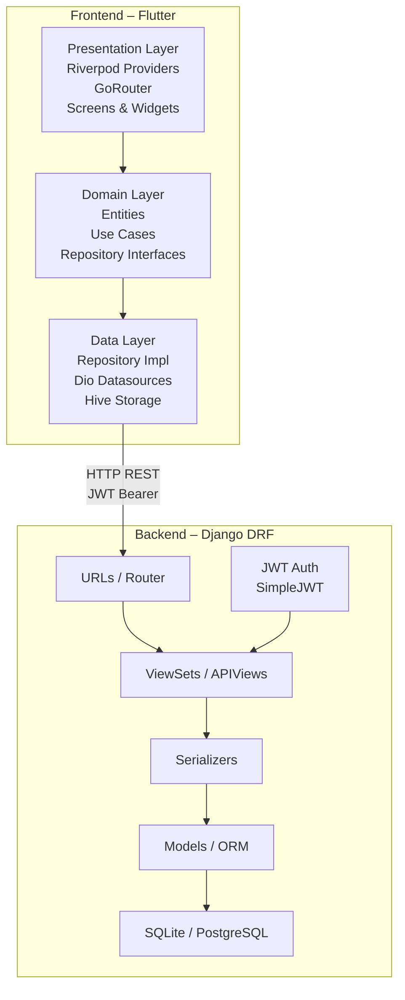

#### 14.4.2 Diagrama de Flujo – Autenticación

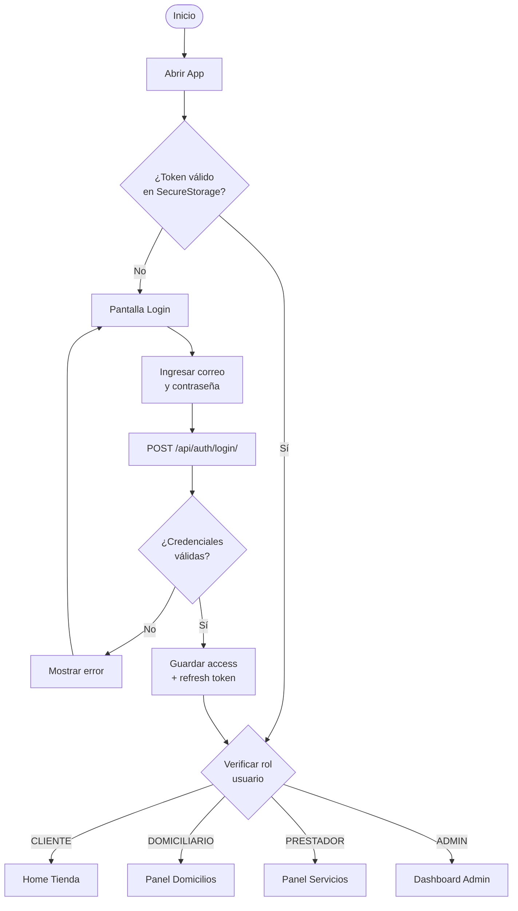

#### 14.4.3 Diagrama de Flujo – Solicitud de Domicilio

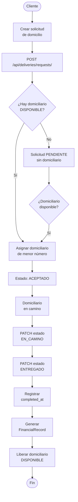

#### 14.4.4 Diagrama de Flujo – Aprobación de Prestador

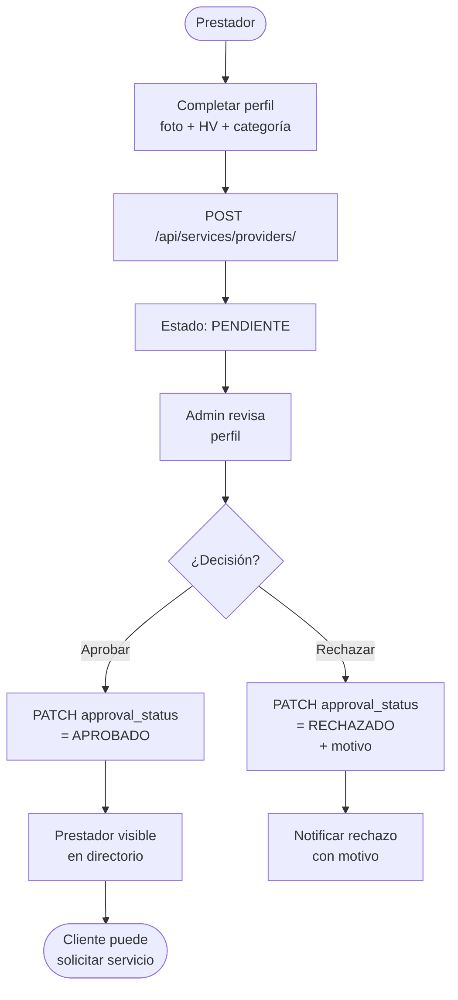

#### 14.4.5 Diseño Relacional

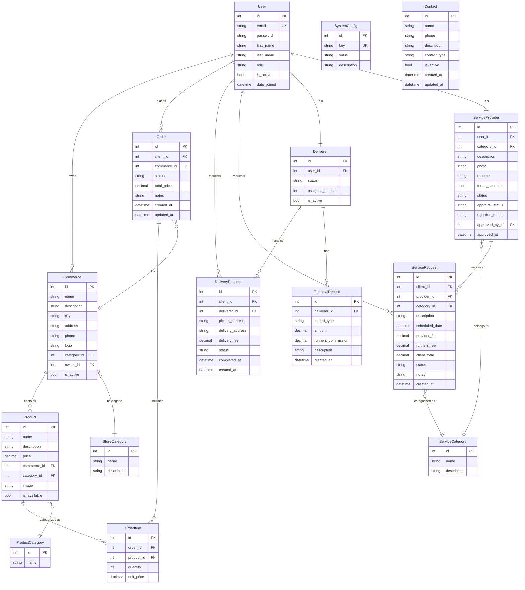

#### 14.4.6 Diagrama de Clases (Dominio Flutter)

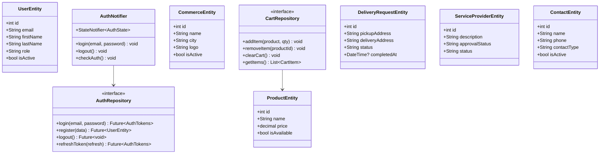

#### 14.4.7 Diagramas de secuencia

Los siguientes diagramas de secuencia describen los flujos dinámicos más relevantes del sistema Runners.

##### 14.4.7.1 Autenticación y enrutamiento por rol

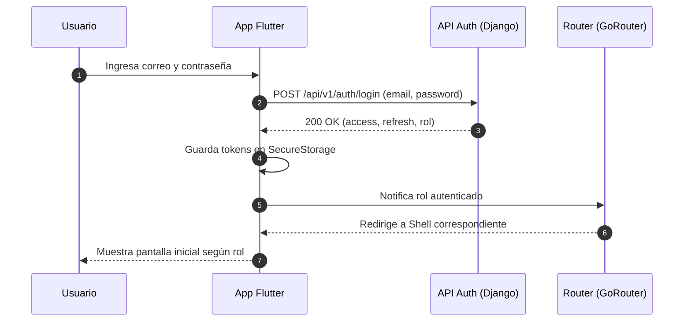

##### 14.4.7.2 Compra en tienda y creación de orden

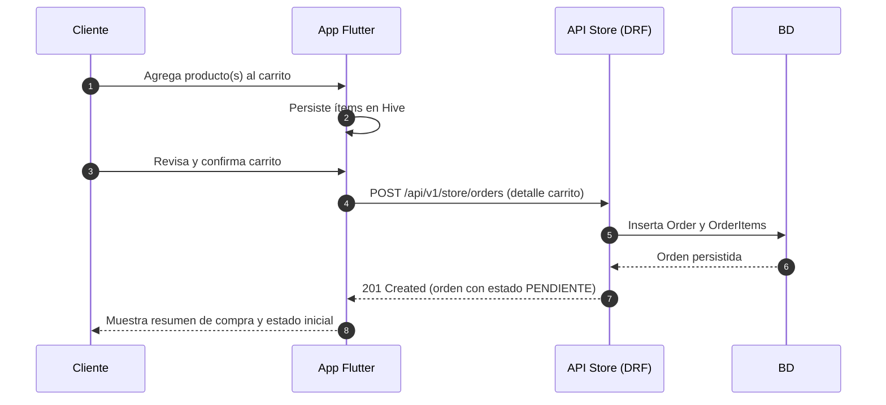

##### 14.4.7.3 Solicitud de domicilio con asignación automática

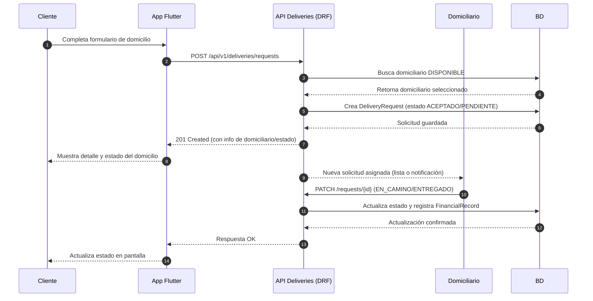

##### 14.4.7.4 Registro de usuario con emisión de tokens

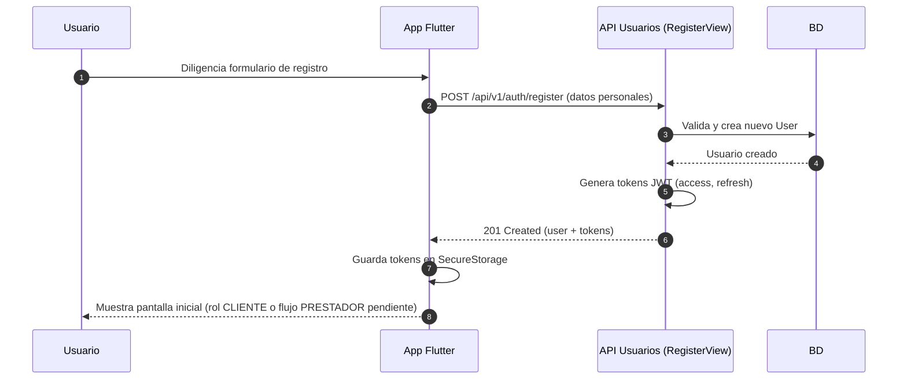

##### 14.4.7.5 Registro y aprobación de prestador de servicios

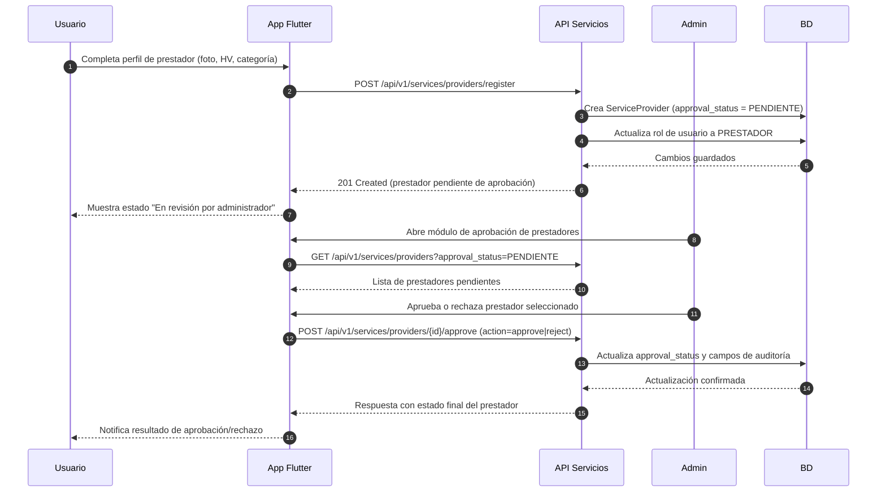

##### 14.4.7.6 Solicitud de servicio entre cliente y prestador

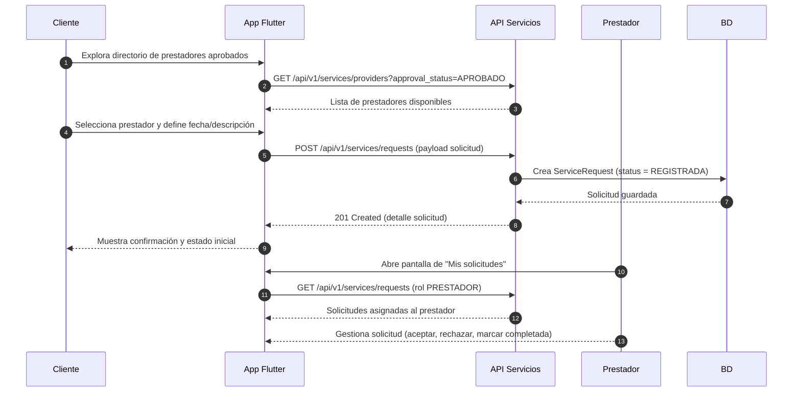

##### 14.4.7.7 Consulta de directorio de contactos y dashboard administrador

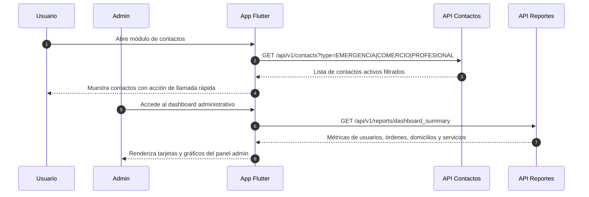

### 14.5 Prototipado

Se desarrollará/desarrolló un prototipo funcional en Flutter que incluye:

- Pantallas de login y registro con validación.
- Home con navegación por módulos según rol.
- Tienda con listado de comercios, productos y carrito.
- Flujo de solicitud y seguimiento de domicilios.
- Directorio de servicios con perfil de prestador.
- Directorio de contactos con filtro por tipo.
- Panel de administración con dashboard y gestión.

---

### 14.6 Plan de pruebas y aseguramiento de la calidad

#### 14.6.1 Objetivos de las pruebas

El plan de pruebas del proyecto Runners tiene como objetivos principales:

- Verificar que los requisitos funcionales y no funcionales descritos para cada módulo se cumplan en la implementación real.
- Detectar defectos de forma temprana durante el ciclo de desarrollo para reducir el costo de corrección.
- Asegurar que los flujos críticos (autenticación, compra en tienda, solicitud de domicilios, solicitud de servicios, gestión administrativa) funcionen de manera estable y consistente.
- Validar que el sistema sea utilizable y comprensible para los distintos roles (CLIENTE, PRESTADOR, DOMICILIARIO, ADMIN) bajo escenarios representativos.
- Proveer evidencia documentada del funcionamiento correcto del sistema para efectos de evaluación académica.

#### 14.6.2 Alcance y niveles de prueba

Se consideran los siguientes niveles de prueba:

- **Pruebas unitarias (parciales):**
    - En backend, centradas en la lógica de negocio encapsulada en modelos y funciones auxiliares de Django (validaciones de modelos, cálculos de comisiones, reglas de asignación automática).
    - En frontend, pruebas básicas de widgets y validaciones de formularios para pantallas críticas (auth, tienda, domicilios).
- **Pruebas de integración:**
    - Comunicación Flutter ↔ Django mediante llamadas HTTP usando Dio y la API REST.
    - Verificación de serialización/deserialización correcta de entidades (User, Order, DeliveryRequest, ServiceRequest, Contact, etc.).
- **Pruebas de sistema (end‑to‑end manuales):**
    - Revisión de flujos completos desde el punto de vista de cada rol.
    - Escenarios de éxito y de error (credenciales inválidas, falta de domiciliarios, prestadores no aprobados, etc.).
- **Pruebas de aceptación académica:**
    - Demostraciones guiadas del sistema ejecutando los casos de uso más importantes (UC‑01 a UC‑13) frente a docentes o jurados.

#### 14.6.3 Estrategia de pruebas por módulo

La siguiente tabla resume la estrategia de pruebas por módulo funcional:

| Módulo | Tipo de pruebas | Herramientas | Descripción |
|---|---|---|---|
| Autenticación y usuarios | Integración, sistema | Postman, App Flutter, Django Admin | Verificar registro, login, logout, actualización de perfil y restricciones por rol. |
| Tienda (store) | Integración, sistema | Postman, App Flutter | Probar listado de comercios/productos, gestión de carrito, creación y consulta de órdenes. |
| Domicilios (deliveries) | Integración, sistema | Postman, App Flutter | Validar creación de solicitudes, asignación automática de domiciliarios, actualización de estados y registros financieros. |
| Servicios (services) | Integración, sistema | Postman, App Flutter, Django Admin | Probar registro de prestadores, aprobación/rechazo por admin y ciclo completo de solicitudes de servicio. |
| Contactos (contacts) | Sistema | Postman, App Flutter | Verificar directorio público filtrado por tipo y gestión de contactos por parte del administrador. |
| Administración y reportes | Sistema | Postman, App Flutter | Validar panel de dashboard, reportes de ventas, reportes de domiciliarios y reportes de servicios. |

#### 14.6.4 Casos de prueba representativos

Algunos casos de prueba representativos, alineados con las historias de usuario, son:

- **PT‑01 – Registro exitoso de usuario (HU‑01, UC‑01):**
    - *Dado* que un usuario completa el formulario con datos válidos,
    - *Cuando* envía la solicitud de registro,
    - *Entonces* se crea el usuario, se generan tokens JWT y se redirige a la pantalla inicial según su rol.

- **PT‑02 – Inicio de sesión con credenciales inválidas (HU‑02, UC‑02):**
    - *Dado* un usuario que ingresa un correo o contraseña incorrectos,
    - *Cuando* envía el formulario de login,
    - *Entonces* la API responde con error 401 y la interfaz muestra un mensaje de credenciales inválidas sin acceder a contenido protegido.

- **PT‑03 – Flujo completo de compra en tienda (HU‑04 a HU‑07, UC‑03/UC‑04):**
    - Listar comercios y productos.
    - Agregar productos al carrito y modificar cantidades.
    - Confirmar el carrito y crear la orden.
    - Verificar que la orden se refleje en el historial del cliente con el estado correcto.

- **PT‑04 – Solicitud de domicilio sin domiciliarios disponibles (HU‑08, UC‑05):**
    - *Dado* que no existen domiciliarios con estado DISPONIBLE,
    - *Cuando* un cliente intenta crear una solicitud,
    - *Entonces* la API responde con un mensaje indicando que no hay domiciliarios disponibles y no se crea registro alguno.

- **PT‑05 – Aprobación de prestador y visibilidad en el directorio (HU‑14, HU‑19, UC‑07/UC‑08):**
    - Registrar un prestador con estado PENDIENTE.
    - Aprobarlo desde el panel de administración.
    - Verificar que ahora aparece en el listado de prestadores visibles para clientes.

- **PT‑06 – Directorio de contactos filtrado (HU‑16, HU‑17, UC‑11):**
    - Consultar contactos sin filtro (todos los tipos activos).
    - Aplicar filtro por tipo EMERGENCIA y verificar que solo se muestran los correspondientes.

- **PT‑07 – Dashboard administrativo coherente (HU‑18, HU‑21, UC‑13):**
    - Generar datos de ejemplo (órdenes, domicilios, servicios).
    - Consultar el endpoint de resumen y reportes.
    - Validar que los totales coincidan con lo esperado según los registros en la base de datos.

#### 14.6.5 Entorno de pruebas

El entorno de pruebas configurado para el proyecto incluye:

- **Backend:**
    - Django 5.2.6 + DRF 3.16.1 sobre Python 3.12.
    - Base de datos SQLite (`db.sqlite3`) con datos semilla de usuarios, comercios, productos, prestadores, domiciliarios y contactos.
    - Ejecución local en `http://127.0.0.1:8000` con configuración de desarrollo.

- **Frontend:**
    - Aplicación Flutter ejecutada en emulador Android o dispositivo físico.
    - Archivo `.env` apuntando a la URL local del backend.
    - Dependencias gestionadas con `flutter pub get` y análisis estático mediante `flutter analyze`.

- **Herramientas de apoyo:**
    - Postman con la colección `runners_api_postman.json` para ejecutar y validar solicitudes HTTP.
    - Django Admin para inspeccionar rápidamente el estado de los modelos durante las pruebas.

#### 14.6.6 Criterios de aceptación y salida

Para considerar que el sistema cumple con los objetivos de calidad definidos, se establecen los siguientes criterios:

- Todos los casos de prueba críticos (PT‑01 a PT‑07) han sido ejecutados y aprobados sin errores bloqueantes.
- No existen errores de severidad alta abiertos en los módulos de autenticación, tienda, domicilios o servicios al finalizar el ciclo de pruebas.
- Los flujos de negocio descritos en los casos de uso (UC‑01 a UC‑13) pueden ejecutarse de principio a fin sin inconsistencias de datos.
- Las pruebas de regresión básicas se ejecutan tras cambios significativos en el código (especialmente en modelos y serializers de Django, y en providers principales de Flutter).

La evidencia de ejecución de pruebas incluye capturas de pantalla, videos cortos de los flujos principales y registros de las llamadas realizadas en Postman.

---

## 15. Casos de uso (detallados)

**Actores:** Cliente (Usuario), Prestador, Domiciliario, Administrador (Admin), Sistema (API Django).

### UC-01: Registrarse (Cliente / Prestador / Domiciliario)

- **Precondición:** el usuario no está registrado.
- **Flujo:** Usuario ingresa nombre, apellido, correo, contraseña y rol → `POST /api/auth/register/` → Sistema valida correo único → Crea usuario → Retorna tokens JWT.
- **Excepciones:** email ya registrado, contraseña muy corta, rol inválido.

### UC-02: Iniciar sesión

- **Precondición:** cuenta existente con credenciales válidas.
- **Flujo:** `POST /api/auth/login/` → Sistema valida credenciales → Retorna access + refresh token → Flutter guarda en SecureStorage → GoRouter redirige según rol.
- **Excepciones:** credenciales inválidas, cuenta inactiva.

### UC-03: Consultar tienda

- **Flujo:** `GET /api/store/commerces/` → listar comercios activos; `GET /api/store/products/?commerce_id=X` → listar productos; Flutter muestra listado con imagen, nombre y precio.

### UC-04: Gestionar carrito

- **Flujo:** Cliente agrega/elimina productos → CartNotifier actualiza Hive → Flutter refleja cambios en tiempo real → Cliente confirma → `POST /api/store/orders/` con ítems.

### UC-05: Solicitar domicilio

- **Flujo:** Cliente llena formulario (pickup_address, delivery_address) → `POST /api/deliveries/requests/` → Sistema asigna domiciliario disponible automáticamente → Retorna solicitud con domiciliario asignado o null.

### UC-06: Actualizar estado de domicilio

- **Flujo:** Domiciliario consulta `GET /api/deliveries/requests/` (sus solicitudes) → `PATCH /api/deliveries/requests/{id}/` con nuevo estado → Sistema actualiza completed_at si estado = ENTREGADO → Genera FinancialRecord.

### UC-07: Completar perfil de prestador

- **Flujo:** `POST /api/services/providers/` con foto, descripción, categoría, hoja de vida, aceptación de términos → Sistema crea perfil con `approval_status = PENDIENTE` → Admin notificado.

### UC-08: Aprobar / rechazar prestador (Admin)

- **Flujo:** Admin consulta `GET /api/services/providers/?approval_status=PENDIENTE` → Revisa perfil → `PATCH /api/services/providers/{id}/` con `approval_status = APROBADO` o `RECHAZADO` + `rejection_reason`.

### UC-09: Solicitar servicio (Cliente)

- **Flujo:** Cliente busca prestadores aprobados → `GET /api/services/providers/` → Selecciona prestador → `POST /api/services/requests/` con descripción y fecha → Sistema calcula client_total → Prestador recibe solicitud.

### UC-10: Gestionar solicitudes de servicio (Prestador)

- **Flujo:** `GET /api/services/requests/` (mis solicitudes) → `PATCH /api/services/requests/{id}/` con status `APROBADO` o `RECHAZADO`.

### UC-11: Consultar directorio de contactos

- **Flujo:** `GET /api/contacts/` → filtros opcionales por `contact_type` → Flutter muestra directorio con nombre, teléfono, descripción e ícono por tipo.

### UC-12: Administrar catálogo y usuarios (Admin)

- **Flujo:** Admin accede a endpoints de gestión: usuarios (`/api/users/`), comercios (`/api/store/commerces/`), configuración (`/api/deliveries/config/`), contactos (`/api/contacts/`).

### UC-13: Ver reportes (Admin)

- **Flujo:** `GET /api/reports/deliveries/` → reportes de domicilios con filtros; `GET /api/reports/services/` → reportes de servicios; `GET /api/reports/store/` → reportes de tienda.

### 15.1 Diagrama de casos de uso

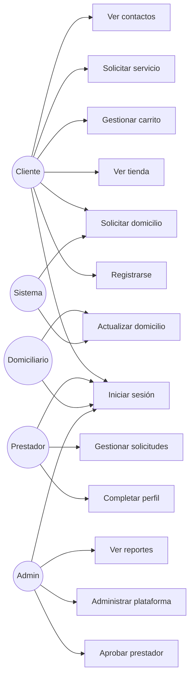

---

## 16. Estructura de carpetas

### 16.1 Backend (Django)

```
backend/
├── manage.py
├── requirements.txt
├── .env / .env.example
├── runners_project/          # Configuración global
│   ├── __init__.py
│   ├── settings.py
│   ├── urls.py
│   ├── wsgi.py
│   └── asgi.py
├── apps/
│   ├── users/                # Modelo User con roles
│   │   ├── models.py
│   │   ├── serializers.py
│   │   ├── views.py
│   │   └── urls.py
│   ├── store/                # Comercios, Productos, Órdenes
│   │   ├── models.py
│   │   ├── serializers.py
│   │   ├── views.py
│   │   └── urls.py
│   ├── deliveries/           # Domicilios y registros financieros
│   │   ├── models.py
│   │   ├── serializers.py
│   │   ├── views.py
│   │   └── urls.py
│   ├── services/             # Prestadores y solicitudes de servicio
│   │   ├── models.py
│   │   ├── serializers.py
│   │   ├── views.py
│   │   └── urls.py
│   ├── contacts/             # Directorio de contactos
│   │   ├── models.py
│   │   ├── serializers.py
│   │   ├── views.py
│   │   └── urls.py
│   └── reports/              # Endpoints de reportes y dashboard
│       ├── views.py
│       └── urls.py
├── media/                    # Archivos subidos (fotos, HV)
└── db.sqlite3
```

### 16.2 Frontend (Flutter + Clean Architecture)

```
frontend/
├── pubspec.yaml
├── lib/
│   ├── main.dart
│   ├── app.dart
│   ├── core/
│   │   ├── network/          # Cliente Dio + interceptores JWT
│   │   ├── router/           # GoRouter con guardias de rol
│   │   ├── storage/          # Hive (carrito) + SecureStorage (tokens)
│   │   ├── theme/            # AppTheme, colores, tipografía
│   │   ├── constants/        # URLs base, constantes de la app
│   │   ├── errors/           # Clases de error y failure
│   │   └── utils/            # Utilidades generales
│   ├── features/
│   │   ├── auth/             # Login, Register, Splash
│   │   │   ├── data/
│   │   │   ├── domain/
│   │   │   └── presentation/
│   │   ├── store/            # Comercios, Productos, Carrito, Órdenes
│   │   │   ├── data/
│   │   │   ├── domain/
│   │   │   └── presentation/
│   │   ├── deliveries/       # Domicilios, Repartidores
│   │   │   ├── data/
│   │   │   ├── domain/
│   │   │   └── presentation/
│   │   ├── services/         # Categorías, Prestadores, Solicitudes
│   │   │   ├── data/
│   │   │   ├── domain/
│   │   │   └── presentation/
│   │   ├── contacts/         # Directorio de contactos
│   │   │   ├── data/
│   │   │   ├── domain/
│   │   │   └── presentation/
│   │   └── admin/            # Dashboard, Reportes, Gestión
│   │       ├── data/
│   │       ├── domain/
│   │       └── presentation/
│   └── shared/
│       └── widgets/          # AppButton, AppTextField, AppCard, etc.
├── android/
├── ios/
└── test/
```

---

## 17. Plan de Gestión de Riesgos

### 17.1 Introducción

Esta sección establece las estrategias, procedimientos y responsabilidades necesarias para identificar, analizar, mitigar y controlar los riesgos del proyecto Runners a lo largo de su ciclo de vida.

#### 17.1.1 Propósito

El propósito de este plan es definir la metodología y las acciones que se implementarán para gestionar los riesgos del proyecto Runners, garantizando la entrega a tiempo de una plataforma funcional, segura y bien documentada.

#### 17.1.2 Alcance

Este plan abarca todos los riesgos identificados durante las fases de análisis, diseño, desarrollo, pruebas y despliegue del sistema Runners. Se aplica a todo el equipo de trabajo, herramientas tecnológicas utilizadas, procesos de comunicación y gestión interna del proyecto.

#### 17.1.3 Definiciones y Acrónimos

- **DRF:** Django REST Framework
- **JWT:** JSON Web Token
- **HU:** Historia de Usuario
- **RN:** Regla de Negocio
- **UC:** Caso de Uso

#### 17.1.4 Referencias

- Documentación oficial Django: https://docs.djangoproject.com/
- Documentación DRF: https://www.django-rest-framework.org/
- Documentación Flutter: https://docs.flutter.dev/
- Riverpod: https://riverpod.dev/
- GoRouter: https://pub.dev/packages/go_router

#### 17.1.5 Descripción General

Este plan se organiza en:
- **Resumen de riesgos:** lista priorizada de riesgos identificados.
- **Tareas de gestión:** identificación, análisis y mitigación.
- **Responsabilidades:** roles del equipo frente a cada riesgo.
- **Presupuesto:** asignación de tiempo para contingencias.
- **Herramientas:** Git, GitHub Issues, documentación colaborativa.

---

## 18. Tareas de Gestión de Riesgos

- **Identificación:** sesiones de análisis con el equipo revisando cada módulo.
- **Análisis:** Matriz de probabilidad/impacto (escala 1-5).
- **Priorización:** Riesgos con puntuación ≥ 8 se gestionan primero.
- **Seguimiento:** revisión semanal durante el sprint activo.

---

## 19. Organización y Responsabilidades

- **Líder del Proyecto:** responsable de coordinar las actividades generales, asegurar el cumplimiento del plan, gestionar la comunicación con los interesados y tomar decisiones de alcance.
- **Gestor de Riesgos:** encargado de identificar, documentar y hacer seguimiento a los riesgos identificados durante el desarrollo.
- **Equipo Técnico (todos los integrantes):** participa en la detección temprana de riesgos técnicos relacionados con el stack (Django, Flutter, JWT, despliegue).
- **Comité de Revisión (equipo completo):** realiza revisiones periódicas para evaluar el estado de los riesgos e implementar medidas correctivas.

---

## 20. Presupuesto

El proyecto Runners es académico y de código abierto. Los costos son:

| Recurso | Costo |
|---|---|
| Servidor de desarrollo (local) | $0 |
| Repositorio GitHub (público) | $0 |
| Herramientas de desarrollo (VS Code, Postman) | $0 |
| Flutter SDK, Django, librerías open source | $0 |
| Servidor de producción (estimado futuro) | Variable según proveedor |
| Contingencia de tiempo (15% del sprint) | 4-6 horas por sprint |

---

## 21. Herramientas y Técnicas

- **Control de versiones:** Git + GitHub (ramas feature, commits semánticos, Pull Requests).
- **Gestión de tareas:** GitHub Issues / tablero Kanban para historias de usuario y bugs.
- **Comunicación:** reuniones regulares de sincronización del equipo.
- **Documentación:** Markdown en el repositorio (README, QUICKSTART, CONTRIBUTING, este documento).
- **Pruebas de API:** Postman con colección `runners_api_postman.json` (30+ endpoints).
- **Pruebas de Frontend:** flujos manuales completos por módulo.

---

## 22. Elementos de Riesgo Por Gestionar

### Riesgo 1 – Pérdida o ausencia de un integrante del equipo

**Descripción:** Un miembro del equipo deja de participar temporalmente o definitivamente.  
**Control:** Documentación accesible en GitHub, commits descriptivos, arquitectura modular que permite que otro integrante retome cualquier módulo.  
- *Prevención:* distribuir responsabilidades equitativamente y documentar avances continuamente.  
- *Mitigación:* asignar roles con redundancia; cualquier miembro puede levantar el backend y el frontend de forma independiente.

### Riesgo 2 – Pérdida o daño de archivos de proyecto

**Descripción:** Fallo de disco, pérdida de laptop o corrupción de archivos.  
**Control:** Todo el código está versionado en GitHub (`https://github.com/Karatsuyu/Runners.git`).  
- *Prevención:* push frecuente al repositorio remoto.  
- *Mitigación:* clone desde GitHub en cualquier equipo en minutos.

### Riesgo 3 – Falta de comunicación en el equipo

**Descripción:** Desacuerdos o malentendidos que afectan el progreso.  
**Control:** Reglas claras de branches, commits semánticos, Pull Requests con descripción.  
- *Prevención:* reuniones periódicas de sincronización.  
- *Mitigación:* revisión cruzada de Pull Requests antes de merge a main.

### Riesgo 4 – Incumplimiento de plazos

**Descripción:** Subestimación del tiempo requerido para módulos complejos.  
**Control:** Sprints con estimación en puntos de historia, revisiones frecuentes.  
- *Prevención:* dejar 15% del sprint como buffer para imprevistos.  
- *Mitigación:* reducir el alcance del sprint y posponer features no críticas.

### Riesgo 5 – Problemas con herramientas o dependencias

**Descripción:** Incompatibilidades de versiones (Flutter, Dart, Django, librerías).  
**Control:** Versiones fijas en `pubspec.yaml` y `requirements.txt`; entorno virtual Python.  
- *Prevención:* usar `requirements.txt` con versiones exactas.  
- *Mitigación:* ambiente virtual Python aislado; `flutter pub get` restaura dependencias.

### Riesgo 6 – Falta de experiencia con el stack

**Descripción:** Miembros del equipo no familiarizados con Clean Architecture, Riverpod o DRF.  
**Control:** Documentación de arquitectura incluida en el repositorio.  
- *Prevención:* sesiones de revisión del código entre pares.  
- *Mitigación:* guías de implementación (`runners_flutter_implementacion.md`, `runners_guia_implementacion_web.md`) disponibles en el proyecto.

### Riesgo 7 – Cambios en los requisitos

**Descripción:** Modificaciones en las funcionalidades o el modelo de datos después de iniciado el desarrollo.  
**Control:** Arquitectura modular que minimiza el impacto de cambios en un módulo sobre los otros.  
- *Prevención:* definir requisitos completos antes de comenzar cada módulo.  
- *Mitigación:* migraciones Django para cambios en el modelo; Clean Architecture para cambios en el frontend sin afectar dominio.

### Riesgo 8 – Fallas en el despliegue a producción

**Descripción:** Errores de configuración al migrar de SQLite a PostgreSQL o al desplegar en servidor.  
**Control:** Variables de entorno en `.env` con `.env.example` documentado.  
- *Prevención:* probar con PostgreSQL en entorno local antes del despliegue.  
- *Mitigación:* documentación de despliegue en `QUICKSTART.md`; SQLite funcional para demostración.

**Niveles de riesgo:** 🟢 Bajo (1-4) | 🟡 Medio (5-9) | 🟠 Alto (10-14) | 🔴 Muy alto (15-25)

---

## 23. Diagrama de paquetes

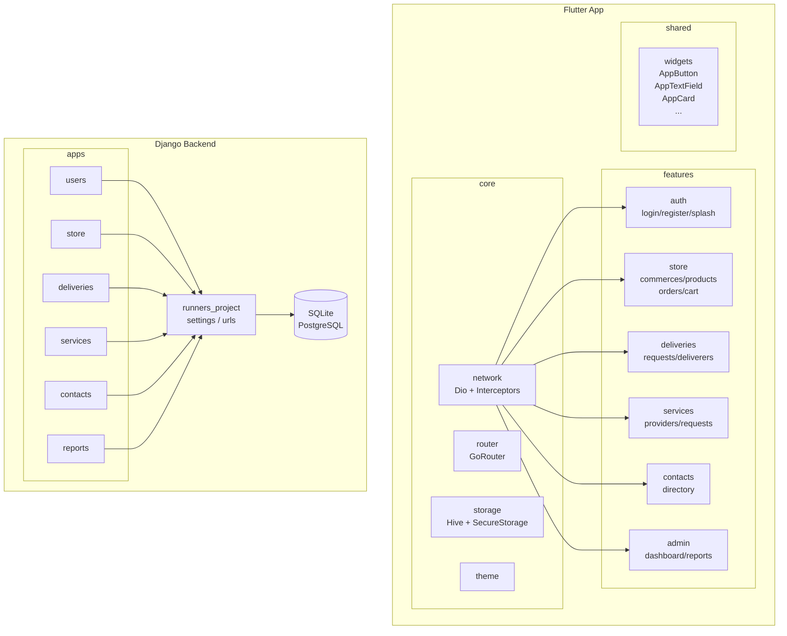

---

## 24. Cronograma

### Planificación del Tiempo

**Duración del Sprint:** 2 semanas (10 días hábiles)

**Capacidad del Equipo:**
- 3 desarrolladores × 40 hr/semana × 2 semanas = 240 hr
- Restando reuniones y sincronización (8 hr): **232 hr efectivas**
- 1 punto de historia = 8 hr → **29 puntos disponibles por sprint**

### Sprint 1 – Autenticación + Tienda

| Historia | Tareas | Puntos |
|---|---|---|
| HU-01 Registro | Diseño pantalla registro, validación de correo único, serializer usuario | 2 |
| HU-02 Login | Diseño pantalla login, endpoint JWT, interceptor Dio, SecureStorage | 3 |
| HU-03 Logout | Limpiar tokens SecureStorage, GoRouter redirige a Login | 1 |
| HU-04 Ver tienda | Endpoint comercios y productos, pantalla listado con categorías | 4 |
| HU-05 Carrito | CartNotifier Riverpod, persistencia Hive, pantalla carrito | 4 |
| HU-06 Confirmar orden | Endpoint crear orden con ítems, pantalla confirmación | 4 |
| HU-07 Historial órdenes | Endpoint listado órdenes del cliente, pantalla historial | 3 |

**Total Sprint 1: 21 puntos**

### Sprint 2 – Domicilios + Servicios

| Historia | Tareas | Puntos |
|---|---|---|
| HU-08 Solicitar domicilio | Endpoint solicitud, asignación automática domiciliario | 4 |
| HU-09 Ver estado domicilio | Pantalla seguimiento, endpoint detalle solicitud | 2 |
| HU-10 Gestionar domicilios | Pantalla domiciliario, PATCH estado, FinancialRecord automático | 4 |
| HU-11 Historial financiero | Endpoint registros financieros, pantalla domiciliario | 2 |
| HU-12 Ver prestadores | Endpoint prestadores aprobados, pantalla directorio servicios | 3 |
| HU-13 Solicitar servicio | Endpoint crear solicitud servicio, cálculo tarifas | 3 |
| HU-14 Perfil prestador | Endpoint crear/actualizar perfil, subida de foto y HV | 3 |
| HU-15 Gestionar solicitudes | Endpoint aprobar/rechazar solicitudes, pantalla prestador | 2 |

**Total Sprint 2: 23 puntos**

### Sprint 3 – Contactos + Admin + Refinamiento

| Historia | Tareas | Puntos |
|---|---|---|
| HU-16 Ver contactos | Endpoint directorio, pantalla listado con filtro | 2 |
| HU-17 Filtrar contactos | Filtros por tipo en endpoint y UI | 1 |
| HU-18 Dashboard admin | Endpoint métricas, pantalla dashboard con cards | 4 |
| HU-19 Aprobar prestadores | Endpoint PATCH approval, pantalla gestión prestadores | 3 |
| HU-20 Gestionar contactos | CRUD contactos para admin, pantalla gestión | 3 |
| HU-21 Reportes | Endpoints reportes domicilios/servicios/tienda, pantallas | 4 |
| Buffer / pruebas | Pruebas Postman, flujos completos, ajustes UX | 4 |

**Total Sprint 3: 21 puntos**

---

## 25. Resultados Esperados

La aplicación Runners se proyecta como una solución integral para la gestión de servicios comunitarios, domicilios y tienda local.

1. **Digitalización de la economía local:** conectar clientes con comercios y prestadores de la comunidad en un canal único y formal.
2. **Eficiencia en la asignación de domicilios:** reducir tiempos de respuesta mediante asignación automática basada en disponibilidad.
3. **Validación de prestadores:** garantizar calidad del servicio mediante aprobación administrativa previa.
4. **Centralización de información:** el administrador tendrá visibilidad completa sobre operaciones, finanzas y usuarios en tiempo real.
5. **Reducción de errores:** flujos automatizados (asignación, cálculo de tarifas, registro financiero) minimizan la intervención manual.
6. **Arquitectura escalable:** la separación Clean Architecture + DRF permitirá agregar módulos (pagos en línea, chat, notificaciones push) sin reestructurar el sistema.
7. **Experiencia de usuario fluida:** gestión de estado con Riverpod, persistencia offline con Hive y manejo de errores con feedback visual garantizan una experiencia confiable.
8. **Documentación completa:** README, QUICKSTART, guías de implementación, colección Postman y este documento aseguran la transferencia del conocimiento.

---

## 26. Recomendaciones y Sugerencias a Futuro

### 1. Implementar pagos en línea reales
Integrar pasarelas como PayPal, Stripe o MercadoPago para completar transacciones reales. Esto requerirá adecuarse a la normativa de pagos electrónicos local y evaluar la seguridad de la integración.

### 2. Notificaciones push en tiempo real
Implementar Firebase Cloud Messaging (FCM) para notificar a clientes sobre cambios de estado en domicilios y servicios, y a domiciliarios sobre nuevas solicitudes asignadas.

### 3. Chat integrado entre cliente y prestador/domiciliario
Un módulo de chat en tiempo real (Django Channels + WebSockets en Flutter) mejoraría la comunicación durante la prestación del servicio o el domicilio.

### 4. Sistema de calificaciones y reseñas
Agregar un módulo de rating para domiciliarios y prestadores después de completar un servicio, mejorando la confianza y la calidad de la plataforma.

### 5. Geolocalización en tiempo real
Integrar GPS para seguimiento de domicilios en mapa (Google Maps SDK para Flutter, backend con coordenadas en DeliveryRequest).

### 6. Panel de analytics avanzado
Dashboard con gráficos de ventas, servicios más solicitados, domiciliarios más activos y métricas de retención de clientes.

### 7. Aplicación web (PWA o React)
Con la API ya desarrollada, construir una versión web para administradores y comercios que no requieran la app móvil.

### 8. Despliegue en producción con Docker
Contenerizar el backend Django con Docker Compose, configurar PostgreSQL, Nginx, SSL y gunicorn para un despliegue robusto en VPS o plataforma cloud.

### 9. Sistema de recomendaciones con IA
Recomendar prestadores o productos basados en el historial de solicitudes del usuario, usando técnicas de filtrado colaborativo.

### 10. Auditoría y trazabilidad
Registrar todas las acciones administrativas (aprobaciones, cambios de estado, configuración) en un log de auditoría para mejorar la seguridad y el control.

---

## 27. Conclusiones

- La arquitectura propuesta (Flutter + Clean Architecture + Riverpod frontend; Django + DRF + JWT backend) ofrece una base sólida, productiva y mantenible para el desarrollo del sistema Runners.
- El modelo relacional diseñado es flexible y soporta correctamente los cuatro módulos principales (tienda, domicilios, servicios, contactos) con sus respectivas relaciones entre entidades.
- La asignación automática de domiciliarios simplifica el flujo operativo sin requerir intervención manual, reduciendo errores y tiempos de respuesta.
- El sistema de aprobación de prestadores garantiza calidad en el directorio de servicios, protegiendo la reputación de la plataforma.
- La arquitectura Clean en Flutter asegura que los cambios en la capa de datos (p.ej., cambio de URL base o estructura de respuesta) no afecten la capa de presentación, reduciendo el costo de mantenimiento.
- Para producción se recomienda: PostgreSQL, almacenamiento de media en S3 o equivalente, HTTPS, contenedores Docker, y pruebas automatizadas con CI/CD en GitHub Actions.
- Se recomienda implementar notificaciones push (FCM) y geolocalización como próximas funcionalidades de alto impacto para la experiencia del usuario.

---

## 28. Bibliografía

- Sommerville, I. (2016). *Ingeniería del Software*. Pearson.
- Pressman, R. (2015). *Ingeniería del Software: Un enfoque práctico*. McGraw-Hill.
- Django Software Foundation. *Django Documentation*. https://docs.djangoproject.com/
- Django REST Framework. *DRF Documentation*. https://www.django-rest-framework.org/
- JWT.io. *JSON Web Tokens Introduction*. https://jwt.io/introduction
- Flutter Team. *Flutter Documentation*. https://docs.flutter.dev/
- Riverpod. *Riverpod Documentation*. https://riverpod.dev/
- GoRouter. *go_router package*. https://pub.dev/packages/go_router
- Hive. *Hive Documentation*. https://docs.hivedb.dev/
- Mermaid. *Mermaid Diagramming Tool*. https://mermaid.js.org/
- Simple JWT. *djangorestframework-simplejwt Documentation*. https://django-rest-framework-simplejwt.readthedocs.io/
