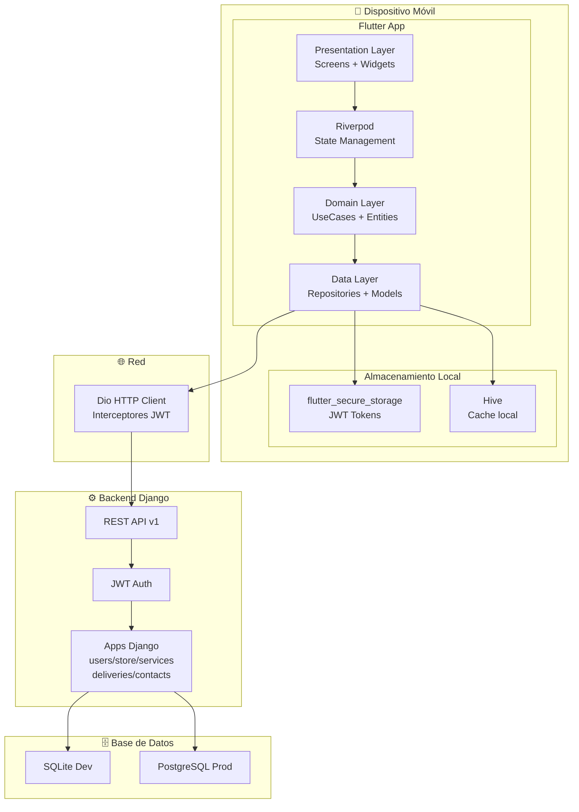
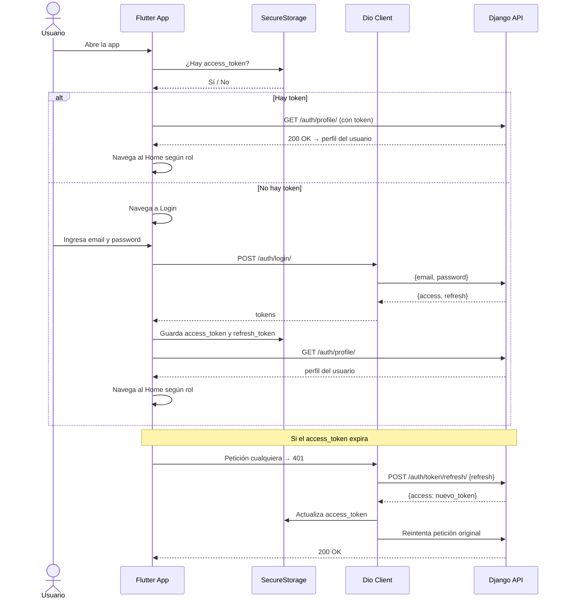
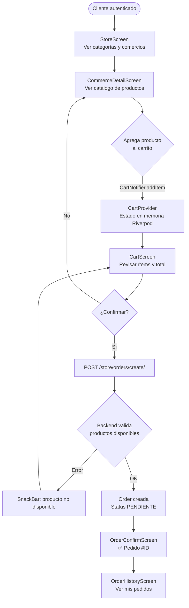
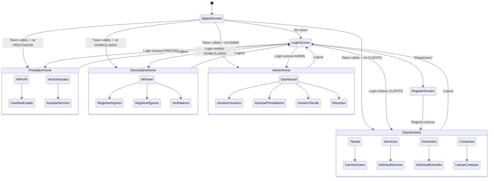
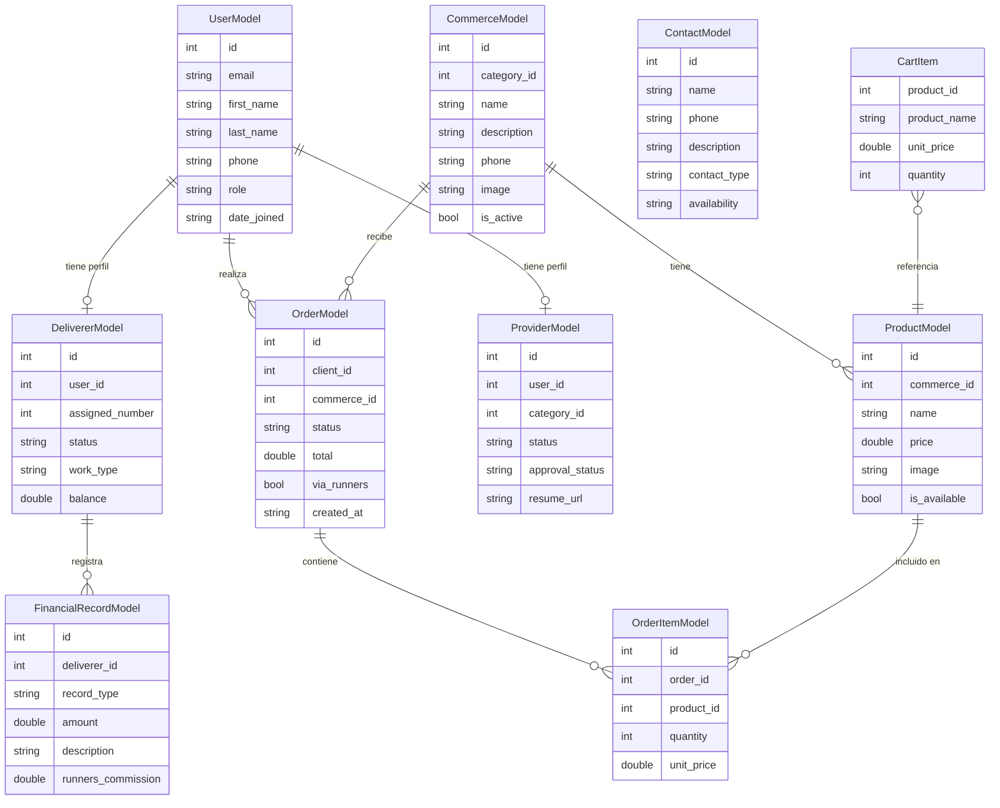
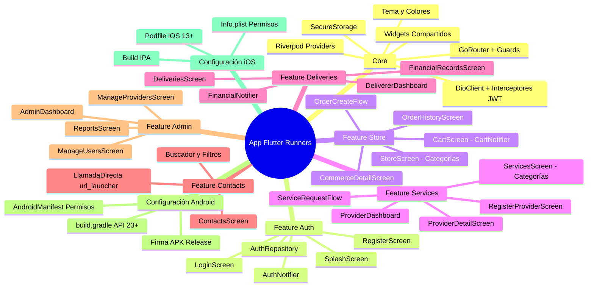

# 🏃 SISTEMA RUNNERS — GUÍA DE IMPLEMENTACIÓN MÓVIL
## Plataforma Flutter (Android + iOS)

> **Proyecto:** Sistema Móvil Runners – Plataforma de Intermediación de Servicios y Domicilios  
> **Empresa:** Runners – Caicedonia, Valle del Cauca  
> **Equipo:** 3 desarrolladores | **Duración:** 4 meses  
> **Stack Móvil:** Flutter 3.x (Dart) | Backend: Django 5.2.6 + DRF | PostgreSQL (prod) / SQLite (dev)  
> **Plataformas objetivo:** Android 6.0+ (API 23+) | iOS 13+

---

## 📋 TABLA DE CONTENIDOS

1. [Descripción General del Sistema](#1-descripción-general-del-sistema)
2. [Requisitos Funcionales](#2-requisitos-funcionales)
3. [Arquitectura de la App Flutter](#3-arquitectura-de-la-app-flutter)
4. [Estructura de Carpetas Flutter](#4-estructura-de-carpetas-flutter)
5. [Instalaciones y Configuración del Entorno](#5-instalaciones-y-configuración-del-entorno)
6. [Dependencias (pubspec.yaml)](#6-dependencias-pubspecyaml)
7. [Backend Django — Referencia Completa](#7-backend-django--referencia-completa)
8. [Código Flutter Completo — Capa de Datos](#8-código-flutter-completo--capa-de-datos)
9. [Código Flutter Completo — Capa de Dominio](#9-código-flutter-completo--capa-de-dominio)
10. [Código Flutter Completo — Capa de Presentación](#10-código-flutter-completo--capa-de-presentación)
11. [Navegación y Rutas](#11-navegación-y-rutas)
12. [Gestión de Estado (Provider + Riverpod)](#12-gestión-de-estado)
13. [Configuración Android](#13-configuración-android)
14. [Configuración iOS](#14-configuración-ios)
15. [Diagramas Mermaid](#15-diagramas-mermaid)
16. [WBS, Backlog y Sprints](#16-wbs-backlog-y-sprints)
17. [Comandos Útiles](#17-comandos-útiles)

---

## 1. Descripción General del Sistema

**Runners** es una plataforma **móvil** de intermediación que conecta a la comunidad de Caicedonia con:

| Módulo | Descripción |
|--------|-------------|
| 🏪 **Tienda** | Pedidos a restaurantes y almacenes, catálogo por categorías, historial de compras |
| 🔧 **Servicios** | Conexión intermediada con profesionales (albañiles, contadores, doctores, etc.) |
| 🏍️ **Domicilios** | Gestión de domiciliarios, control de ingresos/egresos y deuda con la empresa |
| 📞 **Contactos** | Directorio de emergencias y profesionales con disponibilidad en tiempo real |

> ⚠️ **Alcance inicial:** No se gestionan pagos reales. El sistema automatiza la intermediación (lo que hoy se hace en papel). Puede evolucionar a pagos en versiones futuras.

---

## 2. Requisitos Funcionales

---

### RF-USR-001 — Registro de Cliente

| | | |
|---|---|---|
| **Código** | USR-RF-001 | |
| **Nombre** | Registro de cliente en la app móvil | |
| **Descripción** | Permite a una persona natural registrarse como cliente en la app Runners para poder realizar pedidos, solicitar servicios y consultar el directorio de contactos. | |
| **Actores** | Cliente (usuario nuevo), App Flutter, API Django | |
| | | |
| **Precondición** | El usuario no debe tener cuenta registrada con el mismo correo. | |
| | El dispositivo debe tener conexión a internet. | |
| | | |
| | **Paso** | **Descripción** |
| **Secuencia normal** | 1 | El usuario abre la app y selecciona "Registrarse". |
| | 2 | La app muestra el formulario de registro (nombre, apellido, correo, teléfono, contraseña). |
| | 3 | El usuario completa el formulario y toca "Crear cuenta". |
| | 4 | La app valida los campos localmente antes de enviar. |
| | 5 | La app envía `POST /api/v1/auth/register/` al backend Django. |
| | 6 | El backend crea el usuario con rol `CLIENTE` y retorna tokens JWT. |
| | 7 | La app almacena los tokens en `flutter_secure_storage`. |
| | 8 | La app navega al Home según el rol del usuario. |
| | | |
| **Secuencia alterna** | 1A | Si el correo ya existe, el backend retorna 400 y la app muestra el error en el campo correspondiente. |
| | 3A | Si el usuario ya tiene cuenta, puede tocar "Ya tengo cuenta" para ir al login. |
| | | |
| **Excepciones** | E1 | Sin conexión a internet: la app muestra SnackBar "Sin conexión. Verifica tu red." |
| | E2 | Error del servidor (500): la app muestra diálogo de error con opción de reintentar. |
| | | |
| **Postcondición** | El usuario queda registrado con rol `CLIENTE` en la BD del backend. | |
| | Los tokens JWT se almacenan de forma segura en el dispositivo. | |
| | | |
| **Comentarios** | Se puede añadir verificación por correo en versiones futuras. Usar `flutter_secure_storage` para tokens (no SharedPreferences). | |

---

### RF-USR-002 — Autenticación con JWT

| | | |
|---|---|---|
| **Código** | USR-RF-002 | |
| **Nombre** | Inicio de sesión y gestión de tokens JWT | |
| **Descripción** | Permite a los usuarios autenticarse en la app y obtener tokens de acceso y refresco, manejando automáticamente su renovación. | |
| **Actores** | Cliente, Prestador, Domiciliario, Admin, App Flutter, API Django | |
| | | |
| **Precondición** | El usuario debe estar registrado y activo en el sistema. | |
| | | |
| | **Paso** | **Descripción** |
| **Secuencia normal** | 1 | El usuario ingresa correo y contraseña en la pantalla de login. |
| | 2 | La app envía `POST /api/v1/auth/login/` con las credenciales. |
| | 3 | El backend valida y retorna `access_token` (15 min) y `refresh_token` (7 días). |
| | 4 | La app almacena ambos tokens en `flutter_secure_storage`. |
| | 5 | La app obtiene el perfil del usuario (`GET /api/v1/auth/profile/`) y lo guarda en el estado global. |
| | 6 | La app navega al Home del rol correspondiente. |
| | | |
| **Secuencia alterna** | 2A | Credenciales incorrectas: la app muestra "Correo o contraseña incorrectos" sin especificar cuál. |
| | 6A | Usuario suspendido: la app muestra "Cuenta suspendida. Contacta al administrador." |
| | | |
| **Excepciones** | E1 | `access_token` expirado en una petición: el interceptor Dio renueva automáticamente con el `refresh_token`. |
| | E2 | `refresh_token` expirado: la app limpia el storage y redirige al login. |
| | | |
| **Postcondición** | El usuario queda autenticado en la app con tokens válidos almacenados. | |
| | El perfil del usuario está disponible en el estado global de la app. | |
| | | |
| **Comentarios** | Implementar interceptor en Dio para renovación automática de tokens. Usar `go_router` con redirección automática según estado de autenticación. | |

---

### RF-USR-003 — Gestión de Roles y Navegación por Rol

| | | |
|---|---|---|
| **Código** | USR-RF-003 | |
| **Nombre** | Diferenciación de roles y vistas según perfil | |
| **Descripción** | La app muestra interfaces y menús distintos según el rol del usuario autenticado: CLIENTE, PRESTADOR, DOMICILIARIO o ADMIN. | |
| **Actores** | Sistema, App Flutter | |
| | | |
| **Precondición** | El usuario debe estar autenticado. | |
| | El perfil con rol debe estar disponible en el estado global. | |
| | | |
| | **Paso** | **Descripción** |
| **Secuencia normal** | 1 | Al autenticarse, la app lee el campo `role` del perfil del usuario. |
| | 2 | El router de la app redirige al shell de navegación correspondiente al rol. |
| | 3 | El `BottomNavigationBar` o `NavigationRail` muestra solo las secciones permitidas para el rol. |
| | 4 | Cada pantalla verifica el rol antes de mostrar acciones restringidas (ej: botón "Aprobar" solo para ADMIN). |
| | | |
| **Secuencia alterna** | 4A | Si un usuario intenta acceder a una ruta protegida de otro rol, el router lo redirige a su Home. |
| | | |
| **Excepciones** | E1 | Token manipulado: el backend retorna 401, la app limpia storage y redirige al login. | |
| | | |
| **Postcondición** | Cada usuario ve y accede solo a las funcionalidades de su rol. | |
| | | |
| **Comentarios** | Usar `go_router` con guards de autenticación y rol. El BottomNav tendrá ítems distintos por rol. | |

---

### RF-USR-004 — Aprobación de Prestadores de Servicio

| | | |
|---|---|---|
| **Código** | USR-RF-004 | |
| **Nombre** | Flujo de aprobación de perfil de prestador | |
| **Descripción** | Un prestador sube su hoja de vida desde la app; el administrador la revisa y aprueba o rechaza desde su panel en la misma app. | |
| **Actores** | Prestador de Servicio, Administrador, App Flutter, API Django | |
| | | |
| **Precondición** | El prestador debe estar registrado y autenticado. | |
| | El administrador debe tener rol ADMIN. | |
| | | |
| | **Paso** | **Descripción** |
| **Secuencia normal** | 1 | El prestador accede a "Completar perfil" y adjunta su hoja de vida (PDF o imagen desde la galería/cámara). |
| | 2 | La app sube el archivo usando `file_picker` y lo envía como `multipart/form-data` al backend. |
| | 3 | El perfil queda con estado `PENDIENTE`. |
| | 4 | El administrador ve la lista de perfiles pendientes en su panel. |
| | 5 | El administrador toca el perfil, ve la información y descarga/visualiza la hoja de vida. |
| | 6 | El administrador aprueba o rechaza con motivo opcional. |
| | 7 | El backend actualiza el estado; el prestador ve su nuevo estado al abrir la app. |
| | | |
| **Secuencia alterna** | 1A | Si el archivo es mayor a 5 MB, la app muestra error antes de subir. |
| | | |
| **Excepciones** | E1 | Fallo de subida por red débil: la app muestra indicador de progreso y permite reintentar. |
| | | |
| **Postcondición** | Prestador aprobado: aparece como DISPONIBLE en el módulo de servicios. | |
| | Prestador rechazado: ve el motivo del rechazo en su perfil. | |
| | | |
| **Comentarios** | Usar `file_picker` para seleccionar archivos. Usar `dio` con `FormData` para subir multipart. | |

---

### RF-TDA-001 — Catálogo de Tienda por Categorías

| | | |
|---|---|---|
| **Código** | TDA-RF-001 | |
| **Nombre** | Exploración del catálogo de tienda por categorías | |
| **Descripción** | El cliente puede explorar la tienda, filtrar por categorías (restaurantes, almacenes, etc.) y ver el catálogo de productos de cada comercio. | |
| **Actores** | Cliente, App Flutter, API Django | |
| | | |
| **Precondición** | El cliente debe estar autenticado. | |
| | Deben existir categorías y comercios registrados en el backend. | |
| | | |
| | **Paso** | **Descripción** |
| **Secuencia normal** | 1 | El cliente navega a la sección "Tienda" desde el BottomNavigationBar. |
| | 2 | La app carga las categorías disponibles (`GET /api/v1/store/categories/`) y las muestra como chips horizontales. |
| | 3 | El cliente selecciona una categoría; la app filtra y muestra los comercios de esa categoría. |
| | 4 | El cliente toca un comercio; la app navega al detalle del comercio con su catálogo de productos. |
| | | |
| **Secuencia alterna** | 2A | Si no hay conexión, la app intenta mostrar datos en caché local (Hive). |
| | 3A | Si la categoría no tiene comercios, se muestra "Sin establecimientos disponibles en esta categoría". |
| | | |
| **Excepciones** | E1 | Error de API: la app muestra widget de error con botón "Reintentar". |
| | | |
| **Postcondición** | El cliente puede ver el catálogo completo de un comercio con precios. | |
| | | |
| **Comentarios** | Usar `cached_network_image` para imágenes de productos y comercios. Implementar pull-to-refresh en todas las listas. | |

---

### RF-TDA-002 — Carrito y Generación de Pedido

| | | |
|---|---|---|
| **Código** | TDA-RF-002 | |
| **Nombre** | Carrito de compras y generación de pedido | |
| **Descripción** | El cliente puede agregar productos al carrito, modificar cantidades y confirmar el pedido, que llega directamente al comercio a través de la plataforma. | |
| **Actores** | Cliente, App Flutter, API Django, Comercio | |
| | | |
| **Precondición** | El cliente debe estar autenticado. | |
| | Deben existir productos disponibles en el comercio. | |
| | | |
| | **Paso** | **Descripción** |
| **Secuencia normal** | 1 | El cliente toca "Agregar al carrito" en un producto. |
| | 2 | La app actualiza el estado del carrito (Provider/Riverpod) localmente. |
| | 3 | El cliente accede al carrito desde el ícono en la AppBar. |
| | 4 | Revisa los productos, cantidades y total calculado. |
| | 5 | Toca "Confirmar pedido". |
| | 6 | La app envía `POST /api/v1/store/orders/create/` con el detalle del pedido. |
| | 7 | El backend registra el pedido y el comercio recibe la notificación. |
| | 8 | La app navega a la pantalla de confirmación con el número de pedido. |
| | | |
| **Secuencia alterna** | 1A | Si el carrito tiene productos de otro comercio, la app pregunta si desea vaciar el carrito. |
| | 5A | Si un producto no está disponible al confirmar, la app muestra aviso y lo elimina del carrito. |
| | | |
| **Excepciones** | E1 | Sin conexión al confirmar: la app muestra error y mantiene el carrito intacto. |
| | | |
| **Postcondición** | El pedido queda registrado; el cliente puede verlo en "Mis pedidos". | |
| | | |
| **Comentarios** | El carrito se gestiona completamente en memoria con Riverpod. No persiste al cerrar la app (implementación inicial). | |

---

### RF-TDA-003 — Historial de Pedidos del Cliente

| | | |
|---|---|---|
| **Código** | TDA-RF-003 | |
| **Nombre** | Historial de pedidos realizados | |
| **Descripción** | El cliente puede consultar el historial de todos sus pedidos anteriores con estado y detalle de cada uno. | |
| **Actores** | Cliente, App Flutter, API Django | |
| | | |
| **Precondición** | El cliente debe estar autenticado y haber realizado al menos un pedido. | |
| | | |
| | **Paso** | **Descripción** |
| **Secuencia normal** | 1 | El cliente navega a "Mis pedidos". |
| | 2 | La app carga la lista (`GET /api/v1/store/orders/`) con paginación. |
| | 3 | El cliente ve cada pedido con estado, comercio, fecha y total. |
| | 4 | El cliente toca un pedido para ver su detalle completo con los ítems. |
| | | |
| **Secuencia alterna** | 2A | Sin pedidos: la app muestra ilustración y texto "Aún no tienes pedidos. ¡Haz tu primer pedido!". |
| | | |
| **Excepciones** | E1 | Error al cargar: widget de error con "Reintentar". |
| | | |
| **Postcondición** | El cliente puede ver el historial completo y el estado actual de cada pedido. | |
| | | |
| **Comentarios** | Implementar paginación con `ListView` y carga lazy. Usar chips de color para los estados (PENDIENTE=naranja, ENTREGADO=verde, CANCELADO=rojo). | |

---

### RF-SRV-001 — Registro como Prestador de Servicio

| | | |
|---|---|---|
| **Código** | SRV-RF-001 | |
| **Nombre** | Registro y perfil de prestador de servicio | |
| **Descripción** | Permite a un usuario registrado solicitar ser prestador de servicio, seleccionar su categoría y subir su hoja de vida desde la app. | |
| **Actores** | Prestador de Servicio, App Flutter, API Django | |
| | | |
| **Precondición** | El usuario debe estar autenticado. | |
| | Deben existir categorías de servicio en el sistema. | |
| | | |
| | **Paso** | **Descripción** |
| **Secuencia normal** | 1 | El usuario accede a "Registrarme como prestador" desde su perfil. |
| | 2 | La app muestra el formulario: categoría (dropdown), descripción del servicio, hoja de vida (file picker), aceptación de términos. |
| | 3 | El usuario completa el formulario y acepta los términos (checkbox obligatorio). |
| | 4 | La app sube la solicitud con la hoja de vida como multipart al backend. |
| | 5 | El perfil queda en estado PENDIENTE; la app muestra pantalla de confirmación. |
| | | |
| **Secuencia alterna** | 3A | Si no acepta los términos, el botón de envío permanece deshabilitado. |
| | | |
| **Excepciones** | E1 | Archivo mayor a 5 MB: la app valida el tamaño antes de subir y muestra error. |
| | | |
| **Postcondición** | El perfil de prestador queda creado con estado PENDIENTE. | |
| | El rol del usuario se actualiza a PRESTADOR en el estado global. | |
| | | |
| **Comentarios** | Usar `file_picker` con filtro de tipos: PDF, JPG, PNG. | |

---

### RF-SRV-002 — Búsqueda y Solicitud de Servicio

| | | |
|---|---|---|
| **Código** | SRV-RF-002 | |
| **Nombre** | Búsqueda de prestadores y solicitud de servicio | |
| **Descripción** | El cliente busca prestadores disponibles por categoría y solicita un servicio a través de la app; Runners actúa como intermediaria. | |
| **Actores** | Cliente, App Flutter, API Django, Prestador de Servicio | |
| | | |
| **Precondición** | El cliente debe estar autenticado. | |
| | Deben existir prestadores aprobados y con estado DISPONIBLE. | |
| | | |
| | **Paso** | **Descripción** |
| **Secuencia normal** | 1 | El cliente navega a "Servicios" y ve las categorías disponibles. |
| | 2 | Selecciona una categoría; la app muestra tarjetas de los prestadores disponibles. |
| | 3 | El cliente toca un prestador para ver su perfil completo. |
| | 4 | Toca "Solicitar servicio" y describe brevemente el trabajo requerido. |
| | 5 | La app envía la solicitud al backend; Runners registra la intermediación. |
| | 6 | La app muestra los datos de contacto del prestador asignado. |
| | | |
| **Secuencia alterna** | 2A | Sin prestadores disponibles: la app muestra "No hay prestadores disponibles en este momento para esta categoría". |
| | | |
| **Excepciones** | E1 | El prestador cambia a OCUPADO mientras el cliente confirma: la app recarga la disponibilidad y avisa. |
| | | |
| **Postcondición** | La solicitud queda registrada con Runners como intermediaria. | |
| | El cliente tiene los datos de contacto del prestador. | |
| | | |
| **Comentarios** | La comisión de Runners (diferencia entre lo que cobra el prestador y lo que paga el cliente) queda registrada de forma informativa. El cobro es manual en esta versión. | |

---

### RF-SRV-003 — Control de Estado del Prestador (App del Prestador)

| | | |
|---|---|---|
| **Código** | SRV-RF-003 | |
| **Nombre** | Gestión de disponibilidad del prestador desde la app | |
| **Descripción** | El prestador puede cambiar su estado (Disponible / Ocupado / Inactivo) desde su pantalla de perfil en la app, actualizando su visibilidad para los clientes. | |
| **Actores** | Prestador de Servicio, App Flutter, API Django | |
| | | |
| **Precondición** | El prestador debe estar aprobado y autenticado. | |
| | | |
| | **Paso** | **Descripción** |
| **Secuencia normal** | 1 | El prestador accede a su panel desde el BottomNav. |
| | 2 | Ve su estado actual representado con un indicador de color. |
| | 3 | Toca el control de cambio de estado (toggle o dropdown). |
| | 4 | La app envía `PATCH /api/v1/services/providers/status/` con el nuevo estado. |
| | 5 | La UI se actualiza inmediatamente con el nuevo estado. |
| | | |
| **Secuencia alterna** | 3A | Si el prestador tiene solicitudes activas y quiere pasar a INACTIVO, la app muestra un diálogo de confirmación. |
| | | |
| **Excepciones** | E1 | Error de red: la app revierte el cambio visual y muestra el error. |
| | | |
| **Postcondición** | El estado del prestador se actualiza en el backend y los clientes ven la disponibilidad correcta. | |
| | | |
| **Comentarios** | El cambio de estado debe ser inmediato en la UI (optimistic update) con reversión en caso de error. | |

---

### RF-DOM-001 — Directorio de Domiciliarios

| | | |
|---|---|---|
| **Código** | DOM-RF-001 | |
| **Nombre** | Visualización y solicitud de domiciliarios | |
| **Descripción** | El cliente puede ver la lista de domiciliarios disponibles con su número asignado, nombre y estado, y solicitar uno directamente desde la app. | |
| **Actores** | Cliente, App Flutter, API Django, Domiciliario | |
| | | |
| **Precondición** | El cliente debe estar autenticado. | |
| | Debe haber domiciliarios registrados y con estado DISPONIBLE. | |
| | | |
| | **Paso** | **Descripción** |
| **Secuencia normal** | 1 | El cliente navega a "Domicilios" desde el BottomNav. |
| | 2 | La app muestra tarjetas de los domiciliarios disponibles con número, nombre y estado. |
| | 3 | El cliente toca un domiciliario y toca "Solicitar". |
| | 4 | La app registra la solicitud en el backend. |
| | 5 | La app muestra los datos de contacto del domiciliario. |
| | | |
| **Secuencia alterna** | 2A | Sin domiciliarios disponibles: muestra mensaje informativo. |
| | | |
| **Excepciones** | E1 | Sin conexión: muestra error con opción de reintentar. |
| | | |
| **Postcondición** | La solicitud queda registrada y el domiciliario sabe que tiene un cliente esperando. | |
| | | |
| **Comentarios** | Mostrar el número asignado del domiciliario de forma prominente (es su identificador visual en la plataforma). | |

---

### RF-DOM-002 — Panel Financiero del Domiciliario

| | | |
|---|---|---|
| **Código** | DOM-RF-002 | |
| **Nombre** | Control de ingresos, egresos y deuda con Runners | |
| **Descripción** | El domiciliario puede registrar sus servicios/favores, ver su balance de ingresos y egresos, y saber cuánto le debe a la empresa Runners. | |
| **Actores** | Domiciliario, App Flutter, API Django | |
| | | |
| **Precondición** | El usuario debe estar autenticado con rol DOMICILIARIO. | |
| | | |
| | **Paso** | **Descripción** |
| **Secuencia normal** | 1 | El domiciliario accede a su panel financiero desde el BottomNav. |
| | 2 | La app muestra: balance total, total ingresos, total egresos, deuda con Runners. |
| | 3 | El domiciliario toca "Registrar ingreso" o "Registrar egreso". |
| | 4 | Completa descripción y valor; la app envía el registro al backend. |
| | 5 | El balance se actualiza automáticamente en la UI. |
| | | |
| **Secuencia alterna** | 3A | El domiciliario puede ver el historial completo de registros en una lista. |
| | | |
| **Excepciones** | E1 | Valor no numérico o negativo: el campo muestra error de validación antes de enviar. |
| | | |
| **Postcondición** | El registro queda guardado; el administrador puede consultarlo desde su panel. | |
| | | |
| **Comentarios** | El porcentaje de comisión de Runners se obtiene del backend como parámetro de configuración. Mostrar la deuda con Runners de forma clara y diferenciada del balance personal. | |

---

### RF-CON-001 — Directorio de Contactos de Emergencia y Profesionales

| | | |
|---|---|---|
| **Código** | CON-RF-001 | |
| **Nombre** | Consulta del directorio de contactos | |
| **Descripción** | El cliente puede buscar contactos de emergencia y profesionales con filtro por tipo y disponibilidad, y llamar directamente desde la app. | |
| **Actores** | Cliente, App Flutter, API Django | |
| | | |
| **Precondición** | Deben existir contactos registrados en el directorio. | |
| | | |
| | **Paso** | **Descripción** |
| **Secuencia normal** | 1 | El cliente navega a "Contactos" desde el BottomNav. |
| | 2 | La app carga y muestra el directorio completo con buscador superior. |
| | 3 | El cliente puede filtrar por tipo (Emergencia / Profesional) y por disponibilidad. |
| | 4 | El cliente toca el ícono de teléfono en la tarjeta del contacto. |
| | 5 | La app abre el marcador del sistema operativo con el número prellenado usando `url_launcher`. |
| | | |
| **Secuencia alterna** | 2A | Sin contactos: muestra "El directorio está vacío. Pronto se añadirán contactos.". |
| | 3A | Sin resultados de búsqueda: "Sin resultados para tu búsqueda". |
| | | |
| **Excepciones** | E1 | El dispositivo no puede realizar llamadas: `url_launcher` maneja el error mostrando el número para copiar. |
| | | |
| **Postcondición** | El cliente puede comunicarse directamente con el contacto. | |
| | | |
| **Comentarios** | Destacar contactos de emergencia (Policía, Bomberos) en la parte superior con un color diferenciado. Usar `url_launcher` con `tel:` URI scheme para las llamadas. | |

---

### RF-ADM-001 — Panel de Administración Móvil

| | | |
|---|---|---|
| **Código** | ADM-RF-001 | |
| **Nombre** | Panel de control administrativo en la app | |
| **Descripción** | El administrador dispone de un panel móvil completo para gestionar usuarios, aprobar perfiles, consultar reportes y configurar parámetros del sistema. | |
| **Actores** | Administrador, App Flutter, API Django | |
| | | |
| **Precondición** | El usuario debe estar autenticado con rol ADMIN. | |
| | | |
| | **Paso** | **Descripción** |
| **Secuencia normal** | 1 | El administrador inicia sesión; la app navega automáticamente al panel de admin. |
| | 2 | El dashboard muestra tarjetas resumen: usuarios activos, pedidos pendientes, prestadores en espera de aprobación. |
| | 3 | El administrador navega a cada sección (Usuarios, Tienda, Servicios, Domicilios, Reportes) desde el BottomNav o Drawer. |
| | 4 | Puede aprobar/rechazar prestadores con motivo opcional. |
| | 5 | Puede activar/suspender cualquier usuario. |
| | 6 | Puede gestionar comercios, productos y contactos del directorio. |
| | 7 | Puede ver reportes de ventas, servicios y balance de domiciliarios. |
| | | |
| **Secuencia alterna** | 4A | Si no hay prestadores pendientes, la sección muestra "Sin solicitudes pendientes". |
| | | |
| **Excepciones** | E1 | Intento de suspender al único admin: la app muestra error y bloquea la acción. |
| | | |
| **Postcondición** | Todos los cambios del admin tienen efecto inmediato en la plataforma. | |
| | | |
| **Comentarios** | El panel de admin en móvil usará un `NavigationDrawer` además del BottomNav por la mayor cantidad de secciones disponibles. | |

---

## 3. Arquitectura de la App Flutter

La app usa **Clean Architecture** con 3 capas bien diferenciadas:

```
┌─────────────────────────────────────────────┐
│           CAPA DE PRESENTACIÓN              │
│   Screens / Widgets / Providers (Riverpod)  │
├─────────────────────────────────────────────┤
│            CAPA DE DOMINIO                  │
│   Entities / Use Cases / Repository Abs     │
├─────────────────────────────────────────────┤
│            CAPA DE DATOS                    │
│   API (Dio) / Local (Hive) / Models / DTOs  │
└─────────────────────────────────────────────┘
```

### Patrón de estado: Riverpod 2.x

Se usa **Riverpod** como solución principal de gestión de estado por ser:
- Compilación segura (no `BuildContext` requerido en providers)
- Soporte nativo para `AsyncValue` (loading/error/data)
- Compatible con `go_router` y streams

---

## 4. Estructura de Carpetas Flutter

```
runners_app/
├── android/                          # Configuración nativa Android
│   ├── app/
│   │   ├── build.gradle
│   │   ├── google-services.json      # Si se añade Firebase (futuro)
│   │   └── src/
│   │       └── main/
│   │           ├── AndroidManifest.xml
│   │           ├── kotlin/
│   │           │   └── com/runners/app/
│   │           │       └── MainActivity.kt
│   │           └── res/
│   │               ├── drawable/
│   │               │   └── launch_background.xml
│   │               └── mipmap-*/
│   │                   └── ic_launcher.png
│   └── build.gradle
│
├── ios/                              # Configuración nativa iOS
│   ├── Runner/
│   │   ├── AppDelegate.swift
│   │   ├── Info.plist
│   │   ├── Assets.xcassets/
│   │   └── LaunchScreen.storyboard
│   └── Podfile
│
├── lib/                              # Código principal Dart
│   ├── main.dart                     # Entry point
│   ├── app.dart                      # MaterialApp + Riverpod + GoRouter
│   │
│   ├── core/                         # Utilidades y configuración global
│   │   ├── constants/
│   │   │   ├── api_constants.dart    # URLs base, endpoints
│   │   │   ├── app_colors.dart       # Paleta de colores
│   │   │   ├── app_text_styles.dart  # Estilos de texto
│   │   │   └── storage_keys.dart     # Claves de secure storage
│   │   ├── errors/
│   │   │   ├── exceptions.dart       # Excepciones personalizadas
│   │   │   └── failures.dart         # Failures para Either
│   │   ├── network/
│   │   │   ├── dio_client.dart       # Configuración Dio + interceptores
│   │   │   └── network_info.dart     # Verificación de conectividad
│   │   ├── router/
│   │   │   ├── app_router.dart       # GoRouter con guards
│   │   │   └── app_routes.dart       # Constantes de rutas
│   │   ├── storage/
│   │   │   └── secure_storage.dart   # Wrapper flutter_secure_storage
│   │   ├── theme/
│   │   │   └── app_theme.dart        # ThemeData (light + dark)
│   │   └── utils/
│   │       ├── formatters.dart       # Formateadores de moneda, fechas
│   │       └── validators.dart       # Validadores de formulario
│   │
│   ├── features/                     # Módulos de la app
│   │   │
│   │   ├── auth/                     # Autenticación
│   │   │   ├── data/
│   │   │   │   ├── datasources/
│   │   │   │   │   └── auth_remote_datasource.dart
│   │   │   │   ├── models/
│   │   │   │   │   ├── user_model.dart
│   │   │   │   │   └── token_model.dart
│   │   │   │   └── repositories/
│   │   │   │       └── auth_repository_impl.dart
│   │   │   ├── domain/
│   │   │   │   ├── entities/
│   │   │   │   │   └── user_entity.dart
│   │   │   │   ├── repositories/
│   │   │   │   │   └── auth_repository.dart
│   │   │   │   └── usecases/
│   │   │   │       ├── login_usecase.dart
│   │   │   │       ├── register_usecase.dart
│   │   │   │       ├── logout_usecase.dart
│   │   │   │       └── get_profile_usecase.dart
│   │   │   └── presentation/
│   │   │       ├── providers/
│   │   │       │   └── auth_provider.dart
│   │   │       └── screens/
│   │   │           ├── login_screen.dart
│   │   │           ├── register_screen.dart
│   │   │           └── splash_screen.dart
│   │   │
│   │   ├── store/                    # Módulo Tienda
│   │   │   ├── data/
│   │   │   │   ├── datasources/
│   │   │   │   │   └── store_remote_datasource.dart
│   │   │   │   ├── models/
│   │   │   │   │   ├── category_model.dart
│   │   │   │   │   ├── commerce_model.dart
│   │   │   │   │   ├── product_model.dart
│   │   │   │   │   └── order_model.dart
│   │   │   │   └── repositories/
│   │   │   │       └── store_repository_impl.dart
│   │   │   ├── domain/
│   │   │   │   ├── entities/
│   │   │   │   │   ├── category_entity.dart
│   │   │   │   │   ├── commerce_entity.dart
│   │   │   │   │   ├── product_entity.dart
│   │   │   │   │   └── order_entity.dart
│   │   │   │   ├── repositories/
│   │   │   │   │   └── store_repository.dart
│   │   │   │   └── usecases/
│   │   │   │       ├── get_categories_usecase.dart
│   │   │   │       ├── get_commerces_usecase.dart
│   │   │   │       ├── get_products_usecase.dart
│   │   │   │       ├── create_order_usecase.dart
│   │   │   │       └── get_orders_usecase.dart
│   │   │   └── presentation/
│   │   │       ├── providers/
│   │   │       │   ├── store_provider.dart
│   │   │       │   └── cart_provider.dart
│   │   │       ├── screens/
│   │   │       │   ├── store_screen.dart
│   │   │       │   ├── commerce_detail_screen.dart
│   │   │       │   ├── cart_screen.dart
│   │   │       │   ├── order_confirm_screen.dart
│   │   │       │   └── order_history_screen.dart
│   │   │       └── widgets/
│   │   │           ├── category_chip.dart
│   │   │           ├── commerce_card.dart
│   │   │           ├── product_card.dart
│   │   │           └── order_status_badge.dart
│   │   │
│   │   ├── services/                 # Módulo Servicios
│   │   │   ├── data/
│   │   │   │   ├── datasources/
│   │   │   │   │   └── services_remote_datasource.dart
│   │   │   │   ├── models/
│   │   │   │   │   ├── service_category_model.dart
│   │   │   │   │   ├── provider_model.dart
│   │   │   │   │   └── service_request_model.dart
│   │   │   │   └── repositories/
│   │   │   │       └── services_repository_impl.dart
│   │   │   ├── domain/
│   │   │   │   ├── entities/
│   │   │   │   │   ├── service_category_entity.dart
│   │   │   │   │   ├── provider_entity.dart
│   │   │   │   │   └── service_request_entity.dart
│   │   │   │   ├── repositories/
│   │   │   │   │   └── services_repository.dart
│   │   │   │   └── usecases/
│   │   │   │       ├── get_service_categories_usecase.dart
│   │   │   │       ├── get_providers_usecase.dart
│   │   │   │       ├── register_as_provider_usecase.dart
│   │   │   │       ├── update_provider_status_usecase.dart
│   │   │   │       └── create_service_request_usecase.dart
│   │   │   └── presentation/
│   │   │       ├── providers/
│   │   │       │   └── services_provider.dart
│   │   │       ├── screens/
│   │   │       │   ├── services_screen.dart
│   │   │       │   ├── provider_detail_screen.dart
│   │   │       │   ├── register_provider_screen.dart
│   │   │       │   ├── provider_dashboard_screen.dart
│   │   │       │   └── service_request_screen.dart
│   │   │       └── widgets/
│   │   │           ├── provider_card.dart
│   │   │           └── status_toggle_widget.dart
│   │   │
│   │   ├── deliveries/               # Módulo Domicilios
│   │   │   ├── data/
│   │   │   │   ├── datasources/
│   │   │   │   │   └── deliveries_remote_datasource.dart
│   │   │   │   ├── models/
│   │   │   │   │   ├── deliverer_model.dart
│   │   │   │   │   ├── delivery_request_model.dart
│   │   │   │   │   └── financial_record_model.dart
│   │   │   │   └── repositories/
│   │   │   │       └── deliveries_repository_impl.dart
│   │   │   ├── domain/
│   │   │   │   ├── entities/
│   │   │   │   │   ├── deliverer_entity.dart
│   │   │   │   │   └── financial_record_entity.dart
│   │   │   │   ├── repositories/
│   │   │   │   │   └── deliveries_repository.dart
│   │   │   │   └── usecases/
│   │   │   │       ├── get_deliverers_usecase.dart
│   │   │   │       ├── request_delivery_usecase.dart
│   │   │   │       ├── update_deliverer_status_usecase.dart
│   │   │   │       ├── add_financial_record_usecase.dart
│   │   │   │       └── get_financial_records_usecase.dart
│   │   │   └── presentation/
│   │   │       ├── providers/
│   │   │       │   └── deliveries_provider.dart
│   │   │       ├── screens/
│   │   │       │   ├── deliveries_screen.dart
│   │   │       │   ├── deliverer_dashboard_screen.dart
│   │   │       │   └── financial_records_screen.dart
│   │   │       └── widgets/
│   │   │           ├── deliverer_card.dart
│   │   │           ├── balance_card.dart
│   │   │           └── financial_record_tile.dart
│   │   │
│   │   ├── contacts/                 # Módulo Contactos
│   │   │   ├── data/
│   │   │   │   ├── datasources/
│   │   │   │   │   └── contacts_remote_datasource.dart
│   │   │   │   ├── models/
│   │   │   │   │   └── contact_model.dart
│   │   │   │   └── repositories/
│   │   │   │       └── contacts_repository_impl.dart
│   │   │   ├── domain/
│   │   │   │   ├── entities/
│   │   │   │   │   └── contact_entity.dart
│   │   │   │   ├── repositories/
│   │   │   │   │   └── contacts_repository.dart
│   │   │   │   └── usecases/
│   │   │   │       └── get_contacts_usecase.dart
│   │   │   └── presentation/
│   │   │       ├── providers/
│   │   │       │   └── contacts_provider.dart
│   │   │       ├── screens/
│   │   │       │   └── contacts_screen.dart
│   │   │       └── widgets/
│   │   │           └── contact_card.dart
│   │   │
│   │   └── admin/                    # Panel Administración
│   │       ├── data/
│   │       │   ├── datasources/
│   │       │   │   └── admin_remote_datasource.dart
│   │       │   └── repositories/
│   │       │       └── admin_repository_impl.dart
│   │       ├── domain/
│   │       │   ├── repositories/
│   │       │   │   └── admin_repository.dart
│   │       │   └── usecases/
│   │       │       ├── get_dashboard_usecase.dart
│   │       │       ├── approve_provider_usecase.dart
│   │       │       ├── toggle_user_status_usecase.dart
│   │       │       └── get_reports_usecase.dart
│   │       └── presentation/
│   │           ├── providers/
│   │           │   └── admin_provider.dart
│   │           └── screens/
│   │               ├── admin_dashboard_screen.dart
│   │               ├── manage_users_screen.dart
│   │               ├── manage_providers_screen.dart
│   │               ├── manage_store_screen.dart
│   │               ├── manage_contacts_screen.dart
│   │               └── reports_screen.dart
│   │
│   └── shared/                       # Componentes compartidos
│       ├── widgets/
│       │   ├── app_button.dart
│       │   ├── app_text_field.dart
│       │   ├── app_loading.dart
│       │   ├── app_error_widget.dart
│       │   ├── app_empty_state.dart
│       │   ├── app_bottom_nav.dart
│       │   └── confirm_dialog.dart
│       └── extensions/
│           ├── context_extensions.dart
│           └── string_extensions.dart
│
├── assets/
│   ├── images/
│   │   ├── logo.png
│   │   ├── logo_white.png
│   │   └── empty_state.svg
│   ├── icons/
│   │   └── app_icon.png
│   └── fonts/
│       └── (fuentes personalizadas si aplica)
│
├── test/                             # Tests unitarios y de widget
│   ├── features/
│   │   ├── auth/
│   │   ├── store/
│   │   └── services/
│   └── core/
│
├── pubspec.yaml                      # Dependencias Flutter
├── pubspec.lock
├── analysis_options.yaml             # Reglas de linting
├── .env                              # Variables de entorno (dart_dotenv)
├── .env.example
├── .gitignore
└── README.md
```

---

## 5. Instalaciones y Configuración del Entorno

### 5.1 Instalar Flutter

```bash
# Opción 1: Descarga oficial (recomendado)
# Ir a https://flutter.dev/docs/get-started/install

# Opción 2: Con FVM (Flutter Version Manager) — RECOMENDADO PARA EQUIPOS
dart pub global activate fvm
fvm install 3.27.0   # Usar la última versión estable
fvm use 3.27.0
fvm flutter --version

# Verificar instalación y dependencias
flutter doctor -v
# Asegurarse de que no haya errores en:
# [✓] Flutter
# [✓] Android toolchain
# [✓] Xcode (solo en Mac para iOS)
# [✓] VS Code / Android Studio
```

### 5.2 Herramientas requeridas

```bash
# Android
# 1. Instalar Android Studio: https://developer.android.com/studio
# 2. En Android Studio: SDK Manager → Android SDK 14.0 (API 34) mínimo
# 3. Crear AVD (emulador) con API 34 para pruebas

# iOS (solo macOS)
# 1. Instalar Xcode desde App Store (versión >= 15)
# 2. Abrir Xcode y aceptar la licencia
xcode-select --install
sudo xcode-select --switch /Applications/Xcode.app/Contents/Developer
# 3. Instalar CocoaPods
sudo gem install cocoapods
# o usando Homebrew:
brew install cocoapods

# Editor recomendado
# VS Code + extensión Flutter + extensión Dart
# Android Studio también funciona perfectamente

# Crear el proyecto Flutter
flutter create runners_app --org com.runners --platforms android,ios
cd runners_app

# Verificar que corra en emulador
flutter run
```

### 5.3 Configurar variables de entorno

```bash
# Instalar el paquete para leer .env
# En pubspec.yaml añadir: flutter_dotenv

# Crear archivo .env en la raíz del proyecto
touch .env
```

**`.env`**
```env
API_BASE_URL=http://192.168.1.x:8000/api/v1
# En producción:
# API_BASE_URL=https://api.tudominio.com/api/v1
APP_NAME=Runners
```

**`.env.example`**
```env
API_BASE_URL=http://localhost:8000/api/v1
APP_NAME=Runners
```

> ⚠️ Agregar `.env` al `.gitignore`. Nunca subir credenciales reales al repositorio.

---

## 6. Dependencias (pubspec.yaml)

```yaml
name: runners_app
description: Plataforma móvil de intermediación de servicios - Runners Caicedonia
publish_to: 'none'
version: 1.0.0+1

environment:
  sdk: '>=3.0.0 <4.0.0'

dependencies:
  flutter:
    sdk: flutter

  # ── Navegación ──────────────────────────────────────────────
  go_router: ^14.0.0              # Navegación declarativa con guards

  # ── Estado (Riverpod) ────────────────────────────────────────
  flutter_riverpod: ^2.5.0        # Gestión de estado principal
  riverpod_annotation: ^2.3.0     # Anotaciones para code generation

  # ── HTTP / API ───────────────────────────────────────────────
  dio: ^5.7.0                     # Cliente HTTP con interceptores
  pretty_dio_logger: ^1.3.1       # Logger de peticiones en desarrollo

  # ── Almacenamiento Seguro ────────────────────────────────────
  flutter_secure_storage: ^9.2.0  # Almacenamiento seguro de tokens JWT

  # ── Almacenamiento Local (Caché) ─────────────────────────────
  hive_flutter: ^1.1.0            # Base de datos local NoSQL
  hive: ^2.2.3

  # ── Imágenes ─────────────────────────────────────────────────
  cached_network_image: ^3.4.0    # Caché de imágenes de red

  # ── Archivos ─────────────────────────────────────────────────
  file_picker: ^8.1.0             # Selector de archivos (hojas de vida)
  image_picker: ^1.1.0            # Selector de imágenes (galería/cámara)

  # ── URLs / Llamadas ──────────────────────────────────────────
  url_launcher: ^6.3.0            # Abrir URLs, llamadas tel:, email:

  # ── Conectividad ─────────────────────────────────────────────
  connectivity_plus: ^6.1.0       # Verificar conexión a internet

  # ── Variables de Entorno ─────────────────────────────────────
  flutter_dotenv: ^5.1.0          # Leer archivo .env

  # ── Formularios / UX ─────────────────────────────────────────
  form_validator: ^2.1.1          # Validadores de formulario
  intl: ^0.19.0                   # Internacionalización, formato fechas y moneda

  # ── Íconos ───────────────────────────────────────────────────
  flutter_svg: ^2.0.10            # Soporte SVG
  cupertino_icons: ^1.0.8         # Íconos iOS

  # ── Notificaciones locales ───────────────────────────────────
  flutter_local_notifications: ^17.2.0  # Notificaciones locales

  # ── Functional Programming ───────────────────────────────────
  dartz: ^0.10.1                  # Either para manejo de errores

  # ── Misceláneos ──────────────────────────────────────────────
  equatable: ^2.0.5               # Comparación de objetos (entities)
  freezed_annotation: ^2.4.0      # Inmutabilidad de modelos
  json_annotation: ^4.9.0         # Serialización JSON

dev_dependencies:
  flutter_test:
    sdk: flutter
  flutter_lints: ^4.0.0

  # Code generation
  build_runner: ^2.4.0
  riverpod_generator: ^2.4.0
  freezed: ^2.5.0
  json_serializable: ^6.8.0
  hive_generator: ^2.0.0

flutter:
  uses-material-design: true

  assets:
    - .env
    - assets/images/
    - assets/icons/

  # Si se usan fuentes personalizadas:
  # fonts:
  #   - family: Poppins
  #     fonts:
  #       - asset: assets/fonts/Poppins-Regular.ttf
  #       - asset: assets/fonts/Poppins-Bold.ttf
  #         weight: 700
```

```bash
# Instalar todas las dependencias
flutter pub get

# Ejecutar code generation (freezed + riverpod_annotation + json_serializable)
dart run build_runner build --delete-conflicting-outputs

# Para que se regenere automáticamente mientras desarrollas:
dart run build_runner watch --delete-conflicting-outputs
```

---

## 7. Backend Django — Referencia Completa

El backend Django **es el mismo** descrito en la guía web. El frontend Flutter consume exactamente la misma API REST. Ver guía `runners_guia_implementacion.md` para el código completo del backend.

### Endpoints que consume la app Flutter

| Método | Endpoint | Módulo Flutter |
|--------|----------|----------------|
| POST | `/api/v1/auth/register/` | `auth` |
| POST | `/api/v1/auth/login/` | `auth` |
| POST | `/api/v1/auth/token/refresh/` | `core/network` (interceptor) |
| POST | `/api/v1/auth/logout/` | `auth` |
| GET | `/api/v1/auth/profile/` | `auth` |
| GET/POST | `/api/v1/auth/users/` | `admin` |
| POST | `/api/v1/auth/users/{id}/toggle-status/` | `admin` |
| GET | `/api/v1/store/categories/` | `store` |
| GET/POST | `/api/v1/store/commerces/` | `store` |
| GET | `/api/v1/store/commerces/{id}/` | `store` |
| GET | `/api/v1/store/commerces/{id}/products/` | `store` |
| GET | `/api/v1/store/orders/` | `store` |
| POST | `/api/v1/store/orders/create/` | `store` |
| GET | `/api/v1/services/categories/` | `services` |
| GET | `/api/v1/services/providers/` | `services` |
| POST | `/api/v1/services/providers/register/` | `services` |
| PATCH | `/api/v1/services/providers/status/` | `services` |
| POST | `/api/v1/services/providers/{id}/approve/` | `admin` |
| POST | `/api/v1/services/requests/create/` | `services` |
| GET | `/api/v1/deliveries/deliverers/` | `deliveries` |
| PATCH | `/api/v1/deliveries/deliverers/status/` | `deliveries` |
| GET/POST | `/api/v1/deliveries/records/` | `deliveries` |
| GET | `/api/v1/contacts/` | `contacts` |
| GET | `/api/v1/reports/dashboard/` | `admin` |
| GET | `/api/v1/reports/sales/` | `admin` |
| GET | `/api/v1/reports/deliverers/` | `admin` |

> 💡 **Desarrollo local:** Para que el emulador Android acceda al backend Django en tu máquina usa `http://10.0.2.2:8000` (Android) o `http://localhost:8000` (iOS simulator). Configura en `.env`.

```bash
# Iniciar el backend Django para desarrollo
cd backend
source venv/bin/activate
python manage.py runserver 0.0.0.0:8000
# Expone el servidor en toda la red local para que el dispositivo físico pueda acceder
```

## 8. Código Flutter Completo — Capa de Datos

### 8.1 `lib/core/constants/api_constants.dart`

```dart
import 'package:flutter_dotenv/flutter_dotenv.dart';

class ApiConstants {
  static String get baseUrl =>
      dotenv.env['API_BASE_URL'] ?? 'http://10.0.2.2:8000/api/v1';

  // Auth
  static const String register = '/auth/register/';
  static const String login = '/auth/login/';
  static const String tokenRefresh = '/auth/token/refresh/';
  static const String logout = '/auth/logout/';
  static const String profile = '/auth/profile/';
  static const String users = '/auth/users/';
  static String toggleUserStatus(int id) => '/auth/users/$id/toggle-status/';

  // Store
  static const String categories = '/store/categories/';
  static const String commerces = '/store/commerces/';
  static String commerceDetail(int id) => '/store/commerces/$id/';
  static String commerceProducts(int id) => '/store/commerces/$id/products/';
  static const String orders = '/store/orders/';
  static const String createOrder = '/store/orders/create/';

  // Services
  static const String serviceCategories = '/services/categories/';
  static const String providers = '/services/providers/';
  static const String registerProvider = '/services/providers/register/';
  static const String providerStatus = '/services/providers/status/';
  static String approveProvider(int id) => '/services/providers/$id/approve/';
  static const String serviceRequests = '/services/requests/';
  static const String createServiceRequest = '/services/requests/create/';

  // Deliveries
  static const String deliverers = '/deliveries/deliverers/';
  static const String delivererStatus = '/deliveries/deliverers/status/';
  static const String financialRecords = '/deliveries/records/';

  // Contacts
  static const String contacts = '/contacts/';

  // Reports
  static const String dashboardReport = '/reports/dashboard/';
  static const String salesReport = '/reports/sales/';
  static const String deliverersReport = '/reports/deliverers/';
}
```

---

### 8.2 `lib/core/constants/storage_keys.dart`

```dart
class StorageKeys {
  static const String accessToken = 'access_token';
  static const String refreshToken = 'refresh_token';
  static const String userRole = 'user_role';
  static const String userId = 'user_id';
}
```

---

### 8.3 `lib/core/storage/secure_storage.dart`

```dart
import 'package:flutter_secure_storage/flutter_secure_storage.dart';
import '../constants/storage_keys.dart';

class SecureStorageService {
  final FlutterSecureStorage _storage;

  SecureStorageService()
      : _storage = const FlutterSecureStorage(
          aOptions: AndroidOptions(encryptedSharedPreferences: true),
          iOptions: IOSOptions(accessibility: KeychainAccessibility.first_unlock),
        );

  Future<void> saveTokens({
    required String accessToken,
    required String refreshToken,
  }) async {
    await Future.wait([
      _storage.write(key: StorageKeys.accessToken, value: accessToken),
      _storage.write(key: StorageKeys.refreshToken, value: refreshToken),
    ]);
  }

  Future<String?> getAccessToken() =>
      _storage.read(key: StorageKeys.accessToken);

  Future<String?> getRefreshToken() =>
      _storage.read(key: StorageKeys.refreshToken);

  Future<void> clearAll() => _storage.deleteAll();

  Future<bool> hasValidSession() async {
    final token = await getAccessToken();
    return token != null && token.isNotEmpty;
  }
}
```

---

### 8.4 `lib/core/network/dio_client.dart`

```dart
import 'package:dio/dio.dart';
import 'package:pretty_dio_logger/pretty_dio_logger.dart';
import '../constants/api_constants.dart';
import '../storage/secure_storage.dart';

class DioClient {
  late final Dio _dio;
  final SecureStorageService _storage;

  DioClient(this._storage) {
    _dio = Dio(
      BaseOptions(
        baseUrl: ApiConstants.baseUrl,
        connectTimeout: const Duration(seconds: 15),
        receiveTimeout: const Duration(seconds: 15),
        headers: {'Content-Type': 'application/json'},
      ),
    );
    _addInterceptors();
  }

  void _addInterceptors() {
    // Logger solo en debug
    _dio.interceptors.add(
      PrettyDioLogger(
        requestHeader: true,
        requestBody: true,
        responseBody: true,
        error: true,
        compact: false,
      ),
    );

    // Interceptor de autenticación y renovación de token
    _dio.interceptors.add(
      InterceptorsWrapper(
        onRequest: (options, handler) async {
          final token = await _storage.getAccessToken();
          if (token != null) {
            options.headers['Authorization'] = 'Bearer $token';
          }
          return handler.next(options);
        },
        onError: (DioException error, handler) async {
          if (error.response?.statusCode == 401) {
            // Intentar renovar el token
            final refreshed = await _refreshToken();
            if (refreshed) {
              // Reintentar la petición original
              final token = await _storage.getAccessToken();
              error.requestOptions.headers['Authorization'] = 'Bearer $token';
              final response = await _dio.fetch(error.requestOptions);
              return handler.resolve(response);
            } else {
              // Sesión expirada: limpiar storage
              await _storage.clearAll();
            }
          }
          return handler.next(error);
        },
      ),
    );
  }

  Future<bool> _refreshToken() async {
    try {
      final refreshToken = await _storage.getRefreshToken();
      if (refreshToken == null) return false;

      final response = await Dio().post(
        '${ApiConstants.baseUrl}${ApiConstants.tokenRefresh}',
        data: {'refresh': refreshToken},
      );

      final newAccessToken = response.data['access'] as String;
      final newRefreshToken = response.data['refresh'] as String? ?? refreshToken;
      await _storage.saveTokens(
        accessToken: newAccessToken,
        refreshToken: newRefreshToken,
      );
      return true;
    } catch (_) {
      return false;
    }
  }

  Dio get dio => _dio;
}
```

---

### 8.5 `lib/core/errors/exceptions.dart`

```dart
class ServerException implements Exception {
  final String message;
  final int? statusCode;
  ServerException({required this.message, this.statusCode});
}

class NetworkException implements Exception {
  final String message;
  NetworkException({this.message = 'Sin conexión a internet'});
}

class UnauthorizedException implements Exception {
  final String message;
  UnauthorizedException({this.message = 'Sesión expirada. Inicia sesión nuevamente.'});
}

class ValidationException implements Exception {
  final Map<String, dynamic> errors;
  ValidationException({required this.errors});

  String get firstError {
    if (errors.isEmpty) return 'Error de validación';
    final firstKey = errors.keys.first;
    final value = errors[firstKey];
    if (value is List) return value.first.toString();
    return value.toString();
  }
}
```

---

### 8.6 `lib/features/auth/data/models/user_model.dart`

```dart
import 'package:freezed_annotation/freezed_annotation.dart';
import '../../domain/entities/user_entity.dart';

part 'user_model.freezed.dart';
part 'user_model.g.dart';

@freezed
class UserModel with _$UserModel {
  const factory UserModel({
    required int id,
    required String email,
    @JsonKey(name: 'first_name') required String firstName,
    @JsonKey(name: 'last_name') required String lastName,
    String? phone,
    required String role,
    @JsonKey(name: 'date_joined') required String dateJoined,
  }) = _UserModel;

  factory UserModel.fromJson(Map<String, dynamic> json) =>
      _$UserModelFromJson(json);
}

extension UserModelMapper on UserModel {
  UserEntity toEntity() => UserEntity(
        id: id,
        email: email,
        firstName: firstName,
        lastName: lastName,
        phone: phone,
        role: UserRole.values.firstWhere(
          (r) => r.name == role,
          orElse: () => UserRole.CLIENTE,
        ),
        dateJoined: DateTime.parse(dateJoined),
      );
}
```

---

### 8.7 `lib/features/auth/domain/entities/user_entity.dart`

```dart
import 'package:equatable/equatable.dart';

enum UserRole { CLIENTE, PRESTADOR, DOMICILIARIO, ADMIN }

class UserEntity extends Equatable {
  final int id;
  final String email;
  final String firstName;
  final String lastName;
  final String? phone;
  final UserRole role;
  final DateTime dateJoined;

  const UserEntity({
    required this.id,
    required this.email,
    required this.firstName,
    required this.lastName,
    this.phone,
    required this.role,
    required this.dateJoined,
  });

  String get fullName => '$firstName $lastName';
  bool get isAdmin => role == UserRole.ADMIN;
  bool get isCliente => role == UserRole.CLIENTE;
  bool get isPrestador => role == UserRole.PRESTADOR;
  bool get isDomiciliario => role == UserRole.DOMICILIARIO;

  @override
  List<Object?> get props => [id, email, role];
}
```

---

### 8.8 `lib/features/auth/data/datasources/auth_remote_datasource.dart`

```dart
import 'package:dio/dio.dart';
import '../../../../core/constants/api_constants.dart';
import '../../../../core/errors/exceptions.dart';
import '../models/user_model.dart';

abstract class AuthRemoteDataSource {
  Future<Map<String, dynamic>> login(String email, String password);
  Future<Map<String, dynamic>> register(Map<String, String> data);
  Future<UserModel> getProfile();
  Future<void> logout(String refreshToken);
}

class AuthRemoteDataSourceImpl implements AuthRemoteDataSource {
  final Dio _dio;

  AuthRemoteDataSourceImpl(this._dio);

  @override
  Future<Map<String, dynamic>> login(String email, String password) async {
    try {
      final response = await _dio.post(
        ApiConstants.login,
        data: {'email': email, 'password': password},
      );
      return response.data as Map<String, dynamic>;
    } on DioException catch (e) {
      _handleDioError(e);
      rethrow;
    }
  }

  @override
  Future<Map<String, dynamic>> register(Map<String, String> data) async {
    try {
      final response = await _dio.post(ApiConstants.register, data: data);
      return response.data as Map<String, dynamic>;
    } on DioException catch (e) {
      _handleDioError(e);
      rethrow;
    }
  }

  @override
  Future<UserModel> getProfile() async {
    try {
      final response = await _dio.get(ApiConstants.profile);
      return UserModel.fromJson(response.data as Map<String, dynamic>);
    } on DioException catch (e) {
      _handleDioError(e);
      rethrow;
    }
  }

  @override
  Future<void> logout(String refreshToken) async {
    try {
      await _dio.post(ApiConstants.logout, data: {'refresh': refreshToken});
    } on DioException catch (e) {
      _handleDioError(e);
    }
  }

  void _handleDioError(DioException e) {
    if (e.type == DioExceptionType.connectionTimeout ||
        e.type == DioExceptionType.receiveTimeout ||
        e.type == DioExceptionType.unknown) {
      throw NetworkException();
    }
    if (e.response?.statusCode == 401) {
      throw UnauthorizedException();
    }
    if (e.response?.statusCode == 400) {
      throw ValidationException(
        errors: e.response?.data as Map<String, dynamic>? ?? {},
      );
    }
    throw ServerException(
      message: e.response?.data?['detail'] ?? 'Error del servidor',
      statusCode: e.response?.statusCode,
    );
  }
}
```

---

### 8.9 `lib/features/auth/data/repositories/auth_repository_impl.dart`

```dart
import 'package:dartz/dartz.dart';
import '../../../../core/errors/exceptions.dart';
import '../../../../core/errors/failures.dart';
import '../../../../core/storage/secure_storage.dart';
import '../../domain/entities/user_entity.dart';
import '../../domain/repositories/auth_repository.dart';
import '../datasources/auth_remote_datasource.dart';

class AuthRepositoryImpl implements AuthRepository {
  final AuthRemoteDataSource _remoteDataSource;
  final SecureStorageService _storage;

  AuthRepositoryImpl(this._remoteDataSource, this._storage);

  @override
  Future<Either<Failure, UserEntity>> login(
      String email, String password) async {
    try {
      final data = await _remoteDataSource.login(email, password);
      await _storage.saveTokens(
        accessToken: data['access'] as String,
        refreshToken: data['refresh'] as String,
      );
      final profile = await _remoteDataSource.getProfile();
      return Right(profile.toEntity());
    } on NetworkException catch (e) {
      return Left(NetworkFailure(message: e.message));
    } on ValidationException catch (e) {
      return Left(ValidationFailure(message: e.firstError));
    } on ServerException catch (e) {
      return Left(ServerFailure(message: e.message));
    }
  }

  @override
  Future<Either<Failure, UserEntity>> register(
      Map<String, String> data) async {
    try {
      final response = await _remoteDataSource.register(data);
      final tokens = response['tokens'] as Map<String, dynamic>;
      await _storage.saveTokens(
        accessToken: tokens['access'] as String,
        refreshToken: tokens['refresh'] as String,
      );
      final profile = await _remoteDataSource.getProfile();
      return Right(profile.toEntity());
    } on NetworkException catch (e) {
      return Left(NetworkFailure(message: e.message));
    } on ValidationException catch (e) {
      return Left(ValidationFailure(message: e.firstError));
    } on ServerException catch (e) {
      return Left(ServerFailure(message: e.message));
    }
  }

  @override
  Future<Either<Failure, UserEntity>> getProfile() async {
    try {
      final user = await _remoteDataSource.getProfile();
      return Right(user.toEntity());
    } on NetworkException catch (e) {
      return Left(NetworkFailure(message: e.message));
    } on ServerException catch (e) {
      return Left(ServerFailure(message: e.message));
    }
  }

  @override
  Future<Either<Failure, void>> logout() async {
    try {
      final refreshToken = await _storage.getRefreshToken();
      if (refreshToken != null) {
        await _remoteDataSource.logout(refreshToken);
      }
      await _storage.clearAll();
      return const Right(null);
    } catch (_) {
      await _storage.clearAll();
      return const Right(null);
    }
  }
}
```

---

### 8.10 `lib/core/errors/failures.dart`

```dart
abstract class Failure {
  final String message;
  const Failure({required this.message});
}

class ServerFailure extends Failure {
  const ServerFailure({required super.message});
}

class NetworkFailure extends Failure {
  const NetworkFailure({required super.message});
}

class ValidationFailure extends Failure {
  const ValidationFailure({required super.message});
}

class AuthFailure extends Failure {
  const AuthFailure({required super.message});
}

class CacheFailure extends Failure {
  const CacheFailure({required super.message});
}
```

---

### 8.11 Modelos de Tienda — `lib/features/store/data/models/`

```dart
// category_model.dart
import 'package:freezed_annotation/freezed_annotation.dart';
part 'category_model.freezed.dart';
part 'category_model.g.dart';

@freezed
class CategoryModel with _$CategoryModel {
  const factory CategoryModel({
    required int id,
    required String name,
    @Default('') String description,
    @Default('') String icon,
    @JsonKey(name: 'is_active') @Default(true) bool isActive,
  }) = _CategoryModel;

  factory CategoryModel.fromJson(Map<String, dynamic> json) =>
      _$CategoryModelFromJson(json);
}
```

```dart
// commerce_model.dart
import 'package:freezed_annotation/freezed_annotation.dart';
import 'product_model.dart';
part 'commerce_model.freezed.dart';
part 'commerce_model.g.dart';

@freezed
class CommerceModel with _$CommerceModel {
  const factory CommerceModel({
    required int id,
    @JsonKey(name: 'category') required int categoryId,
    @JsonKey(name: 'category_name') @Default('') String categoryName,
    required String name,
    @Default('') String description,
    @Default('') String phone,
    @Default('') String address,
    String? image,
    @JsonKey(name: 'is_active') @Default(true) bool isActive,
    @JsonKey(name: 'products_count') @Default(0) int productsCount,
    @Default([]) List<ProductModel> products,
  }) = _CommerceModel;

  factory CommerceModel.fromJson(Map<String, dynamic> json) =>
      _$CommerceModelFromJson(json);
}
```

```dart
// product_model.dart
import 'package:freezed_annotation/freezed_annotation.dart';
part 'product_model.freezed.dart';
part 'product_model.g.dart';

@freezed
class ProductModel with _$ProductModel {
  const factory ProductModel({
    required int id,
    required int commerce,
    required String name,
    @Default('') String description,
    required double price,
    String? image,
    @JsonKey(name: 'is_available') @Default(true) bool isAvailable,
  }) = _ProductModel;

  factory ProductModel.fromJson(Map<String, dynamic> json) =>
      _$ProductModelFromJson(json);
}
```

```dart
// order_model.dart
import 'package:freezed_annotation/freezed_annotation.dart';
part 'order_model.freezed.dart';
part 'order_model.g.dart';

@freezed
class OrderItemModel with _$OrderItemModel {
  const factory OrderItemModel({
    required int id,
    required int product,
    @JsonKey(name: 'product_name') @Default('') String productName,
    required int quantity,
    @JsonKey(name: 'unit_price') required double unitPrice,
    required double subtotal,
  }) = _OrderItemModel;

  factory OrderItemModel.fromJson(Map<String, dynamic> json) =>
      _$OrderItemModelFromJson(json);
}

@freezed
class OrderModel with _$OrderModel {
  const factory OrderModel({
    required int id,
    @JsonKey(name: 'client_name') @Default('') String clientName,
    @JsonKey(name: 'commerce_name') @Default('') String commerceName,
    required String status,
    required double total,
    @Default('') String notes,
    @JsonKey(name: 'via_runners') @Default(true) bool viaRunners,
    @Default([]) List<OrderItemModel> items,
    @JsonKey(name: 'created_at') required String createdAt,
  }) = _OrderModel;

  factory OrderModel.fromJson(Map<String, dynamic> json) =>
      _$OrderModelFromJson(json);
}
```

---

### 8.12 DataSource Tienda — `lib/features/store/data/datasources/store_remote_datasource.dart`

```dart
import 'package:dio/dio.dart';
import '../../../../core/constants/api_constants.dart';
import '../../../../core/errors/exceptions.dart';
import '../models/category_model.dart';
import '../models/commerce_model.dart';
import '../models/product_model.dart';
import '../models/order_model.dart';

abstract class StoreRemoteDataSource {
  Future<List<CategoryModel>> getCategories();
  Future<List<CommerceModel>> getCommerces({int? categoryId});
  Future<CommerceModel> getCommerceDetail(int id);
  Future<List<ProductModel>> getProducts(int commerceId);
  Future<OrderModel> createOrder(Map<String, dynamic> data);
  Future<List<OrderModel>> getOrders();
}

class StoreRemoteDataSourceImpl implements StoreRemoteDataSource {
  final Dio _dio;
  StoreRemoteDataSourceImpl(this._dio);

  @override
  Future<List<CategoryModel>> getCategories() async {
    try {
      final response = await _dio.get(ApiConstants.categories);
      final data = (response.data as Map<String, dynamic>)['results'] as List?
          ?? response.data as List;
      return data.map((e) => CategoryModel.fromJson(e as Map<String, dynamic>)).toList();
    } on DioException catch (e) {
      throw _handleError(e);
    }
  }

  @override
  Future<List<CommerceModel>> getCommerces({int? categoryId}) async {
    try {
      final response = await _dio.get(
        ApiConstants.commerces,
        queryParameters: categoryId != null ? {'category': categoryId} : null,
      );
      final data = (response.data as Map<String, dynamic>)['results'] as List?
          ?? response.data as List;
      return data.map((e) => CommerceModel.fromJson(e as Map<String, dynamic>)).toList();
    } on DioException catch (e) {
      throw _handleError(e);
    }
  }

  @override
  Future<CommerceModel> getCommerceDetail(int id) async {
    try {
      final response = await _dio.get(ApiConstants.commerceDetail(id));
      return CommerceModel.fromJson(response.data as Map<String, dynamic>);
    } on DioException catch (e) {
      throw _handleError(e);
    }
  }

  @override
  Future<List<ProductModel>> getProducts(int commerceId) async {
    try {
      final response = await _dio.get(ApiConstants.commerceProducts(commerceId));
      final data = (response.data as Map<String, dynamic>)['results'] as List?
          ?? response.data as List;
      return data.map((e) => ProductModel.fromJson(e as Map<String, dynamic>)).toList();
    } on DioException catch (e) {
      throw _handleError(e);
    }
  }

  @override
  Future<OrderModel> createOrder(Map<String, dynamic> data) async {
    try {
      final response = await _dio.post(ApiConstants.createOrder, data: data);
      return OrderModel.fromJson(response.data as Map<String, dynamic>);
    } on DioException catch (e) {
      throw _handleError(e);
    }
  }

  @override
  Future<List<OrderModel>> getOrders() async {
    try {
      final response = await _dio.get(ApiConstants.orders);
      final data = (response.data as Map<String, dynamic>)['results'] as List?
          ?? response.data as List;
      return data.map((e) => OrderModel.fromJson(e as Map<String, dynamic>)).toList();
    } on DioException catch (e) {
      throw _handleError(e);
    }
  }

  Exception _handleError(DioException e) {
    if (e.type == DioExceptionType.unknown ||
        e.type == DioExceptionType.connectionTimeout) {
      return NetworkException();
    }
    if (e.response?.statusCode == 400) {
      return ValidationException(
          errors: e.response?.data as Map<String, dynamic>? ?? {});
    }
    return ServerException(
      message: e.response?.data?['detail'] ?? 'Error del servidor',
      statusCode: e.response?.statusCode,
    );
  }
}
```

---

## 9. Código Flutter Completo — Capa de Dominio

### 9.1 `lib/features/auth/domain/repositories/auth_repository.dart`

```dart
import 'package:dartz/dartz.dart';
import '../../../../core/errors/failures.dart';
import '../entities/user_entity.dart';

abstract class AuthRepository {
  Future<Either<Failure, UserEntity>> login(String email, String password);
  Future<Either<Failure, UserEntity>> register(Map<String, String> data);
  Future<Either<Failure, UserEntity>> getProfile();
  Future<Either<Failure, void>> logout();
}
```

---

### 9.2 Use Cases de Autenticación

```dart
// lib/features/auth/domain/usecases/login_usecase.dart
import 'package:dartz/dartz.dart';
import '../../../../core/errors/failures.dart';
import '../entities/user_entity.dart';
import '../repositories/auth_repository.dart';

class LoginUseCase {
  final AuthRepository _repository;
  LoginUseCase(this._repository);

  Future<Either<Failure, UserEntity>> call(
      String email, String password) =>
      _repository.login(email, password);
}
```

```dart
// lib/features/auth/domain/usecases/register_usecase.dart
import 'package:dartz/dartz.dart';
import '../../../../core/errors/failures.dart';
import '../entities/user_entity.dart';
import '../repositories/auth_repository.dart';

class RegisterUseCase {
  final AuthRepository _repository;
  RegisterUseCase(this._repository);

  Future<Either<Failure, UserEntity>> call(Map<String, String> data) =>
      _repository.register(data);
}
```

```dart
// lib/features/auth/domain/usecases/logout_usecase.dart
import 'package:dartz/dartz.dart';
import '../../../../core/errors/failures.dart';
import '../repositories/auth_repository.dart';

class LogoutUseCase {
  final AuthRepository _repository;
  LogoutUseCase(this._repository);

  Future<Either<Failure, void>> call() => _repository.logout();
}
```

---

### 9.3 Entidades de Tienda — `lib/features/store/domain/entities/`

```dart
// cart_item_entity.dart — Entidad usada solo en cliente (no viene del backend)
import 'package:equatable/equatable.dart';

class CartItem extends Equatable {
  final int productId;
  final String productName;
  final double unitPrice;
  final int quantity;
  final String? imageUrl;

  const CartItem({
    required this.productId,
    required this.productName,
    required this.unitPrice,
    required this.quantity,
    this.imageUrl,
  });

  double get subtotal => unitPrice * quantity;

  CartItem copyWith({int? quantity}) => CartItem(
        productId: productId,
        productName: productName,
        unitPrice: unitPrice,
        quantity: quantity ?? this.quantity,
        imageUrl: imageUrl,
      );

  @override
  List<Object?> get props => [productId, quantity];
}
```

---

### 9.4 Entidades de Servicios — `lib/features/services/domain/entities/`

```dart
// provider_entity.dart
import 'package:equatable/equatable.dart';

enum ProviderStatus { DISPONIBLE, OCUPADO, INACTIVO }
enum ApprovalStatus { PENDIENTE, APROBADO, RECHAZADO }

class ProviderEntity extends Equatable {
  final int id;
  final int userId;
  final String userName;
  final String userPhone;
  final int categoryId;
  final String categoryName;
  final String description;
  final String? resumeUrl;
  final ProviderStatus status;
  final ApprovalStatus approvalStatus;
  final String? rejectionReason;

  const ProviderEntity({
    required this.id,
    required this.userId,
    required this.userName,
    required this.userPhone,
    required this.categoryId,
    required this.categoryName,
    required this.description,
    this.resumeUrl,
    required this.status,
    required this.approvalStatus,
    this.rejectionReason,
  });

  bool get isAvailable => status == ProviderStatus.DISPONIBLE;
  bool get isApproved => approvalStatus == ApprovalStatus.APROBADO;

  @override
  List<Object?> get props => [id, status, approvalStatus];
}
```

---

### 9.5 Entidades de Domicilios

```dart
// lib/features/deliveries/domain/entities/deliverer_entity.dart
import 'package:equatable/equatable.dart';

enum DelivererStatus { DISPONIBLE, OCUPADO, INACTIVO }
enum WorkType { INDEPENDIENTE, EMPRESA }

class DelivererEntity extends Equatable {
  final int id;
  final int userId;
  final String userName;
  final String? phone;
  final int assignedNumber;
  final DelivererStatus status;
  final WorkType workType;
  final double balance;

  const DelivererEntity({
    required this.id,
    required this.userId,
    required this.userName,
    this.phone,
    required this.assignedNumber,
    required this.status,
    required this.workType,
    required this.balance,
  });

  bool get isAvailable => status == DelivererStatus.DISPONIBLE;

  @override
  List<Object?> get props => [id, assignedNumber, status];
}
```

```dart
// lib/features/deliveries/domain/entities/financial_record_entity.dart
import 'package:equatable/equatable.dart';

enum RecordType { INGRESO, EGRESO }

class FinancialRecordEntity extends Equatable {
  final int id;
  final RecordType recordType;
  final double amount;
  final String description;
  final double runnersCommission;
  final DateTime createdAt;

  const FinancialRecordEntity({
    required this.id,
    required this.recordType,
    required this.amount,
    required this.description,
    required this.runnersCommission,
    required this.createdAt,
  });

  @override
  List<Object?> get props => [id];
}
```

---

### 9.6 Entidad de Contactos

```dart
// lib/features/contacts/domain/entities/contact_entity.dart
import 'package:equatable/equatable.dart';

enum ContactType { EMERGENCIA, PROFESIONAL, COMERCIO, OTRO }
enum AvailabilityStatus { EN_SERVICIO, FUERA_DE_SERVICIO }

class ContactEntity extends Equatable {
  final int id;
  final String name;
  final String phone;
  final String description;
  final ContactType contactType;
  final AvailabilityStatus availability;

  const ContactEntity({
    required this.id,
    required this.name,
    required this.phone,
    required this.description,
    required this.contactType,
    required this.availability,
  });

  bool get isAvailable => availability == AvailabilityStatus.EN_SERVICIO;
  bool get isEmergency => contactType == ContactType.EMERGENCIA;

  @override
  List<Object?> get props => [id];
}
```

## 10. Código Flutter Completo — Capa de Presentación

### 10.1 `lib/main.dart`

```dart
import 'package:flutter/material.dart';
import 'package:flutter_dotenv/flutter_dotenv.dart';
import 'package:flutter_riverpod/flutter_riverpod.dart';
import 'app.dart';

Future<void> main() async {
  WidgetsFlutterBinding.ensureInitialized();
  await dotenv.load(fileName: '.env');
  runApp(
    const ProviderScope(
      child: RunnersApp(),
    ),
  );
}
```

---

### 10.2 `lib/app.dart`

```dart
import 'package:flutter/material.dart';
import 'package:flutter_riverpod/flutter_riverpod.dart';
import 'core/router/app_router.dart';
import 'core/theme/app_theme.dart';

class RunnersApp extends ConsumerWidget {
  const RunnersApp({super.key});

  @override
  Widget build(BuildContext context, WidgetRef ref) {
    final router = ref.watch(appRouterProvider);
    return MaterialApp.router(
      title: 'Runners',
      debugShowCheckedModeBanner: false,
      theme: AppTheme.lightTheme,
      darkTheme: AppTheme.darkTheme,
      themeMode: ThemeMode.system,
      routerConfig: router,
    );
  }
}
```

---

### 10.3 `lib/core/theme/app_theme.dart`

```dart
import 'package:flutter/material.dart';

class AppColors {
  // Colores principales de Runners
  static const Color primary = Color(0xFFE53935);      // Rojo vibrante
  static const Color primaryDark = Color(0xFFB71C1C);
  static const Color secondary = Color(0xFF212121);    // Negro carbón
  static const Color accent = Color(0xFFFF8F00);       // Naranja para estados
  static const Color success = Color(0xFF2E7D32);      // Verde éxito
  static const Color error = Color(0xFFC62828);
  static const Color warning = Color(0xFFF57F17);
  static const Color background = Color(0xFFF5F5F5);
  static const Color surface = Colors.white;
  static const Color textPrimary = Color(0xFF212121);
  static const Color textSecondary = Color(0xFF757575);

  // Estados de pedido
  static const Color statusPending = Color(0xFFFF8F00);
  static const Color statusConfirmed = Color(0xFF1565C0);
  static const Color statusDelivered = Color(0xFF2E7D32);
  static const Color statusCancelled = Color(0xFFC62828);
}

class AppTheme {
  static ThemeData get lightTheme => ThemeData(
        useMaterial3: true,
        colorScheme: ColorScheme.fromSeed(
          seedColor: AppColors.primary,
          primary: AppColors.primary,
          secondary: AppColors.secondary,
          surface: AppColors.surface,
          background: AppColors.background,
          error: AppColors.error,
        ),
        appBarTheme: const AppBarTheme(
          backgroundColor: AppColors.primary,
          foregroundColor: Colors.white,
          elevation: 0,
          centerTitle: true,
        ),
        bottomNavigationBarTheme: const BottomNavigationBarThemeData(
          selectedItemColor: AppColors.primary,
          unselectedItemColor: AppColors.textSecondary,
          type: BottomNavigationBarType.fixed,
          elevation: 8,
        ),
        elevatedButtonTheme: ElevatedButtonThemeData(
          style: ElevatedButton.styleFrom(
            backgroundColor: AppColors.primary,
            foregroundColor: Colors.white,
            shape: RoundedRectangleBorder(
              borderRadius: BorderRadius.circular(12),
            ),
            padding: const EdgeInsets.symmetric(vertical: 16, horizontal: 24),
            textStyle: const TextStyle(fontSize: 16, fontWeight: FontWeight.w600),
          ),
        ),
        inputDecorationTheme: InputDecorationTheme(
          border: OutlineInputBorder(borderRadius: BorderRadius.circular(12)),
          focusedBorder: OutlineInputBorder(
            borderRadius: BorderRadius.circular(12),
            borderSide: const BorderSide(color: AppColors.primary, width: 2),
          ),
          contentPadding: const EdgeInsets.symmetric(horizontal: 16, vertical: 14),
          filled: true,
          fillColor: Colors.white,
        ),
        cardTheme: CardTheme(
          elevation: 2,
          shape: RoundedRectangleBorder(borderRadius: BorderRadius.circular(16)),
          color: Colors.white,
        ),
        chipTheme: ChipThemeData(
          shape: RoundedRectangleBorder(borderRadius: BorderRadius.circular(20)),
        ),
      );

  static ThemeData get darkTheme => ThemeData.dark(useMaterial3: true).copyWith(
        colorScheme: ColorScheme.fromSeed(
          seedColor: AppColors.primary,
          brightness: Brightness.dark,
        ),
      );
}
```

---

### 10.4 Providers de Autenticación — `lib/features/auth/presentation/providers/auth_provider.dart`

```dart
import 'package:flutter_riverpod/flutter_riverpod.dart';
import '../../../../core/network/dio_client.dart';
import '../../../../core/storage/secure_storage.dart';
import '../../data/datasources/auth_remote_datasource.dart';
import '../../data/repositories/auth_repository_impl.dart';
import '../../domain/entities/user_entity.dart';
import '../../domain/repositories/auth_repository.dart';
import '../../domain/usecases/login_usecase.dart';
import '../../domain/usecases/logout_usecase.dart';
import '../../domain/usecases/register_usecase.dart';

// ─── Providers de infraestructura ──────────────────────────────────────────
final secureStorageProvider = Provider<SecureStorageService>((_) => SecureStorageService());

final dioClientProvider = Provider<DioClient>((ref) {
  final storage = ref.read(secureStorageProvider);
  return DioClient(storage);
});

final authRepositoryProvider = Provider<AuthRepository>((ref) {
  final dio = ref.read(dioClientProvider).dio;
  final storage = ref.read(secureStorageProvider);
  final dataSource = AuthRemoteDataSourceImpl(dio);
  return AuthRepositoryImpl(dataSource, storage);
});

// ─── Use Cases ─────────────────────────────────────────────────────────────
final loginUseCaseProvider = Provider<LoginUseCase>((ref) =>
    LoginUseCase(ref.read(authRepositoryProvider)));

final registerUseCaseProvider = Provider<RegisterUseCase>((ref) =>
    RegisterUseCase(ref.read(authRepositoryProvider)));

final logoutUseCaseProvider = Provider<LogoutUseCase>((ref) =>
    LogoutUseCase(ref.read(authRepositoryProvider)));

// ─── Estado de autenticación ───────────────────────────────────────────────
class AuthState {
  final UserEntity? user;
  final bool isLoading;
  final String? error;

  const AuthState({this.user, this.isLoading = false, this.error});

  bool get isAuthenticated => user != null;

  AuthState copyWith({UserEntity? user, bool? isLoading, String? error}) =>
      AuthState(
        user: user ?? this.user,
        isLoading: isLoading ?? this.isLoading,
        error: error,
      );
}

class AuthNotifier extends StateNotifier<AuthState> {
  final LoginUseCase _loginUseCase;
  final RegisterUseCase _registerUseCase;
  final LogoutUseCase _logoutUseCase;
  final AuthRepository _authRepository;

  AuthNotifier({
    required LoginUseCase loginUseCase,
    required RegisterUseCase registerUseCase,
    required LogoutUseCase logoutUseCase,
    required AuthRepository authRepository,
  })  : _loginUseCase = loginUseCase,
        _registerUseCase = registerUseCase,
        _logoutUseCase = logoutUseCase,
        _authRepository = authRepository,
        super(const AuthState());

  Future<bool> checkAuthStatus() async {
    final result = await _authRepository.getProfile();
    return result.fold(
      (_) => false,
      (user) {
        state = state.copyWith(user: user);
        return true;
      },
    );
  }

  Future<bool> login(String email, String password) async {
    state = state.copyWith(isLoading: true, error: null);
    final result = await _loginUseCase(email, password);
    return result.fold(
      (failure) {
        state = state.copyWith(isLoading: false, error: failure.message);
        return false;
      },
      (user) {
        state = state.copyWith(isLoading: false, user: user);
        return true;
      },
    );
  }

  Future<bool> register(Map<String, String> data) async {
    state = state.copyWith(isLoading: true, error: null);
    final result = await _registerUseCase(data);
    return result.fold(
      (failure) {
        state = state.copyWith(isLoading: false, error: failure.message);
        return false;
      },
      (user) {
        state = state.copyWith(isLoading: false, user: user);
        return true;
      },
    );
  }

  Future<void> logout() async {
    await _logoutUseCase();
    state = const AuthState();
  }
}

final authProvider = StateNotifierProvider<AuthNotifier, AuthState>((ref) {
  return AuthNotifier(
    loginUseCase: ref.read(loginUseCaseProvider),
    registerUseCase: ref.read(registerUseCaseProvider),
    logoutUseCase: ref.read(logoutUseCaseProvider),
    authRepository: ref.read(authRepositoryProvider),
  );
});
```

---

### 10.5 Provider del Carrito — `lib/features/store/presentation/providers/cart_provider.dart`

```dart
import 'package:flutter_riverpod/flutter_riverpod.dart';
import '../../domain/entities/cart_item_entity.dart';

class CartNotifier extends StateNotifier<List<CartItem>> {
  CartNotifier() : super([]);

  int? _commerceId;

  void addItem(CartItem item, int commerceId) {
    // Si hay ítems de otro comercio, preguntar antes (manejado en la UI)
    if (_commerceId != null && _commerceId != commerceId) {
      clearCart();
    }
    _commerceId = commerceId;

    final existing = state.firstWhere(
      (i) => i.productId == item.productId,
      orElse: () => const CartItem(
          productId: -1, productName: '', unitPrice: 0, quantity: 0),
    );

    if (existing.productId != -1) {
      state = state
          .map((i) => i.productId == item.productId
              ? i.copyWith(quantity: i.quantity + 1)
              : i)
          .toList();
    } else {
      state = [...state, item];
    }
  }

  void removeItem(int productId) {
    state = state.where((i) => i.productId != productId).toList();
    if (state.isEmpty) _commerceId = null;
  }

  void decreaseQuantity(int productId) {
    state = state
        .map((i) => i.productId == productId && i.quantity > 1
            ? i.copyWith(quantity: i.quantity - 1)
            : i)
        .toList();
  }

  void clearCart() {
    state = [];
    _commerceId = null;
  }

  double get total =>
      state.fold(0, (sum, item) => sum + item.subtotal);

  int get itemCount =>
      state.fold(0, (sum, item) => sum + item.quantity);

  int? get currentCommerceId => _commerceId;

  Map<String, dynamic> toOrderPayload() {
    return {
      'commerce_id': _commerceId,
      'items': state
          .map((item) => {
                'product': item.productId,
                'quantity': item.quantity,
              })
          .toList(),
    };
  }
}

final cartProvider = StateNotifierProvider<CartNotifier, List<CartItem>>(
  (_) => CartNotifier(),
);
```

---

### 10.6 Provider de Tienda

```dart
// lib/features/store/presentation/providers/store_provider.dart
import 'package:flutter_riverpod/flutter_riverpod.dart';
import 'package:dio/dio.dart';
import '../../data/datasources/store_remote_datasource.dart';
import '../../data/models/category_model.dart';
import '../../data/models/commerce_model.dart';
import '../../data/models/order_model.dart';
import '../../../auth/presentation/providers/auth_provider.dart';

final storeDataSourceProvider = Provider<StoreRemoteDataSource>((ref) {
  final dio = ref.read(dioClientProvider).dio;
  return StoreRemoteDataSourceImpl(dio);
});

final categoriesProvider = FutureProvider<List<CategoryModel>>((ref) {
  return ref.read(storeDataSourceProvider).getCategories();
});

final selectedCategoryProvider = StateProvider<int?>((ref) => null);

final commercesProvider = FutureProvider<List<CommerceModel>>((ref) {
  final categoryId = ref.watch(selectedCategoryProvider);
  return ref.read(storeDataSourceProvider).getCommerces(categoryId: categoryId);
});

final commerceDetailProvider = FutureProvider.family<CommerceModel, int>((ref, id) {
  return ref.read(storeDataSourceProvider).getCommerceDetail(id);
});

final ordersProvider = FutureProvider<List<OrderModel>>((ref) {
  return ref.read(storeDataSourceProvider).getOrders();
});
```

---

### 10.7 Provider de Servicios

```dart
// lib/features/services/presentation/providers/services_provider.dart
import 'package:flutter_riverpod/flutter_riverpod.dart';
import 'package:dio/dio.dart';
import '../../../auth/presentation/providers/auth_provider.dart';

// DataSource simplificado para el módulo de servicios
class ServicesDataSource {
  final Dio _dio;
  ServicesDataSource(this._dio);

  Future<List<Map<String, dynamic>>> getServiceCategories() async {
    final response = await _dio.get('/services/categories/');
    return (response.data as List).cast<Map<String, dynamic>>();
  }

  Future<List<Map<String, dynamic>>> getProviders({int? categoryId}) async {
    final response = await _dio.get(
      '/services/providers/',
      queryParameters: categoryId != null ? {'category': categoryId} : null,
    );
    final data = (response.data as Map<String, dynamic>)['results'] as List?
        ?? response.data as List;
    return data.cast<Map<String, dynamic>>();
  }

  Future<void> updateProviderStatus(String status) async {
    await _dio.patch('/services/providers/status/', data: {'status': status});
  }

  Future<Map<String, dynamic>> createServiceRequest(Map<String, dynamic> data) async {
    final response = await _dio.post('/services/requests/create/', data: data);
    return response.data as Map<String, dynamic>;
  }

  Future<void> registerAsProvider(Map<String, dynamic> data, String resumePath) async {
    final formData = FormData.fromMap({
      ...data,
      'resume': await MultipartFile.fromFile(resumePath),
    });
    await _dio.post('/services/providers/register/', data: formData);
  }
}

final servicesDataSourceProvider = Provider<ServicesDataSource>((ref) {
  final dio = ref.read(dioClientProvider).dio;
  return ServicesDataSource(dio);
});

final serviceCategoriesProvider = FutureProvider((ref) {
  return ref.read(servicesDataSourceProvider).getServiceCategories();
});

final selectedServiceCategoryProvider = StateProvider<int?>((ref) => null);

final providersProvider = FutureProvider((ref) {
  final categoryId = ref.watch(selectedServiceCategoryProvider);
  return ref.read(servicesDataSourceProvider).getProviders(categoryId: categoryId);
});
```

---

### 10.8 Provider de Domicilios

```dart
// lib/features/deliveries/presentation/providers/deliveries_provider.dart
import 'package:flutter_riverpod/flutter_riverpod.dart';
import 'package:dio/dio.dart';
import '../../../auth/presentation/providers/auth_provider.dart';

class DeliveriesDataSource {
  final Dio _dio;
  DeliveriesDataSource(this._dio);

  Future<List<Map<String, dynamic>>> getDeliverers() async {
    final response = await _dio.get('/deliveries/deliverers/');
    final data = (response.data as Map<String, dynamic>)['results'] as List?
        ?? response.data as List;
    return data.cast<Map<String, dynamic>>();
  }

  Future<void> updateStatus(String status) async {
    await _dio.patch('/deliveries/deliverers/status/', data: {'status': status});
  }

  Future<List<Map<String, dynamic>>> getFinancialRecords() async {
    final response = await _dio.get('/deliveries/records/');
    final data = (response.data as Map<String, dynamic>)['results'] as List?
        ?? response.data as List;
    return data.cast<Map<String, dynamic>>();
  }

  Future<Map<String, dynamic>> addFinancialRecord(Map<String, dynamic> data) async {
    final response = await _dio.post('/deliveries/records/', data: data);
    return response.data as Map<String, dynamic>;
  }
}

final deliveriesDataSourceProvider = Provider<DeliveriesDataSource>((ref) {
  final dio = ref.read(dioClientProvider).dio;
  return DeliveriesDataSource(dio);
});

final deliverersProvider = FutureProvider((ref) {
  return ref.read(deliveriesDataSourceProvider).getDeliverers();
});

final financialRecordsProvider = FutureProvider((ref) {
  return ref.read(deliveriesDataSourceProvider).getFinancialRecords();
});
```

---

### 10.9 Provider de Contactos

```dart
// lib/features/contacts/presentation/providers/contacts_provider.dart
import 'package:flutter_riverpod/flutter_riverpod.dart';
import 'package:dio/dio.dart';
import '../../../auth/presentation/providers/auth_provider.dart';

final contactsProvider = FutureProvider((ref) async {
  final dio = ref.read(dioClientProvider).dio;
  final response = await dio.get('/contacts/');
  final data = (response.data as Map<String, dynamic>)['results'] as List?
      ?? response.data as List;
  return data.cast<Map<String, dynamic>>();
});

final contactSearchQueryProvider = StateProvider<String>((ref) => '');
final contactTypeFilterProvider = StateProvider<String?>((ref) => null);

final filteredContactsProvider = Provider<AsyncValue<List<Map<String, dynamic>>>>((ref) {
  final contacts = ref.watch(contactsProvider);
  final query = ref.watch(contactSearchQueryProvider).toLowerCase();
  final typeFilter = ref.watch(contactTypeFilterProvider);

  return contacts.whenData((list) {
    return list.where((c) {
      final name = (c['name'] as String).toLowerCase();
      final desc = (c['description'] as String? ?? '').toLowerCase();
      final matchesQuery = query.isEmpty || name.contains(query) || desc.contains(query);
      final matchesType = typeFilter == null || c['contact_type'] == typeFilter;
      return matchesQuery && matchesType;
    }).toList();
  });
});
```

---

## 11. Navegación y Rutas

### 11.1 `lib/core/router/app_routes.dart`

```dart
class AppRoutes {
  static const String splash = '/';
  static const String login = '/login';
  static const String register = '/register';

  // Shell de cliente
  static const String clientHome = '/client';
  static const String store = '/client/store';
  static const String commerceDetail = '/client/store/:id';
  static const String cart = '/client/cart';
  static const String orderConfirm = '/client/order-confirm';
  static const String orderHistory = '/client/orders';
  static const String services = '/client/services';
  static const String providerDetail = '/client/services/:id';
  static const String deliveries = '/client/deliveries';
  static const String contacts = '/client/contacts';

  // Shell de prestador
  static const String providerHome = '/provider';
  static const String providerDashboard = '/provider/dashboard';
  static const String registerProvider = '/provider/register';

  // Shell de domiciliario
  static const String delivererHome = '/deliverer';
  static const String delivererDashboard = '/deliverer/dashboard';
  static const String financialRecords = '/deliverer/records';

  // Shell de admin
  static const String adminHome = '/admin';
  static const String adminDashboard = '/admin/dashboard';
  static const String manageUsers = '/admin/users';
  static const String manageProviders = '/admin/providers';
  static const String manageStore = '/admin/store';
  static const String manageContacts = '/admin/contacts';
  static const String reports = '/admin/reports';
}
```

---

### 11.2 `lib/core/router/app_router.dart`

```dart
import 'package:flutter/material.dart';
import 'package:flutter_riverpod/flutter_riverpod.dart';
import 'package:go_router/go_router.dart';
import '../../features/auth/presentation/providers/auth_provider.dart';
import '../../features/auth/presentation/screens/login_screen.dart';
import '../../features/auth/presentation/screens/register_screen.dart';
import '../../features/auth/presentation/screens/splash_screen.dart';
import '../../features/store/presentation/screens/store_screen.dart';
import '../../features/store/presentation/screens/commerce_detail_screen.dart';
import '../../features/store/presentation/screens/cart_screen.dart';
import '../../features/store/presentation/screens/order_history_screen.dart';
import '../../features/services/presentation/screens/services_screen.dart';
import '../../features/services/presentation/screens/provider_detail_screen.dart';
import '../../features/services/presentation/screens/register_provider_screen.dart';
import '../../features/services/presentation/screens/provider_dashboard_screen.dart';
import '../../features/deliveries/presentation/screens/deliveries_screen.dart';
import '../../features/deliveries/presentation/screens/deliverer_dashboard_screen.dart';
import '../../features/deliveries/presentation/screens/financial_records_screen.dart';
import '../../features/contacts/presentation/screens/contacts_screen.dart';
import '../../features/admin/presentation/screens/admin_dashboard_screen.dart';
import '../../features/admin/presentation/screens/manage_users_screen.dart';
import '../../features/admin/presentation/screens/manage_providers_screen.dart';
import '../../features/admin/presentation/screens/reports_screen.dart';
import '../../shared/widgets/app_bottom_nav.dart';
import 'app_routes.dart';
import '../domain/entities/user_entity.dart';

final appRouterProvider = Provider<GoRouter>((ref) {
  final authState = ref.watch(authProvider);

  return GoRouter(
    initialLocation: AppRoutes.splash,
    redirect: (context, state) {
      final isAuth = authState.isAuthenticated;
      final isLoading = authState.isLoading;
      final loc = state.matchedLocation;

      if (isLoading) return null;

      final publicRoutes = [AppRoutes.login, AppRoutes.register, AppRoutes.splash];
      final isPublic = publicRoutes.contains(loc);

      if (!isAuth && !isPublic) return AppRoutes.login;
      if (isAuth && isPublic && loc != AppRoutes.splash) {
        return _homeRouteForRole(authState.user!.role);
      }
      return null;
    },
    routes: [
      GoRoute(
        path: AppRoutes.splash,
        builder: (_, __) => const SplashScreen(),
      ),
      GoRoute(
        path: AppRoutes.login,
        builder: (_, __) => const LoginScreen(),
      ),
      GoRoute(
        path: AppRoutes.register,
        builder: (_, __) => const RegisterScreen(),
      ),

      // ── Shell Cliente ──────────────────────────────────────────────────
      ShellRoute(
        builder: (context, state, child) => ClientShell(child: child),
        routes: [
          GoRoute(path: AppRoutes.store, builder: (_, __) => const StoreScreen()),
          GoRoute(
            path: '/client/store/:id',
            builder: (_, state) => CommerceDetailScreen(
              commerceId: int.parse(state.pathParameters['id']!),
            ),
          ),
          GoRoute(path: '/client/cart', builder: (_, __) => const CartScreen()),
          GoRoute(path: AppRoutes.orderHistory, builder: (_, __) => const OrderHistoryScreen()),
          GoRoute(path: AppRoutes.services, builder: (_, __) => const ServicesScreen()),
          GoRoute(
            path: '/client/services/:id',
            builder: (_, state) => ProviderDetailScreen(
              providerId: int.parse(state.pathParameters['id']!),
            ),
          ),
          GoRoute(path: AppRoutes.deliveries, builder: (_, __) => const DeliveriesScreen()),
          GoRoute(path: AppRoutes.contacts, builder: (_, __) => const ContactsScreen()),
        ],
      ),

      // ── Shell Prestador ────────────────────────────────────────────────
      ShellRoute(
        builder: (context, state, child) => ProviderShell(child: child),
        routes: [
          GoRoute(path: AppRoutes.providerDashboard, builder: (_, __) => const ProviderDashboardScreen()),
          GoRoute(path: AppRoutes.registerProvider, builder: (_, __) => const RegisterProviderScreen()),
          GoRoute(path: AppRoutes.services, builder: (_, __) => const ServicesScreen()),
          GoRoute(path: AppRoutes.contacts, builder: (_, __) => const ContactsScreen()),
        ],
      ),

      // ── Shell Domiciliario ─────────────────────────────────────────────
      ShellRoute(
        builder: (context, state, child) => DelivererShell(child: child),
        routes: [
          GoRoute(path: AppRoutes.delivererDashboard, builder: (_, __) => const DelivererDashboardScreen()),
          GoRoute(path: AppRoutes.financialRecords, builder: (_, __) => const FinancialRecordsScreen()),
          GoRoute(path: AppRoutes.contacts, builder: (_, __) => const ContactsScreen()),
        ],
      ),

      // ── Shell Admin ────────────────────────────────────────────────────
      ShellRoute(
        builder: (context, state, child) => AdminShell(child: child),
        routes: [
          GoRoute(path: AppRoutes.adminDashboard, builder: (_, __) => const AdminDashboardScreen()),
          GoRoute(path: AppRoutes.manageUsers, builder: (_, __) => const ManageUsersScreen()),
          GoRoute(path: AppRoutes.manageProviders, builder: (_, __) => const ManageProvidersScreen()),
          GoRoute(path: AppRoutes.reports, builder: (_, __) => const ReportsScreen()),
        ],
      ),
    ],
  );
});

String _homeRouteForRole(UserRole role) {
  switch (role) {
    case UserRole.ADMIN: return AppRoutes.adminDashboard;
    case UserRole.PRESTADOR: return AppRoutes.providerDashboard;
    case UserRole.DOMICILIARIO: return AppRoutes.delivererDashboard;
    case UserRole.CLIENTE: return AppRoutes.store;
  }
}
```

---

### 11.3 Shells de Navegación — `lib/shared/widgets/app_bottom_nav.dart`

```dart
import 'package:flutter/material.dart';
import 'package:go_router/go_router.dart';
import '../../core/router/app_routes.dart';
import '../../core/theme/app_theme.dart';

// ── Shell del Cliente ──────────────────────────────────────────────────────
class ClientShell extends StatelessWidget {
  final Widget child;
  const ClientShell({super.key, required this.child});

  @override
  Widget build(BuildContext context) {
    final location = GoRouterState.of(context).matchedLocation;

    final tabs = [
      (AppRoutes.store, Icons.store_rounded, 'Tienda'),
      (AppRoutes.services, Icons.handyman_rounded, 'Servicios'),
      (AppRoutes.deliveries, Icons.delivery_dining_rounded, 'Domicilios'),
      (AppRoutes.contacts, Icons.contacts_rounded, 'Contactos'),
    ];

    int currentIndex = tabs.indexWhere((t) => location.startsWith(t.$1));
    if (currentIndex == -1) currentIndex = 0;

    return Scaffold(
      body: child,
      bottomNavigationBar: NavigationBar(
        selectedIndex: currentIndex,
        onDestinationSelected: (i) => context.go(tabs[i].$1),
        destinations: tabs.map((t) => NavigationDestination(
          icon: Icon(t.$2),
          label: t.$3,
        )).toList(),
      ),
      floatingActionButton: location.startsWith(AppRoutes.store)
          ? _CartFAB()
          : null,
    );
  }
}

class _CartFAB extends StatelessWidget {
  @override
  Widget build(BuildContext context) {
    return FloatingActionButton(
      backgroundColor: AppColors.primary,
      onPressed: () => context.go('/client/cart'),
      child: const Icon(Icons.shopping_cart_rounded, color: Colors.white),
    );
  }
}

// ── Shell del Prestador ────────────────────────────────────────────────────
class ProviderShell extends StatelessWidget {
  final Widget child;
  const ProviderShell({super.key, required this.child});

  @override
  Widget build(BuildContext context) {
    final location = GoRouterState.of(context).matchedLocation;
    final tabs = [
      (AppRoutes.providerDashboard, Icons.dashboard_rounded, 'Mi Panel'),
      (AppRoutes.services, Icons.search_rounded, 'Servicios'),
      (AppRoutes.contacts, Icons.contacts_rounded, 'Contactos'),
    ];
    int idx = tabs.indexWhere((t) => location.startsWith(t.$1));
    return Scaffold(
      body: child,
      bottomNavigationBar: NavigationBar(
        selectedIndex: idx < 0 ? 0 : idx,
        onDestinationSelected: (i) => context.go(tabs[i].$1),
        destinations: tabs.map((t) => NavigationDestination(
          icon: Icon(t.$2),
          label: t.$3,
        )).toList(),
      ),
    );
  }
}

// ── Shell del Domiciliario ─────────────────────────────────────────────────
class DelivererShell extends StatelessWidget {
  final Widget child;
  const DelivererShell({super.key, required this.child});

  @override
  Widget build(BuildContext context) {
    final location = GoRouterState.of(context).matchedLocation;
    final tabs = [
      (AppRoutes.delivererDashboard, Icons.dashboard_rounded, 'Mi Panel'),
      (AppRoutes.financialRecords, Icons.account_balance_wallet_rounded, 'Finanzas'),
      (AppRoutes.contacts, Icons.contacts_rounded, 'Contactos'),
    ];
    int idx = tabs.indexWhere((t) => location.startsWith(t.$1));
    return Scaffold(
      body: child,
      bottomNavigationBar: NavigationBar(
        selectedIndex: idx < 0 ? 0 : idx,
        onDestinationSelected: (i) => context.go(tabs[i].$1),
        destinations: tabs.map((t) => NavigationDestination(
          icon: Icon(t.$2),
          label: t.$3,
        )).toList(),
      ),
    );
  }
}

// ── Shell del Admin ────────────────────────────────────────────────────────
class AdminShell extends StatelessWidget {
  final Widget child;
  const AdminShell({super.key, required this.child});

  @override
  Widget build(BuildContext context) {
    return Scaffold(
      appBar: AppBar(
        title: const Text('Panel Runners Admin'),
        actions: [
          Builder(
            builder: (ctx) => IconButton(
              icon: const Icon(Icons.menu),
              onPressed: () => Scaffold.of(ctx).openDrawer(),
            ),
          ),
        ],
      ),
      drawer: NavigationDrawer(
        children: [
          const DrawerHeader(
            decoration: BoxDecoration(color: AppColors.primary),
            child: Text('Runners Admin', style: TextStyle(color: Colors.white, fontSize: 22, fontWeight: FontWeight.bold)),
          ),
          _DrawerItem(Icons.dashboard_rounded, 'Dashboard', AppRoutes.adminDashboard),
          _DrawerItem(Icons.people_rounded, 'Usuarios', AppRoutes.manageUsers),
          _DrawerItem(Icons.handyman_rounded, 'Prestadores', AppRoutes.manageProviders),
          _DrawerItem(Icons.store_rounded, 'Tienda', AppRoutes.manageStore),
          _DrawerItem(Icons.contacts_rounded, 'Contactos', AppRoutes.manageContacts),
          _DrawerItem(Icons.bar_chart_rounded, 'Reportes', AppRoutes.reports),
        ],
      ),
      body: child,
    );
  }
}

class _DrawerItem extends StatelessWidget {
  final IconData icon;
  final String label;
  final String route;
  const _DrawerItem(this.icon, this.label, this.route);

  @override
  Widget build(BuildContext context) {
    return ListTile(
      leading: Icon(icon, color: AppColors.primary),
      title: Text(label),
      onTap: () {
        Navigator.pop(context);
        context.go(route);
      },
    );
  }
}
```

---

## 12. Gestión de Estado

> La app usa **Riverpod 2.x** como gestor de estado principal. Todos los providers están definidos en los archivos `*_provider.dart` de cada feature. El patrón es consistente:

```
FutureProvider  → Datos asincrónicos de la API (readonly)
StateProvider   → Estado simple reactivo (filtros, selección)
StateNotifierProvider → Estado complejo con lógica (auth, carrito)
Provider        → Dependencias inyectadas (repositorios, use cases, Dio)
```

---

### Pantallas Principales

### 12.1 `lib/features/auth/presentation/screens/splash_screen.dart`

```dart
import 'package:flutter/material.dart';
import 'package:flutter_riverpod/flutter_riverpod.dart';
import 'package:go_router/go_router.dart';
import '../providers/auth_provider.dart';
import '../../../../core/router/app_routes.dart';

class SplashScreen extends ConsumerStatefulWidget {
  const SplashScreen({super.key});

  @override
  ConsumerState<SplashScreen> createState() => _SplashScreenState();
}

class _SplashScreenState extends ConsumerState<SplashScreen> {
  @override
  void initState() {
    super.initState();
    _checkSession();
  }

  Future<void> _checkSession() async {
    await Future.delayed(const Duration(seconds: 2));
    if (!mounted) return;

    final storage = ref.read(secureStorageProvider);
    final hasSession = await storage.hasValidSession();

    if (hasSession) {
      final authenticated = await ref.read(authProvider.notifier).checkAuthStatus();
      if (mounted) {
        if (authenticated) {
          final user = ref.read(authProvider).user!;
          context.go(_homeForRole(user.role.name));
        } else {
          context.go(AppRoutes.login);
        }
      }
    } else {
      if (mounted) context.go(AppRoutes.login);
    }
  }

  String _homeForRole(String role) {
    switch (role) {
      case 'ADMIN': return AppRoutes.adminDashboard;
      case 'PRESTADOR': return AppRoutes.providerDashboard;
      case 'DOMICILIARIO': return AppRoutes.delivererDashboard;
      default: return AppRoutes.store;
    }
  }

  @override
  Widget build(BuildContext context) {
    return const Scaffold(
      backgroundColor: Color(0xFFE53935),
      body: Center(
        child: Column(
          mainAxisAlignment: MainAxisAlignment.center,
          children: [
            Icon(Icons.directions_run_rounded, size: 100, color: Colors.white),
            SizedBox(height: 16),
            Text('RUNNERS', style: TextStyle(fontSize: 40, fontWeight: FontWeight.bold, color: Colors.white, letterSpacing: 6)),
            SizedBox(height: 8),
            Text('Caicedonia, Valle', style: TextStyle(color: Colors.white70, fontSize: 16)),
            SizedBox(height: 48),
            CircularProgressIndicator(color: Colors.white),
          ],
        ),
      ),
    );
  }
}
```

---

### 12.2 `lib/features/auth/presentation/screens/login_screen.dart`

```dart
import 'package:flutter/material.dart';
import 'package:flutter_riverpod/flutter_riverpod.dart';
import 'package:go_router/go_router.dart';
import '../providers/auth_provider.dart';
import '../../../../core/router/app_routes.dart';
import '../../../../shared/widgets/app_button.dart';
import '../../../../shared/widgets/app_text_field.dart';
import '../../../../core/theme/app_theme.dart';

class LoginScreen extends ConsumerStatefulWidget {
  const LoginScreen({super.key});

  @override
  ConsumerState<LoginScreen> createState() => _LoginScreenState();
}

class _LoginScreenState extends ConsumerState<LoginScreen> {
  final _formKey = GlobalKey<FormState>();
  final _emailCtrl = TextEditingController();
  final _passCtrl = TextEditingController();
  bool _obscurePass = true;

  @override
  void dispose() {
    _emailCtrl.dispose();
    _passCtrl.dispose();
    super.dispose();
  }

  Future<void> _login() async {
    if (!_formKey.currentState!.validate()) return;
    final success = await ref.read(authProvider.notifier).login(
          _emailCtrl.text.trim(),
          _passCtrl.text,
        );
    if (success && mounted) {
      final user = ref.read(authProvider).user!;
      final route = _homeForRole(user.role.name);
      context.go(route);
    }
  }

  String _homeForRole(String role) {
    switch (role) {
      case 'ADMIN': return AppRoutes.adminDashboard;
      case 'PRESTADOR': return AppRoutes.providerDashboard;
      case 'DOMICILIARIO': return AppRoutes.delivererDashboard;
      default: return AppRoutes.store;
    }
  }

  @override
  Widget build(BuildContext context) {
    final authState = ref.watch(authProvider);
    return Scaffold(
      body: SafeArea(
        child: SingleChildScrollView(
          padding: const EdgeInsets.all(24),
          child: Form(
            key: _formKey,
            child: Column(
              crossAxisAlignment: CrossAxisAlignment.stretch,
              children: [
                const SizedBox(height: 48),
                const Icon(Icons.directions_run_rounded, size: 72, color: AppColors.primary),
                const SizedBox(height: 8),
                const Text('RUNNERS', textAlign: TextAlign.center,
                    style: TextStyle(fontSize: 32, fontWeight: FontWeight.bold, color: AppColors.primary)),
                const Text('Inicia sesión en tu cuenta', textAlign: TextAlign.center,
                    style: TextStyle(color: AppColors.textSecondary)),
                const SizedBox(height: 40),

                if (authState.error != null)
                  Container(
                    padding: const EdgeInsets.all(12),
                    margin: const EdgeInsets.only(bottom: 16),
                    decoration: BoxDecoration(
                      color: Colors.red.shade50,
                      borderRadius: BorderRadius.circular(8),
                      border: Border.all(color: Colors.red.shade200),
                    ),
                    child: Text(authState.error!, style: const TextStyle(color: AppColors.error)),
                  ),

                AppTextField(
                  controller: _emailCtrl,
                  label: 'Correo electrónico',
                  prefixIcon: Icons.email_outlined,
                  keyboardType: TextInputType.emailAddress,
                  validator: (v) => v == null || !v.contains('@') ? 'Correo inválido' : null,
                ),
                const SizedBox(height: 16),
                AppTextField(
                  controller: _passCtrl,
                  label: 'Contraseña',
                  prefixIcon: Icons.lock_outline,
                  obscureText: _obscurePass,
                  suffixIcon: IconButton(
                    icon: Icon(_obscurePass ? Icons.visibility_off : Icons.visibility),
                    onPressed: () => setState(() => _obscurePass = !_obscurePass),
                  ),
                  validator: (v) => v == null || v.length < 6 ? 'Mínimo 6 caracteres' : null,
                ),
                const SizedBox(height: 24),
                AppButton(
                  label: 'Iniciar sesión',
                  isLoading: authState.isLoading,
                  onPressed: _login,
                ),
                const SizedBox(height: 16),
                TextButton(
                  onPressed: () => context.go(AppRoutes.register),
                  child: const Text('¿No tienes cuenta? Regístrate'),
                ),
              ],
            ),
          ),
        ),
      ),
    );
  }
}
```

---

### 12.3 Pantalla de Tienda — `lib/features/store/presentation/screens/store_screen.dart`

```dart
import 'package:flutter/material.dart';
import 'package:flutter_riverpod/flutter_riverpod.dart';
import 'package:go_router/go_router.dart';
import '../providers/store_provider.dart';
import '../widgets/category_chip.dart';
import '../widgets/commerce_card.dart';
import '../../../../shared/widgets/app_loading.dart';
import '../../../../shared/widgets/app_error_widget.dart';
import '../../../../shared/widgets/app_empty_state.dart';

class StoreScreen extends ConsumerWidget {
  const StoreScreen({super.key});

  @override
  Widget build(BuildContext context, WidgetRef ref) {
    final categoriesAsync = ref.watch(categoriesProvider);
    final commercesAsync = ref.watch(commercesProvider);
    final selectedCategory = ref.watch(selectedCategoryProvider);

    return Scaffold(
      appBar: AppBar(
        title: const Text('Tienda Runners'),
        actions: [
          IconButton(
            icon: const Icon(Icons.shopping_cart_outlined),
            onPressed: () => context.go('/client/cart'),
          ),
        ],
      ),
      body: Column(
        children: [
          // Chips de categorías
          categoriesAsync.when(
            loading: () => const SizedBox(height: 56, child: Center(child: AppLoading(size: 24))),
            error: (_, __) => const SizedBox(),
            data: (categories) => SizedBox(
              height: 56,
              child: ListView(
                scrollDirection: Axis.horizontal,
                padding: const EdgeInsets.symmetric(horizontal: 12, vertical: 8),
                children: [
                  CategoryChip(
                    label: 'Todos',
                    isSelected: selectedCategory == null,
                    onTap: () => ref.read(selectedCategoryProvider.notifier).state = null,
                  ),
                  ...categories.map((cat) => CategoryChip(
                        label: cat.name,
                        isSelected: selectedCategory == cat.id,
                        onTap: () => ref.read(selectedCategoryProvider.notifier).state = cat.id,
                      )),
                ],
              ),
            ),
          ),
          // Lista de comercios
          Expanded(
            child: commercesAsync.when(
              loading: () => const AppLoading(),
              error: (err, _) => AppErrorWidget(
                message: 'Error al cargar comercios',
                onRetry: () => ref.invalidate(commercesProvider),
              ),
              data: (commerces) => commerces.isEmpty
                  ? const AppEmptyState(
                      icon: Icons.store_mall_directory_outlined,
                      title: 'Sin establecimientos',
                      subtitle: 'No hay comercios disponibles en esta categoría.',
                    )
                  : RefreshIndicator(
                      onRefresh: () async => ref.invalidate(commercesProvider),
                      child: ListView.builder(
                        padding: const EdgeInsets.all(12),
                        itemCount: commerces.length,
                        itemBuilder: (_, i) => CommerceCard(
                          commerce: commerces[i],
                          onTap: () => context.go('/client/store/${commerces[i].id}'),
                        ),
                      ),
                    ),
            ),
          ),
        ],
      ),
    );
  }
}
```

---

### 12.4 Pantalla de Contactos — `lib/features/contacts/presentation/screens/contacts_screen.dart`

```dart
import 'package:flutter/material.dart';
import 'package:flutter_riverpod/flutter_riverpod.dart';
import 'package:url_launcher/url_launcher.dart';
import '../providers/contacts_provider.dart';
import '../../../../core/theme/app_theme.dart';
import '../../../../shared/widgets/app_loading.dart';
import '../../../../shared/widgets/app_error_widget.dart';

class ContactsScreen extends ConsumerWidget {
  const ContactsScreen({super.key});

  @override
  Widget build(BuildContext context, WidgetRef ref) {
    final contactsAsync = ref.watch(filteredContactsProvider);
    final query = ref.watch(contactSearchQueryProvider);
    final typeFilter = ref.watch(contactTypeFilterProvider);

    return Scaffold(
      appBar: AppBar(title: const Text('Directorio de Contactos')),
      body: Column(
        children: [
          // Buscador
          Padding(
            padding: const EdgeInsets.all(12),
            child: TextField(
              decoration: InputDecoration(
                hintText: 'Buscar contacto...',
                prefixIcon: const Icon(Icons.search),
                border: OutlineInputBorder(borderRadius: BorderRadius.circular(12)),
              ),
              onChanged: (v) =>
                  ref.read(contactSearchQueryProvider.notifier).state = v,
            ),
          ),
          // Filtros de tipo
          SingleChildScrollView(
            scrollDirection: Axis.horizontal,
            padding: const EdgeInsets.symmetric(horizontal: 12),
            child: Row(
              children: [
                _TypeChip('Todos', null, typeFilter, ref),
                _TypeChip('Emergencia', 'EMERGENCIA', typeFilter, ref),
                _TypeChip('Profesional', 'PROFESIONAL', typeFilter, ref),
                _TypeChip('Comercio', 'COMERCIO', typeFilter, ref),
              ],
            ),
          ),
          const SizedBox(height: 8),
          // Lista de contactos
          Expanded(
            child: contactsAsync.when(
              loading: () => const AppLoading(),
              error: (err, _) => AppErrorWidget(
                message: 'Error al cargar contactos',
                onRetry: () => ref.invalidate(contactsProvider),
              ),
              data: (contacts) => contacts.isEmpty
                  ? const Center(child: Text('Sin resultados'))
                  : ListView.separated(
                      padding: const EdgeInsets.all(12),
                      itemCount: contacts.length,
                      separatorBuilder: (_, __) => const Divider(height: 1),
                      itemBuilder: (_, i) => _ContactTile(contact: contacts[i]),
                    ),
            ),
          ),
        ],
      ),
    );
  }
}

class _TypeChip extends StatelessWidget {
  final String label;
  final String? value;
  final String? selected;
  final WidgetRef ref;
  const _TypeChip(this.label, this.value, this.selected, this.ref);

  @override
  Widget build(BuildContext context) {
    return Padding(
      padding: const EdgeInsets.only(right: 8),
      child: ChoiceChip(
        label: Text(label),
        selected: selected == value,
        onSelected: (_) =>
            ref.read(contactTypeFilterProvider.notifier).state = value,
        selectedColor: AppColors.primary,
        labelStyle: TextStyle(
          color: selected == value ? Colors.white : AppColors.textPrimary,
        ),
      ),
    );
  }
}

class _ContactTile extends StatelessWidget {
  final Map<String, dynamic> contact;
  const _ContactTile({required this.contact});

  @override
  Widget build(BuildContext context) {
    final isEmergency = contact['contact_type'] == 'EMERGENCIA';
    final isAvailable = contact['availability'] == 'EN_SERVICIO';

    return ListTile(
      leading: CircleAvatar(
        backgroundColor: isEmergency ? Colors.red.shade100 : Colors.blue.shade100,
        child: Icon(
          isEmergency ? Icons.emergency_rounded : Icons.person_rounded,
          color: isEmergency ? Colors.red : Colors.blue,
        ),
      ),
      title: Text(contact['name'] as String, style: const TextStyle(fontWeight: FontWeight.w600)),
      subtitle: Text(contact['description'] as String? ?? ''),
      trailing: Column(
        mainAxisAlignment: MainAxisAlignment.center,
        children: [
          Container(
            padding: const EdgeInsets.symmetric(horizontal: 8, vertical: 2),
            decoration: BoxDecoration(
              color: isAvailable ? AppColors.success.withOpacity(0.1) : Colors.grey.shade200,
              borderRadius: BorderRadius.circular(12),
            ),
            child: Text(
              isAvailable ? 'Disponible' : 'No disponible',
              style: TextStyle(
                fontSize: 10,
                color: isAvailable ? AppColors.success : Colors.grey,
                fontWeight: FontWeight.w500,
              ),
            ),
          ),
          const SizedBox(height: 4),
          GestureDetector(
            onTap: () => _makeCall(contact['phone'] as String),
            child: const Icon(Icons.phone_rounded, color: AppColors.primary),
          ),
        ],
      ),
    );
  }

  Future<void> _makeCall(String phone) async {
    final uri = Uri(scheme: 'tel', path: phone);
    if (await canLaunchUrl(uri)) {
      await launchUrl(uri);
    }
  }
}
```

---

### 12.5 Panel del Domiciliario — `lib/features/deliveries/presentation/screens/deliverer_dashboard_screen.dart`

```dart
import 'package:flutter/material.dart';
import 'package:flutter_riverpod/flutter_riverpod.dart';
import 'package:intl/intl.dart';
import '../providers/deliveries_provider.dart';
import '../../../../core/theme/app_theme.dart';
import '../../../../shared/widgets/app_loading.dart';
import '../../../../shared/widgets/app_button.dart';
import '../../../auth/presentation/providers/auth_provider.dart';

class DelivererDashboardScreen extends ConsumerStatefulWidget {
  const DelivererDashboardScreen({super.key});

  @override
  ConsumerState<DelivererDashboardScreen> createState() => _DelivererDashboardState();
}

class _DelivererDashboardState extends ConsumerState<DelivererDashboardScreen> {
  final _amountCtrl = TextEditingController();
  final _descCtrl = TextEditingController();

  @override
  void dispose() {
    _amountCtrl.dispose();
    _descCtrl.dispose();
    super.dispose();
  }

  Future<void> _addRecord(String type) async {
    final amount = double.tryParse(_amountCtrl.text.replaceAll(',', '.'));
    if (amount == null || amount <= 0) {
      ScaffoldMessenger.of(context).showSnackBar(
        const SnackBar(content: Text('Ingresa un valor válido')),
      );
      return;
    }
    try {
      await ref.read(deliveriesDataSourceProvider).addFinancialRecord({
        'record_type': type,
        'amount': amount,
        'description': _descCtrl.text.trim(),
      });
      _amountCtrl.clear();
      _descCtrl.clear();
      ref.invalidate(financialRecordsProvider);
      if (mounted) {
        ScaffoldMessenger.of(context).showSnackBar(
          SnackBar(
            content: Text('${type == 'INGRESO' ? 'Ingreso' : 'Egreso'} registrado'),
            backgroundColor: type == 'INGRESO' ? AppColors.success : AppColors.error,
          ),
        );
      }
    } catch (e) {
      if (mounted) {
        ScaffoldMessenger.of(context).showSnackBar(
          SnackBar(content: Text('Error: $e'), backgroundColor: AppColors.error),
        );
      }
    }
  }

  @override
  Widget build(BuildContext context) {
    final recordsAsync = ref.watch(financialRecordsProvider);
    final user = ref.read(authProvider).user;
    final currency = NumberFormat.simpleCurrency(locale: 'es_CO', name: 'COP');

    return Scaffold(
      appBar: AppBar(
        title: Text('Hola, ${user?.firstName ?? 'Domiciliario'}'),
        actions: [
          IconButton(
            icon: const Icon(Icons.logout),
            onPressed: () => ref.read(authProvider.notifier).logout(),
          ),
        ],
      ),
      body: recordsAsync.when(
        loading: () => const AppLoading(),
        error: (e, _) => Center(child: Text('Error: $e')),
        data: (records) {
          double totalIncome = 0, totalExpense = 0, totalCommission = 0;
          for (final r in records) {
            final amount = (r['amount'] as num).toDouble();
            final commission = (r['runners_commission'] as num).toDouble();
            if (r['record_type'] == 'INGRESO') {
              totalIncome += amount;
              totalCommission += commission;
            } else {
              totalExpense += amount;
            }
          }
          final balance = totalIncome - totalExpense;
          final debt = totalCommission;

          return RefreshIndicator(
            onRefresh: () async => ref.invalidate(financialRecordsProvider),
            child: SingleChildScrollView(
              padding: const EdgeInsets.all(16),
              physics: const AlwaysScrollableScrollPhysics(),
              child: Column(
                crossAxisAlignment: CrossAxisAlignment.stretch,
                children: [
                  // Tarjeta de resumen financiero
                  Card(
                    color: AppColors.primary,
                    child: Padding(
                      padding: const EdgeInsets.all(20),
                      child: Column(
                        children: [
                          const Text('Balance Total', style: TextStyle(color: Colors.white70, fontSize: 14)),
                          Text(currency.format(balance),
                              style: const TextStyle(color: Colors.white, fontSize: 32, fontWeight: FontWeight.bold)),
                          const SizedBox(height: 16),
                          Row(
                            mainAxisAlignment: MainAxisAlignment.spaceAround,
                            children: [
                              _StatItem('Ingresos', currency.format(totalIncome), AppColors.success),
                              _StatItem('Egresos', currency.format(totalExpense), Colors.orange),
                              _StatItem('A Runners', currency.format(debt), Colors.red.shade300),
                            ],
                          ),
                        ],
                      ),
                    ),
                  ),
                  const SizedBox(height: 24),
                  // Formulario de registro
                  const Text('Registrar movimiento', style: TextStyle(fontWeight: FontWeight.bold, fontSize: 16)),
                  const SizedBox(height: 12),
                  TextField(
                    controller: _descCtrl,
                    decoration: const InputDecoration(labelText: 'Descripción', border: OutlineInputBorder()),
                  ),
                  const SizedBox(height: 8),
                  TextField(
                    controller: _amountCtrl,
                    keyboardType: TextInputType.number,
                    decoration: const InputDecoration(
                      labelText: 'Valor (\$)',
                      prefixText: '\$ ',
                      border: OutlineInputBorder(),
                    ),
                  ),
                  const SizedBox(height: 12),
                  Row(
                    children: [
                      Expanded(
                        child: ElevatedButton.icon(
                          style: ElevatedButton.styleFrom(backgroundColor: AppColors.success),
                          icon: const Icon(Icons.add_circle_outline),
                          label: const Text('Ingreso'),
                          onPressed: () => _addRecord('INGRESO'),
                        ),
                      ),
                      const SizedBox(width: 12),
                      Expanded(
                        child: ElevatedButton.icon(
                          style: ElevatedButton.styleFrom(backgroundColor: AppColors.error),
                          icon: const Icon(Icons.remove_circle_outline),
                          label: const Text('Egreso'),
                          onPressed: () => _addRecord('EGRESO'),
                        ),
                      ),
                    ],
                  ),
                  const SizedBox(height: 24),
                  // Historial reciente
                  const Text('Historial reciente', style: TextStyle(fontWeight: FontWeight.bold, fontSize: 16)),
                  const SizedBox(height: 8),
                  ...records.take(20).map((r) {
                    final isIngreso = r['record_type'] == 'INGRESO';
                    return Card(
                      margin: const EdgeInsets.only(bottom: 8),
                      child: ListTile(
                        leading: CircleAvatar(
                          backgroundColor: isIngreso ? AppColors.success.withOpacity(0.1) : AppColors.error.withOpacity(0.1),
                          child: Icon(
                            isIngreso ? Icons.arrow_upward : Icons.arrow_downward,
                            color: isIngreso ? AppColors.success : AppColors.error,
                          ),
                        ),
                        title: Text(r['description'] as String),
                        subtitle: Text(r['created_at'] as String),
                        trailing: Text(
                          '${isIngreso ? '+' : '-'} ${currency.format((r['amount'] as num).toDouble())}',
                          style: TextStyle(
                            fontWeight: FontWeight.bold,
                            color: isIngreso ? AppColors.success : AppColors.error,
                          ),
                        ),
                      ),
                    );
                  }),
                ],
              ),
            ),
          );
        },
      ),
    );
  }
}

class _StatItem extends StatelessWidget {
  final String label;
  final String value;
  final Color color;
  const _StatItem(this.label, this.value, this.color);

  @override
  Widget build(BuildContext context) => Column(
        children: [
          Text(label, style: const TextStyle(color: Colors.white70, fontSize: 11)),
          Text(value, style: TextStyle(color: color, fontWeight: FontWeight.bold, fontSize: 13)),
        ],
      );
}
```

---

### 12.6 Widgets Compartidos — `lib/shared/widgets/`

```dart
// app_button.dart
import 'package:flutter/material.dart';
import '../../core/theme/app_theme.dart';

class AppButton extends StatelessWidget {
  final String label;
  final VoidCallback? onPressed;
  final bool isLoading;
  final bool isOutlined;
  final IconData? icon;

  const AppButton({
    super.key,
    required this.label,
    this.onPressed,
    this.isLoading = false,
    this.isOutlined = false,
    this.icon,
  });

  @override
  Widget build(BuildContext context) {
    final child = isLoading
        ? const SizedBox(width: 20, height: 20, child: CircularProgressIndicator(color: Colors.white, strokeWidth: 2))
        : icon != null
            ? Row(mainAxisSize: MainAxisSize.min, children: [Icon(icon), const SizedBox(width: 8), Text(label)])
            : Text(label);

    if (isOutlined) {
      return OutlinedButton(
        onPressed: isLoading ? null : onPressed,
        style: OutlinedButton.styleFrom(
          side: const BorderSide(color: AppColors.primary),
          padding: const EdgeInsets.symmetric(vertical: 16, horizontal: 24),
          shape: RoundedRectangleBorder(borderRadius: BorderRadius.circular(12)),
        ),
        child: child,
      );
    }

    return ElevatedButton(
      onPressed: isLoading ? null : onPressed,
      child: child,
    );
  }
}
```

```dart
// app_text_field.dart
import 'package:flutter/material.dart';

class AppTextField extends StatelessWidget {
  final TextEditingController controller;
  final String label;
  final IconData? prefixIcon;
  final Widget? suffixIcon;
  final bool obscureText;
  final TextInputType? keyboardType;
  final String? Function(String?)? validator;
  final int? maxLines;

  const AppTextField({
    super.key,
    required this.controller,
    required this.label,
    this.prefixIcon,
    this.suffixIcon,
    this.obscureText = false,
    this.keyboardType,
    this.validator,
    this.maxLines = 1,
  });

  @override
  Widget build(BuildContext context) {
    return TextFormField(
      controller: controller,
      obscureText: obscureText,
      keyboardType: keyboardType,
      validator: validator,
      maxLines: obscureText ? 1 : maxLines,
      decoration: InputDecoration(
        labelText: label,
        prefixIcon: prefixIcon != null ? Icon(prefixIcon) : null,
        suffixIcon: suffixIcon,
      ),
    );
  }
}
```

```dart
// app_loading.dart
import 'package:flutter/material.dart';
import '../../core/theme/app_theme.dart';

class AppLoading extends StatelessWidget {
  final double size;
  const AppLoading({super.key, this.size = 48});

  @override
  Widget build(BuildContext context) => Center(
        child: SizedBox(
          width: size,
          height: size,
          child: const CircularProgressIndicator(color: AppColors.primary, strokeWidth: 3),
        ),
      );
}
```

```dart
// app_error_widget.dart
import 'package:flutter/material.dart';
import '../../core/theme/app_theme.dart';

class AppErrorWidget extends StatelessWidget {
  final String message;
  final VoidCallback? onRetry;
  const AppErrorWidget({super.key, required this.message, this.onRetry});

  @override
  Widget build(BuildContext context) => Center(
        child: Padding(
          padding: const EdgeInsets.all(24),
          child: Column(
            mainAxisSize: MainAxisSize.min,
            children: [
              const Icon(Icons.error_outline_rounded, size: 64, color: AppColors.error),
              const SizedBox(height: 16),
              Text(message, textAlign: TextAlign.center, style: const TextStyle(fontSize: 16)),
              if (onRetry != null) ...[
                const SizedBox(height: 16),
                ElevatedButton.icon(
                  onPressed: onRetry,
                  icon: const Icon(Icons.refresh),
                  label: const Text('Reintentar'),
                ),
              ],
            ],
          ),
        ),
      );
}
```

```dart
// app_empty_state.dart
import 'package:flutter/material.dart';
import '../../core/theme/app_theme.dart';

class AppEmptyState extends StatelessWidget {
  final IconData icon;
  final String title;
  final String subtitle;
  const AppEmptyState({super.key, required this.icon, required this.title, required this.subtitle});

  @override
  Widget build(BuildContext context) => Center(
        child: Padding(
          padding: const EdgeInsets.all(32),
          child: Column(
            mainAxisSize: MainAxisSize.min,
            children: [
              Icon(icon, size: 80, color: Colors.grey.shade400),
              const SizedBox(height: 16),
              Text(title, style: const TextStyle(fontSize: 18, fontWeight: FontWeight.bold, color: AppColors.textSecondary)),
              const SizedBox(height: 8),
              Text(subtitle, textAlign: TextAlign.center, style: const TextStyle(color: AppColors.textSecondary)),
            ],
          ),
        ),
      );
}
```

## 13. Configuración Android

### 13.1 `android/app/build.gradle`

```gradle
android {
    namespace 'com.runners.app'
    compileSdkVersion 34

    defaultConfig {
        applicationId 'com.runners.app'
        minSdkVersion 23          // Android 6.0+ (API 23)
        targetSdkVersion 34
        versionCode 1
        versionName "1.0.0"
        multiDexEnabled true
    }

    buildTypes {
        release {
            signingConfig signingConfigs.release
            minifyEnabled true
            shrinkResources true
            proguardFiles getDefaultProguardFile('proguard-android-optimize.txt'), 'proguard-rules.pro'
        }
        debug {
            applicationIdSuffix '.debug'
            debuggable true
        }
    }

    compileOptions {
        sourceCompatibility JavaVersion.VERSION_1_8
        targetCompatibility JavaVersion.VERSION_1_8
    }

    kotlinOptions {
        jvmTarget = '1.8'
    }
}

dependencies {
    implementation 'com.google.android.material:material:1.12.0'
    implementation 'androidx.multidex:multidex:2.0.1'
}
```

### 13.2 `android/app/src/main/AndroidManifest.xml`

```xml
<manifest xmlns:android="http://schemas.android.com/apk/res/android">

    <!-- Permisos de red -->
    <uses-permission android:name="android.permission.INTERNET" />
    <uses-permission android:name="android.permission.ACCESS_NETWORK_STATE" />

    <!-- Permisos para cámara y galería (hojas de vida, fotos de perfil) -->
    <uses-permission android:name="android.permission.CAMERA" />
    <uses-permission android:name="android.permission.READ_EXTERNAL_STORAGE"
        android:maxSdkVersion="32" />
    <uses-permission android:name="android.permission.READ_MEDIA_IMAGES" />
    <uses-permission android:name="android.permission.READ_MEDIA_VIDEO" />

    <!-- Permiso para llamadas (marcador telefónico) -->
    <uses-permission android:name="android.permission.CALL_PHONE" />

    <application
        android:label="Runners"
        android:name="${applicationName}"
        android:icon="@mipmap/ic_launcher"
        android:usesCleartextTraffic="true"
        android:roundIcon="@mipmap/ic_launcher_round">

        <activity
            android:name=".MainActivity"
            android:exported="true"
            android:launchMode="singleTop"
            android:theme="@style/LaunchTheme"
            android:configChanges="orientation|keyboardHidden|keyboard|screenSize|smallestScreenSize|locale|layoutDirection|fontScale|screenLayout|density|uiMode"
            android:hardwareAccelerated="true"
            android:windowSoftInputMode="adjustResize">
            <meta-data
                android:name="io.flutter.embedding.android.NormalTheme"
                android:resource="@style/NormalTheme" />
            <intent-filter>
                <action android:name="android.intent.action.MAIN" />
                <category android:name="android.intent.category.LAUNCHER" />
            </intent-filter>
        </activity>
        <meta-data
            android:name="flutterEmbedding"
            android:value="2" />
    </application>
</manifest>
```

> ⚠️ **Nota:** `android:usesCleartextTraffic="true"` es solo para desarrollo local. En producción con HTTPS, eliminar esta línea.

### 13.3 `android/app/src/main/res/drawable/launch_background.xml`

```xml
<?xml version="1.0" encoding="utf-8"?>
<layer-list xmlns:android="http://schemas.android.com/apk/res/android">
    <item android:drawable="@color/runners_red" />
    <item>
        <bitmap
            android:gravity="center"
            android:src="@mipmap/ic_launcher" />
    </item>
</layer-list>
```

### 13.4 Generación del APK/AAB para producción

```bash
# APK de debug para pruebas
flutter build apk --debug

# APK de release (requiere keystore configurado)
flutter build apk --release

# Android App Bundle (para Google Play Store)
flutter build appbundle --release

# El .aab estará en:
# build/app/outputs/bundle/release/app-release.aab
```

### 13.5 Keystore para firma (solo producción)

```bash
# Generar keystore (ejecutar una sola vez)
keytool -genkey -v -keystore ~/runners-keystore.jks \
  -keyalg RSA -keysize 2048 -validity 10000 \
  -alias runners_key

# Crear android/key.properties (NO subir a git)
storePassword=tu_password_del_keystore
keyPassword=tu_password_de_la_key
keyAlias=runners_key
storeFile=/ruta/a/runners-keystore.jks
```

Agregar a `android/key.properties` en el `.gitignore`.

---

## 14. Configuración iOS

### 14.1 `ios/Runner/Info.plist`

```xml
<?xml version="1.0" encoding="UTF-8"?>
<!DOCTYPE plist PUBLIC "-//Apple//DTD PLIST 1.0//EN" "http://www.apple.com/DTDs/PropertyList-1.0.dtd">
<plist version="1.0">
<dict>
    <key>CFBundleDevelopmentRegion</key>
    <string>es</string>
    <key>CFBundleDisplayName</key>
    <string>Runners</string>
    <key>CFBundleExecutable</key>
    <string>$(EXECUTABLE_NAME)</string>
    <key>CFBundleIdentifier</key>
    <string>$(PRODUCT_BUNDLE_IDENTIFIER)</string>
    <key>CFBundleInfoDictionaryVersion</key>
    <string>6.0</string>
    <key>CFBundleName</key>
    <string>runners_app</string>
    <key>CFBundlePackageType</key>
    <string>APPL</string>
    <key>CFBundleShortVersionString</key>
    <string>$(FLUTTER_BUILD_NAME)</string>
    <key>CFBundleSignature</key>
    <string>????</string>
    <key>CFBundleVersion</key>
    <string>$(FLUTTER_BUILD_NUMBER)</string>

    <!-- Permisos -->
    <key>NSCameraUsageDescription</key>
    <string>Runners necesita acceso a la cámara para subir tu foto de perfil y hoja de vida.</string>
    <key>NSPhotoLibraryUsageDescription</key>
    <string>Runners necesita acceso a tus fotos para subir tu hoja de vida.</string>
    <key>NSPhotoLibraryAddUsageDescription</key>
    <string>Runners guardará documentos en tu galería.</string>
    <key>NSMicrophoneUsageDescription</key>
    <string>No se usa el micrófono en esta app.</string>

    <!-- Redes locales (desarrollo) -->
    <key>NSLocalNetworkUsageDescription</key>
    <string>Runners necesita acceso a la red local para conectarse al servidor de desarrollo.</string>
    <key>NSBonjourServices</key>
    <array>
        <string>_dartobservatory._tcp</string>
    </array>

    <!-- UI -->
    <key>UILaunchStoryboardName</key>
    <string>LaunchScreen</string>
    <key>UIMainStoryboardFile</key>
    <string>Main</string>
    <key>UISupportedInterfaceOrientations</key>
    <array>
        <string>UIInterfaceOrientationPortrait</string>
        <string>UIInterfaceOrientationPortraitUpsideDown</string>
    </array>
    <key>UISupportedInterfaceOrientations~ipad</key>
    <array>
        <string>UIInterfaceOrientationPortrait</string>
        <string>UIInterfaceOrientationPortraitUpsideDown</string>
        <string>UIInterfaceOrientationLandscapeLeft</string>
        <string>UIInterfaceOrientationLandscapeRight</string>
    </array>
    <key>UIViewControllerBasedStatusBarAppearance</key>
    <false/>

    <!-- App Transport Security (solo dev) -->
    <key>NSAppTransportSecurity</key>
    <dict>
        <key>NSAllowsArbitraryLoads</key>
        <true/>
    </dict>
</dict>
</plist>
```

> ⚠️ `NSAllowsArbitraryLoads` es solo para desarrollo local. En producción con HTTPS, eliminar esa sección.

### 14.2 `ios/Podfile`

```ruby
# Uncomment this line to define a global platform for your project
platform :ios, '13.0'

# CocoaPods analytics sends network stats synchronously affecting flutter build latency.
ENV['COCOAPODS_DISABLE_STATS'] = 'true'

project 'Runner', {
  'Debug' => :debug,
  'Profile' => :release,
  'Release' => :release,
}

def flutter_root
  generated_xcode_build_settings_path = File.expand_path(
    File.join('..', 'Flutter', 'Generated.xcconfig'), __FILE__)
  unless File.exist?(generated_xcode_build_settings_path)
    raise "#{generated_xcode_build_settings_path} must exist. If you're running pod install manually, make sure flutter pub get is executed first"
  end

  File.foreach(generated_xcode_build_settings_path) do |line|
    matches = line.match(/FLUTTER_ROOT\=(.*)/)
    return matches[1].strip if matches
  end
  raise "FLUTTER_ROOT not found in #{generated_xcode_build_settings_path}"
end

require File.expand_path(File.join('packages', 'flutter_tools', 'bin', 'podhelper'), flutter_root)

flutter_ios_podfile_setup

target 'Runner' do
  use_frameworks!
  use_modular_headers!
  flutter_install_all_ios_pods File.dirname(File.realpath(__FILE__))
end

post_install do |installer|
  installer.pods_project.targets.each do |target|
    flutter_additional_ios_build_settings(target)
    target.build_configurations.each do |config|
      config.build_settings['IPHONEOS_DEPLOYMENT_TARGET'] = '13.0'
    end
  end
end
```

```bash
# Instalar dependencias iOS (en macOS)
cd ios
pod install
cd ..

# Ejecutar en simulador iOS
flutter run -d "iPhone 15 Pro"

# Build para TestFlight / App Store
flutter build ipa --release

# El .ipa estará en:
# build/ios/ipa/runners_app.ipa
```

### 14.3 `ios/Runner/AppDelegate.swift`

```swift
import Flutter
import UIKit

@UIApplicationMain
@objc class AppDelegate: FlutterAppDelegate {
  override func application(
    _ application: UIApplication,
    didFinishLaunchingWithOptions launchOptions: [UIApplication.LaunchOptionsKey: Any]?
  ) -> Bool {
    GeneratedPluginRegistrant.register(with: self)
    return super.application(application, didFinishLaunchingWithOptions: launchOptions)
  }
}
```

---

## 15. Diagramas Mermaid

> Copiar cada bloque en [mermaid.live](https://mermaid.live) para visualizar.

### 15.1 Arquitectura Completa del Sistema Móvil



---

### 15.2 Flujo de Autenticación Móvil



---

### 15.3 Flujo de Pedido en Tienda (Flutter)



---

### 15.4 Diagrama de Estado de la App por Rol



---

### 15.5 Diagrama Entidad-Relación (referencia para Flutter Models)



---

### 15.6 WBS Flutter



---

## 16. WBS, Backlog y Sprints

### Épicas del Proyecto Flutter

| Código | Épica | Plataformas |
|--------|-------|-------------|
| EP-01 | Infraestructura y Core | Android + iOS |
| EP-02 | Autenticación y Roles | Android + iOS |
| EP-03 | Módulo Tienda | Android + iOS |
| EP-04 | Módulo Servicios | Android + iOS |
| EP-05 | Módulo Domicilios | Android + iOS |
| EP-06 | Módulo Contactos | Android + iOS |
| EP-07 | Panel Administración | Android + iOS |
| EP-08 | Reportes | Android + iOS |

---

### Backlog Inicial — 25 HU mínimas

| Código | Historia de Usuario | Épica | Prioridad | Esfuerzo |
|--------|---------------------|-------|-----------|----------|
| HU-01 | Splash Screen con verificación de sesión | EP-01 | Alta | 1 |
| HU-02 | Configuración Dio + interceptores JWT | EP-01 | Alta | 3 |
| HU-03 | SecureStorage para tokens | EP-01 | Alta | 1 |
| HU-04 | GoRouter con guards por rol | EP-01 | Alta | 3 |
| HU-05 | Pantalla Login | EP-02 | Alta | 3 |
| HU-06 | Pantalla Registro de cliente | EP-02 | Alta | 3 |
| HU-07 | Logout con limpieza de storage | EP-02 | Alta | 1 |
| HU-08 | Navegación por rol (BottomNav diferenciado) | EP-02 | Alta | 3 |
| HU-09 | Pantalla Tienda con categorías y comercios | EP-03 | Alta | 5 |
| HU-10 | Detalle de comercio con catálogo | EP-03 | Alta | 3 |
| HU-11 | Carrito de compras (CartNotifier) | EP-03 | Alta | 5 |
| HU-12 | Confirmación y creación de pedido | EP-03 | Alta | 3 |
| HU-13 | Historial de pedidos del cliente | EP-03 | Media | 3 |
| HU-14 | Pantalla Servicios con categorías y prestadores | EP-04 | Alta | 5 |
| HU-15 | Detalle del prestador | EP-04 | Alta | 3 |
| HU-16 | Formulario de solicitud de servicio | EP-04 | Alta | 3 |
| HU-17 | Registro como prestador (file_picker + upload) | EP-04 | Alta | 5 |
| HU-18 | Panel del prestador con cambio de estado | EP-04 | Media | 3 |
| HU-19 | Pantalla Domicilios con lista de disponibles | EP-05 | Alta | 3 |
| HU-20 | Panel financiero del domiciliario | EP-05 | Alta | 5 |
| HU-21 | Registro de ingresos y egresos | EP-05 | Alta | 3 |
| HU-22 | Directorio de contactos con buscador y filtros | EP-06 | Alta | 3 |
| HU-23 | Llamada directa desde la app (url_launcher) | EP-06 | Alta | 1 |
| HU-24 | Dashboard del admin (resumen y métricas) | EP-07 | Alta | 5 |
| HU-25 | Aprobación/rechazo de prestadores desde admin | EP-07 | Alta | 3 |

---

### Sprints — 4 Meses / 3 Desarrolladores

```
Dev A → Backend (Django) + integración
Dev B → Flutter Frontend (screens + providers)
Dev C → Flutter UI/UX (widgets, diseño, pruebas)
```

| Sprint | Duración | Dev A (Backend) | Dev B (Flutter Logic) | Dev C (Flutter UI) |
|--------|----------|-----------------|----------------------|--------------------|
| **Sprint 1** | 3 sem | Setup Django, Auth JWT, CORS, endpoints de usuarios | HU-01 a HU-04: Core, DioClient, GoRouter, SecureStorage | Tema, colores, widgets compartidos |
| **Sprint 2** | 3 sem | Endpoints Tienda (categorías, comercios, productos, pedidos) | HU-05 a HU-08: Login, Register, Logout, Splash | HU-09 a HU-10: StoreScreen, CommerceDetail |
| **Sprint 3** | 3 sem | Endpoints Servicios (categorías, prestadores, solicitudes, aprobación) | HU-11 a HU-13: Carrito, Pedidos, Historial | HU-14 a HU-16: ServicesScreen, Provider, Request |
| **Sprint 4** | 3 sem | Endpoints Domicilios, Contactos, Reportes | HU-17 a HU-21: Prestador, Domicilios, Finanzas | HU-22 a HU-23: Contactos, Llamadas |
| **Sprint 5** | 3 sem | Ajustes de API, PostgreSQL producción, documentación | HU-24 a HU-25: Admin Dashboard, Aprobaciones | Testing, ajustes UI, preparar release |

---

## 17. Comandos Útiles

### Desarrollo

```bash
# Ver dispositivos conectados (emuladores y físicos)
flutter devices

# Ejecutar en modo debug en dispositivo específico
flutter run -d <device_id>

# Ejecutar en todos los dispositivos conectados
flutter run -d all

# Hot reload manual (dentro de flutter run)
# Presionar 'r' en la terminal

# Hot restart (reinicia la app)
# Presionar 'R' en la terminal

# Modo release para probar rendimiento real
flutter run --release

# Limpiar caché de build
flutter clean
flutter pub get
```

### Code Generation (Freezed + Riverpod + JSON)

```bash
# Generar una sola vez
dart run build_runner build --delete-conflicting-outputs

# Modo watch (se regenera automáticamente al guardar)
dart run build_runner watch --delete-conflicting-outputs
```

### Testing

```bash
# Ejecutar todos los tests
flutter test

# Test con cobertura
flutter test --coverage
genhtml coverage/lcov.info -o coverage/html

# Test de un archivo específico
flutter test test/features/auth/login_test.dart

# Integration tests (en dispositivo real)
flutter test integration_test/app_test.dart
```

### Análisis de código

```bash
# Verificar reglas de linting
flutter analyze

# Formateador de código
dart format lib/
```

### Build

```bash
# Android APK debug
flutter build apk --debug

# Android APK release
flutter build apk --release --split-per-abi
# Genera: arm64-v8a, armeabi-v7a, x86_64

# Android App Bundle (recomendado para Play Store)
flutter build appbundle --release

# iOS (solo macOS)
flutter build ios --release
flutter build ipa --release

# Inspeccionar tamaño del bundle
flutter build appbundle --analyze-size
```

### Utilidades

```bash
# Ver el árbol de widgets en detalle
flutter inspector

# Ver logs del dispositivo
flutter logs

# Actualizar Flutter
flutter upgrade

# Actualizar dependencias del proyecto
flutter pub upgrade

# Ver qué dependencias están desactualizadas
flutter pub outdated

# Verificar salud del entorno
flutter doctor -v
```

---

## 📌 Notas Finales de Implementación

### Consideraciones de Seguridad

1. **Tokens JWT:** Siempre usar `flutter_secure_storage` con `encryptedSharedPreferences: true` en Android. Nunca almacenar tokens en `SharedPreferences` plano.

2. **HTTPS en producción:** En producción, el backend **debe** usar HTTPS. Eliminar `android:usesCleartextTraffic="true"` y `NSAllowsArbitraryLoads: true` antes del release.

3. **Validación local + backend:** Validar formularios tanto en Flutter (UX) como en el backend Django (seguridad). Nunca confiar solo en la validación del cliente.

4. **Subida de archivos:** Limitar el tamaño de hojas de vida a 5 MB antes de enviar. Usar `MultipartFile` de Dio para uploads.

### Consideraciones de UX Móvil

5. **Offline first:** Para contactos y el directorio, implementar caché en Hive para que funcione sin conexión con datos del último refresh.

6. **Pull-to-refresh:** Implementar en todas las listas con `RefreshIndicator`. Usar `ref.invalidate(provider)` de Riverpod para refrescar.

7. **Estados vacíos:** Usar `AppEmptyState` en todas las listas que puedan estar vacías, con ilustraciones y mensajes claros.

8. **Feedback inmediato:** Usar `SnackBar` para confirmaciones rápidas y `AlertDialog` para acciones destructivas o irreversibles.

9. **El número asignado del domiciliario** es su identificador visual en la plataforma. Mostrarlo de forma prominente en tarjetas y paneles.

10. **Llamadas directas:** Usar `url_launcher` con esquema `tel:` para iniciar llamadas. Verificar con `canLaunchUrl` antes de llamar.

### Para No Olvidar

11. El campo `via_runners: true` en todos los pedidos garantiza la **trazabilidad** de que pasaron por la plataforma.

12. La **comisión de Runners** se registra en `FinancialRecord.runners_commission` de forma informativa. El cobro real es manual en esta versión inicial.

13. El campo `SystemConfig` del backend permite cambiar el **porcentaje de comisión** sin tocar código. El frontend debe leerlo dinámicamente.

14. El **modo release** en Android requiere la firma con keystore. Sin keystore configurado, el APK de release no se puede instalar.

15. El build para **iOS requiere macOS** con Xcode instalado. Si el equipo no tiene Mac, usar un servicio como Codemagic o GitHub Actions con runners de macOS.

---

*Guía generada para el proyecto de grado — Runners, Caicedonia, Valle del Cauca. Implementación inicial v1.0.0*
