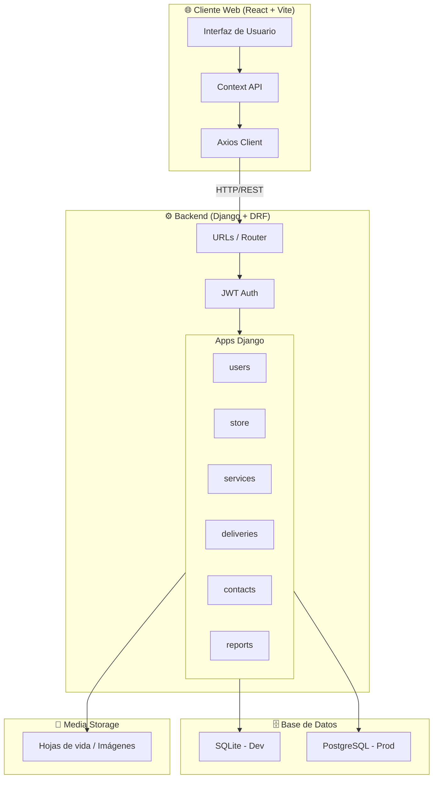
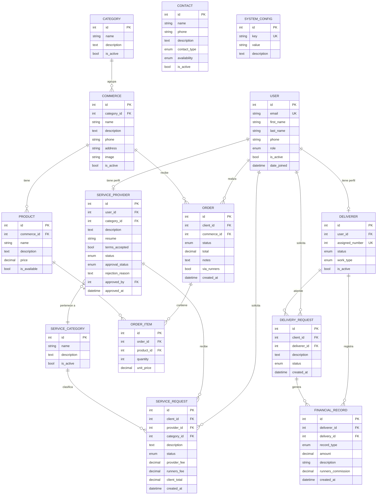
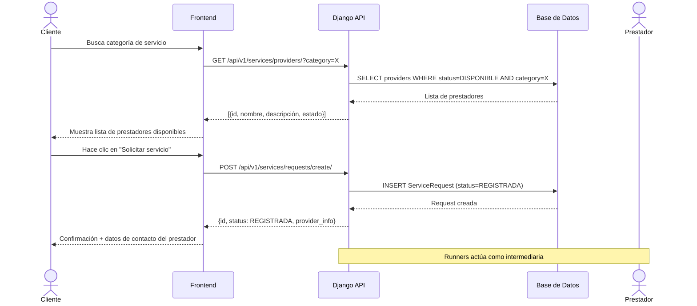
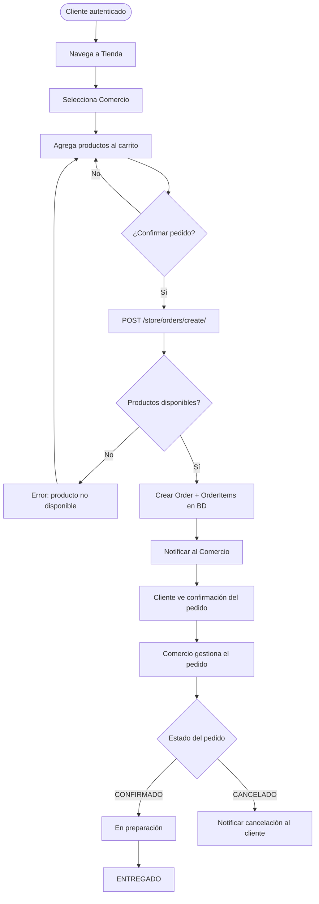
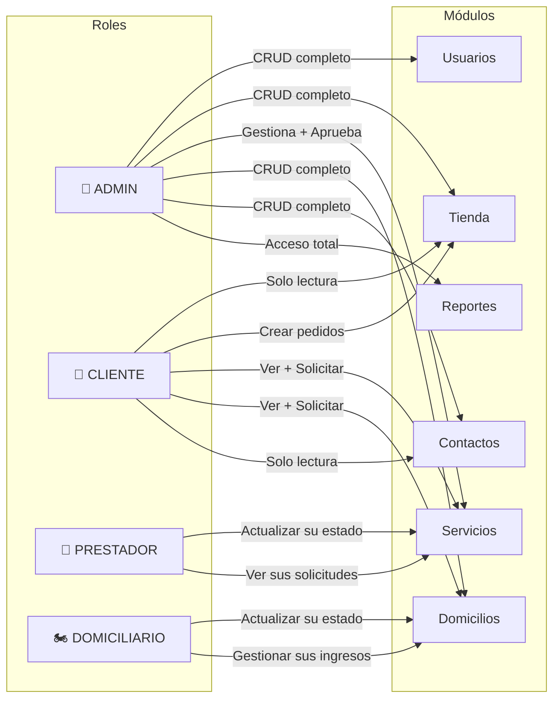
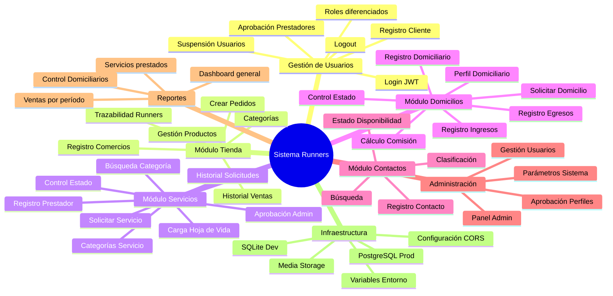

# 🏃 SISTEMA WEB RUNNERS
## Guía de Implementación y Desarrollo — Versión Inicial

> **Proyecto:** Sistema Web Runners – Plataforma de Intermediación de Servicios y Domicilios  
> **Empresa:** Runners – Caicedonia, Valle del Cauca (fundada 2019)  
> **Equipo:** 3 desarrolladores | **Duración:** 4 meses  
> **Stack:** Python 3.12 + Django 5.2.6 + DRF | React 19 + Vite 7 | PostgreSQL (prod) / SQLite (dev)

---

## 📋 TABLA DE CONTENIDOS

1. [Descripción General del Sistema](#descripción-general-del-sistema)
2. [Requisitos Funcionales](#requisitos-funcionales)
3. [Estructura de Carpetas](#estructura-de-carpetas)
4. [Instalaciones y Configuración del Entorno](#instalaciones-y-configuración-del-entorno)
5. [Base de Datos — Modelos Django](#base-de-datos--modelos-django)
6. [Backend — Código Completo](#backend--código-completo)
7. [Frontend — Estructura Base](#frontend--estructura-base)
8. [Diagramas Mermaid](#diagramas-mermaid)
9. [WBS y Backlog Inicial](#wbs-y-backlog-inicial)
10. [Sprints Sugeridos](#sprints-sugeridos)

---

## 1. Descripción General del Sistema

**Runners** es una plataforma web de intermediación que conecta a la comunidad de Caicedonia con:

- **Tiendas y restaurantes** — pedidos en línea con notificación directa al comercio.
- **Prestadores de servicios** — conexión intermediada entre clientes y profesionales (albañiles, contadores, doctores, etc.).
- **Domiciliarios** — gestión de pedidos, control de ingresos/egresos y deuda con la empresa.
- **Contactos de emergencia y profesionales** — directorio de disponibilidad en tiempo real.

> ⚠️ **Nota de alcance:** En esta implementación inicial **no se gestionan pagos reales**. El sistema automatiza el proceso de intermediación (lo que hoy se hace en papel o listas manuales).

---

## 2. Requisitos Funcionales

---

### RF-USR-001 — Registro de Cliente

| | | |
|---|---|---|
| **Código** | USR-RF-001 | |
| **Nombre** | Registro de cliente en la plataforma | |
| **Descripción** | Permite a una persona natural registrarse como cliente en la plataforma Runners para poder realizar pedidos, solicitar servicios y consultar el directorio de contactos. | |
| **Actores** | Cliente (usuario nuevo), Sistema | |
| | | |
| **Precondición** | El usuario no debe tener una cuenta registrada previamente con el mismo correo. | |
| | El sistema debe estar en línea y operativo. | |
| | | |
| | **Paso** | **Descripción** |
| **Secuencia normal** | 1 | El usuario accede a la página de registro desde la pantalla principal. |
| | 2 | El sistema presenta el formulario de registro (nombre, apellido, correo, teléfono, contraseña). |
| | 3 | El usuario diligencia el formulario y hace clic en "Registrarse". |
| | 4 | El sistema valida los campos obligatorios y el formato del correo. |
| | 5 | El sistema crea el usuario con rol `CLIENTE` y genera un token JWT. |
| | 6 | El usuario es redirigido al panel principal autenticado. |
| | | |
| **Secuencia alterna** | 1A | Si el correo ya existe, el sistema muestra un mensaje de error indicando que ya hay una cuenta registrada. |
| | 3A | Si el usuario ya tiene cuenta, puede hacer clic en "Iniciar sesión" para ir al login. |
| | | |
| **Excepciones** | E1 | Error de conexión con la base de datos: el sistema muestra un mensaje de error 500 y pide reintentar. |
| | E2 | Campos inválidos (correo mal formado, contraseña corta): el sistema muestra validación en línea sin enviar el formulario. |
| | | |
| **Postcondición** | El usuario queda registrado con rol `CLIENTE` en la base de datos. | |
| | El usuario recibe un JWT válido para operar en la plataforma. | |
| | | |
| **Comentarios** | Se puede añadir verificación por correo electrónico en versiones futuras. | |

---

### RF-USR-002 — Autenticación con JWT

| | | |
|---|---|---|
| **Código** | USR-RF-002 | |
| **Nombre** | Inicio de sesión con JWT | |
| **Descripción** | Permite a usuarios registrados (clientes, prestadores, domiciliarios, administradores) autenticarse en la plataforma y obtener tokens de acceso y refresco. | |
| **Actores** | Cliente, Prestador de Servicio, Domiciliario, Administrador, Sistema | |
| | | |
| **Precondición** | El usuario debe estar registrado y activo en el sistema. | |
| | | |
| | **Paso** | **Descripción** |
| **Secuencia normal** | 1 | El usuario accede a la pantalla de inicio de sesión. |
| | 2 | Ingresa correo y contraseña. |
| | 3 | El sistema valida las credenciales contra la base de datos. |
| | 4 | El sistema genera un `access_token` (15 min) y un `refresh_token` (7 días). |
| | 5 | El token se almacena en el cliente (localStorage o cookie segura). |
| | 6 | El usuario es redirigido a su panel según su rol. |
| | | |
| **Secuencia alterna** | 3A | Si las credenciales son incorrectas, el sistema muestra "Correo o contraseña incorrectos" sin especificar cuál falló (seguridad). |
| | 6A | Si el usuario está suspendido, el sistema muestra "Cuenta suspendida, contacte al administrador". |
| | | |
| **Excepciones** | E1 | Token expirado: el sistema usa el refresh_token para renovar automáticamente el access_token. |
| | E2 | Refresh expirado: el usuario es redirigido al login. |
| | | |
| **Postcondición** | El usuario queda autenticado con token válido. | |
| | El sistema registra la sesión activa. | |
| | | |
| **Comentarios** | Usar `djangorestframework-simplejwt` para la gestión de tokens. | |

---

### RF-USR-003 — Gestión de Roles

| | | |
|---|---|---|
| **Código** | USR-RF-003 | |
| **Nombre** | Diferenciación y control de roles | |
| **Descripción** | El sistema debe diferenciar y controlar el acceso según el rol del usuario: CLIENTE, PRESTADOR, DOMICILIARIO, ADMIN. | |
| **Actores** | Sistema, Administrador | |
| | | |
| **Precondición** | El usuario debe estar autenticado. | |
| | | |
| | **Paso** | **Descripción** |
| **Secuencia normal** | 1 | El sistema lee el campo `role` del token JWT o del perfil del usuario. |
| | 2 | El sistema aplica permisos de acceso según el rol. |
| | 3 | El frontend renderiza el menú y las vistas correspondientes al rol. |
| | 4 | El backend valida el rol en cada endpoint con decoradores de permisos. |
| | | |
| **Secuencia alterna** | 2A | Si un usuario intenta acceder a un endpoint no autorizado, el sistema devuelve HTTP 403 Forbidden. |
| | | |
| **Excepciones** | E1 | Token manipulado o inválido: el sistema devuelve HTTP 401 Unauthorized. |
| | | |
| **Postcondición** | Solo se permite el acceso a los recursos autorizados para cada rol. | |
| | | |
| **Comentarios** | El rol ADMIN puede gestionar todos los demás usuarios. Los roles se definen en el modelo de usuario personalizado. | |

---

### RF-USR-004 — Aprobación de Prestadores de Servicio

| | | |
|---|---|---|
| **Código** | USR-RF-004 | |
| **Nombre** | Aprobación de perfil de prestador por administrador | |
| **Descripción** | Un prestador de servicio debe ser aprobado por el administrador antes de aparecer activo en la plataforma, previa carga de hoja de vida. | |
| **Actores** | Prestador de Servicio, Administrador, Sistema | |
| | | |
| **Precondición** | El prestador debe haberse registrado y cargado su hoja de vida en formato PDF o imagen. | |
| | El administrador debe estar autenticado con rol ADMIN. | |
| | | |
| | **Paso** | **Descripción** |
| **Secuencia normal** | 1 | El prestador completa su perfil y adjunta hoja de vida. |
| | 2 | El sistema guarda el perfil con estado `PENDIENTE`. |
| | 3 | El administrador accede al panel de perfiles pendientes. |
| | 4 | El administrador revisa la hoja de vida y la información del prestador. |
| | 5 | El administrador aprueba o rechaza el perfil. |
| | 6 | El sistema actualiza el estado a `APROBADO` o `RECHAZADO` y notifica al prestador. |
| | | |
| **Secuencia alterna** | 5A | Si rechaza, el administrador puede dejar un comentario de motivo. |
| | | |
| **Excepciones** | E1 | Error al subir el archivo de hoja de vida (formato no soportado o tamaño excesivo): el sistema muestra mensaje de error con las restricciones permitidas. |
| | | |
| **Postcondición** | El prestador aprobado queda activo y visible para los clientes. | |
| | El prestador rechazado recibe notificación con motivo (si se registró). | |
| | | |
| **Comentarios** | Los tipos de archivo permitidos deben definirse en settings (PDF, JPG, PNG). Tamaño máximo recomendado: 5 MB. | |

---

### RF-TDA-001 — Registro de Comercio (Restaurante/Almacén)

| | | |
|---|---|---|
| **Código** | TDA-RF-001 | |
| **Nombre** | Registro de restaurante o almacén en la Tienda | |
| **Descripción** | Permite al administrador registrar un comercio (restaurante, almacén u otro tipo) en la plataforma, asignándole categoría, nombre, descripción e imagen. | |
| **Actores** | Administrador, Sistema | |
| | | |
| **Precondición** | El administrador debe estar autenticado. | |
| | La categoría del comercio debe existir en el sistema. | |
| | | |
| | **Paso** | **Descripción** |
| **Secuencia normal** | 1 | El administrador accede al panel de administración → Módulo Tienda → Registrar Comercio. |
| | 2 | El sistema presenta el formulario de registro de comercio. |
| | 3 | El administrador completa nombre, categoría, descripción, teléfono e imagen. |
| | 4 | El sistema guarda el comercio en la base de datos. |
| | 5 | El comercio queda visible en la tienda para los clientes. |
| | | |
| **Secuencia alterna** | 3A | Si la categoría no existe, el administrador puede crear una nueva categoría antes de continuar. |
| | | |
| **Excepciones** | E1 | Error al subir la imagen: el sistema muestra error y permite continuar sin imagen (opcional). |
| | | |
| **Postcondición** | El comercio queda registrado y disponible en la tienda. | |
| | | |
| **Comentarios** | En versiones futuras, los propios comerciantes podrán auto-registrarse y gestionar su catálogo. | |

---

### RF-TDA-002 — Gestión de Productos del Comercio

| | | |
|---|---|---|
| **Código** | TDA-RF-002 | |
| **Nombre** | Registro y gestión de productos de un comercio | |
| **Descripción** | Permite registrar, editar y desactivar productos asociados a un comercio registrado en la plataforma. | |
| **Actores** | Administrador, Sistema | |
| | | |
| **Precondición** | El comercio debe estar previamente registrado y activo. | |
| | | |
| | **Paso** | **Descripción** |
| **Secuencia normal** | 1 | El administrador selecciona el comercio desde el panel. |
| | 2 | Accede a la sección "Productos" del comercio. |
| | 3 | Hace clic en "Agregar producto". |
| | 4 | Completa nombre, descripción, precio e imagen del producto. |
| | 5 | El sistema guarda el producto asociado al comercio. |
| | 6 | El producto queda visible en el catálogo del comercio para clientes. |
| | | |
| **Secuencia alterna** | 4A | El administrador puede editar o desactivar un producto existente. |
| | | |
| **Excepciones** | E1 | Precio negativo o cero: el sistema muestra error de validación. |
| | | |
| **Postcondición** | El producto queda disponible en el catálogo del comercio. | |
| | | |
| **Comentarios** | El campo `disponible` (boolean) permite activar/desactivar productos sin eliminarlos. | |

---

### RF-TDA-003 — Generación de Pedido por Cliente

| | | |
|---|---|---|
| **Código** | TDA-RF-003 | |
| **Nombre** | Generación de pedido desde la tienda | |
| **Descripción** | Permite al cliente seleccionar productos de un comercio y generar un pedido que llega directamente al establecimiento a través de la plataforma. | |
| **Actores** | Cliente, Sistema, Comercio | |
| | | |
| **Precondición** | El cliente debe estar autenticado. | |
| | Los productos del comercio deben estar disponibles. | |
| | | |
| | **Paso** | **Descripción** |
| **Secuencia normal** | 1 | El cliente navega a la tienda y selecciona un comercio. |
| | 2 | El cliente selecciona uno o más productos y los agrega al carrito. |
| | 3 | El cliente revisa el carrito y hace clic en "Realizar pedido". |
| | 4 | El sistema registra el pedido con estado `PENDIENTE` y lo asocia al comercio. |
| | 5 | El comercio recibe notificación del nuevo pedido. |
| | 6 | El cliente visualiza el pedido en su historial con estado actualizado. |
| | | |
| **Secuencia alterna** | 2A | El cliente puede vaciar el carrito o eliminar productos antes de confirmar. |
| | 3A | Si el cliente no está autenticado, el sistema lo redirige al login antes de confirmar el pedido. |
| | | |
| **Excepciones** | E1 | Producto no disponible al momento de confirmar: el sistema muestra un aviso y elimina el ítem del carrito. |
| | | |
| **Postcondición** | El pedido queda registrado en el historial del cliente y del comercio. | |
| | El comercio recibe la notificación del pedido. | |
| | | |
| **Comentarios** | No se procesan pagos en esta implementación inicial. El seguimiento es informativo para la plataforma. | |

---

### RF-TDA-004 — Historial de Ventas

| | | |
|---|---|---|
| **Código** | TDA-RF-004 | |
| **Nombre** | Visualización del historial de ventas | |
| **Descripción** | Permite al administrador y a los comercios ver el historial de pedidos generados a través de la plataforma, incluyendo qué se vendió, cuándo y a través de qué canal. | |
| **Actores** | Administrador, Sistema | |
| | | |
| **Precondición** | Deben existir pedidos registrados en el sistema. | |
| | El administrador debe estar autenticado. | |
| | | |
| | **Paso** | **Descripción** |
| **Secuencia normal** | 1 | El administrador accede al módulo de Reportes → Historial de Ventas. |
| | 2 | El sistema muestra listado de pedidos con filtros por fecha, comercio y estado. |
| | 3 | El administrador aplica filtros según necesidad. |
| | 4 | El sistema muestra los resultados filtrados con detalle de cada transacción. |
| | | |
| **Secuencia alterna** | 3A | Si no hay pedidos en el rango seleccionado, el sistema muestra "Sin resultados para el período indicado". |
| | | |
| **Excepciones** | E1 | Error en la consulta a la base de datos: el sistema muestra mensaje de error y permite reintentar. |
| | | |
| **Postcondición** | El administrador puede ver la trazabilidad completa de ventas vía Runners. | |
| | | |
| **Comentarios** | Se puede extender con exportación a CSV o PDF en versiones futuras. | |

---

### RF-SRV-001 — Registro de Prestador de Servicio

| | | |
|---|---|---|
| **Código** | SRV-RF-001 | |
| **Nombre** | Registro de prestador de servicio | |
| **Descripción** | Permite a una persona registrarse como prestador de servicio en la plataforma, cargando su información profesional y hoja de vida para revisión del administrador. | |
| **Actores** | Prestador de Servicio, Sistema | |
| | | |
| **Precondición** | La persona no debe tener un perfil de prestador activo con el mismo correo. | |
| | El sistema debe tener al menos una categoría de servicio registrada. | |
| | | |
| | **Paso** | **Descripción** |
| **Secuencia normal** | 1 | El prestador accede a la sección "Registrarme como prestador". |
| | 2 | El sistema muestra formulario con campos: nombre, especialidad/categoría, descripción, teléfono, hoja de vida (archivo), aceptación de términos. |
| | 3 | El prestador completa el formulario y acepta los términos y condiciones. |
| | 4 | El sistema guarda el perfil con estado `PENDIENTE` a espera de aprobación. |
| | 5 | El prestador recibe confirmación de que su perfil está en revisión. |
| | | |
| **Secuencia alterna** | 3A | Si no acepta los términos, el sistema no permite continuar y resalta el campo. |
| | | |
| **Excepciones** | E1 | Error al cargar el archivo de hoja de vida: el sistema muestra mensaje con formatos y tamaño permitido. |
| | | |
| **Postcondición** | El perfil del prestador queda registrado con estado PENDIENTE. | |
| | El administrador recibe notificación de nuevo perfil a revisar. | |
| | | |
| **Comentarios** | Términos y condiciones deben redactarse como documento legal separado. | |

---

### RF-SRV-002 — Búsqueda y Solicitud de Servicio

| | | |
|---|---|---|
| **Código** | SRV-RF-002 | |
| **Nombre** | Búsqueda y solicitud de servicio por categoría | |
| **Descripción** | Permite al cliente buscar servicios por categoría (ej: plomería, contabilidad, medicina) y solicitar un prestador disponible a través de la plataforma. | |
| **Actores** | Cliente, Sistema, Prestador de Servicio | |
| | | |
| **Precondición** | El cliente debe estar autenticado. | |
| | Deben existir prestadores aprobados y con estado DISPONIBLE en la categoría buscada. | |
| | | |
| | **Paso** | **Descripción** |
| **Secuencia normal** | 1 | El cliente accede al módulo Servicios. |
| | 2 | Selecciona o busca una categoría de servicio. |
| | 3 | El sistema muestra la lista de prestadores disponibles en esa categoría. |
| | 4 | El cliente hace clic en "Solicitar servicio" sobre el prestador elegido. |
| | 5 | El sistema registra la solicitud y la redirige (rebota) a la plataforma Runners como intermediaria. |
| | 6 | El sistema notifica al prestador y genera el registro de la solicitud. |
| | 7 | El cliente visualiza los datos de contacto del prestador para coordinar. |
| | | |
| **Secuencia alterna** | 3A | Si no hay prestadores disponibles, el sistema muestra "Sin prestadores disponibles en este momento". |
| | | |
| **Excepciones** | E1 | El prestador cambia a estado OCUPADO mientras el cliente confirma: el sistema recalcula disponibilidad y lo informa. |
| | | |
| **Postcondición** | La solicitud queda registrada en el historial de la plataforma. | |
| | Runners queda como intermediaria del contacto entre cliente y prestador. | |
| | | |
| **Comentarios** | El sistema debe registrar la comisión de Runners (ej: prestador cobra $50.000, cliente paga $60.000). La gestión del cobro es manual en esta versión. | |

---

### RF-SRV-003 — Control de Estado del Prestador

| | | |
|---|---|---|
| **Código** | SRV-RF-003 | |
| **Nombre** | Cambio de estado del prestador (Disponible / Ocupado / Inactivo) | |
| **Descripción** | Permite al prestador de servicio actualizar su estado de disponibilidad dentro de la plataforma para que los clientes vean si puede atender solicitudes. | |
| **Actores** | Prestador de Servicio, Sistema | |
| | | |
| **Precondición** | El prestador debe estar aprobado y autenticado. | |
| | | |
| | **Paso** | **Descripción** |
| **Secuencia normal** | 1 | El prestador accede a su panel de perfil. |
| | 2 | Visualiza su estado actual (Disponible / Ocupado / Inactivo). |
| | 3 | Hace clic en el botón de cambio de estado. |
| | 4 | El sistema actualiza el estado en la base de datos. |
| | 5 | El cambio se refleja en tiempo real en el módulo de Servicios. |
| | | |
| **Secuencia alterna** | 4A | Si hay solicitudes activas asignadas al prestador, el sistema advierte antes de pasar a INACTIVO. |
| | | |
| **Excepciones** | E1 | Error de conexión al guardar el estado: el sistema muestra mensaje de error y conserva el estado anterior. |
| | | |
| **Postcondición** | El estado del prestador se actualiza y los clientes solo ven prestadores DISPONIBLES. | |
| | | |
| **Comentarios** | El estado INACTIVO significa que el prestador está deshabilitado temporalmente por decisión propia o administrativa. | |

---

### RF-DOM-001 — Registro de Domiciliario

| | | |
|---|---|---|
| **Código** | DOM-RF-001 | |
| **Nombre** | Registro de domiciliario en la plataforma | |
| **Descripción** | Permite registrar a un domiciliario con su perfil, número asignado e información de contacto para que los clientes puedan solicitarlo directamente. | |
| **Actores** | Administrador, Sistema | |
| | | |
| **Precondición** | El administrador debe estar autenticado. | |
| | | |
| | **Paso** | **Descripción** |
| **Secuencia normal** | 1 | El administrador accede al módulo de Domicilios → Registrar domiciliario. |
| | 2 | Completa el formulario con: nombre, teléfono, número asignado, tipo (independiente / empresa). |
| | 3 | El sistema guarda el perfil del domiciliario con estado DISPONIBLE por defecto. |
| | 4 | El domiciliario aparece en el módulo de domicilios para los clientes. |
| | | |
| **Secuencia alterna** | 2A | El propio domiciliario puede auto-registrarse (rol DOMICILIARIO) y el administrador lo aprueba. |
| | | |
| **Excepciones** | E1 | Número asignado duplicado: el sistema valida unicidad y muestra error. |
| | | |
| **Postcondición** | El domiciliario queda activo en la plataforma con su perfil y número. | |
| | | |
| **Comentarios** | El número asignado es el identificador visual del domiciliario dentro de la plataforma. | |

---

### RF-DOM-002 — Control de Ingresos y Egresos del Domiciliario

| | | |
|---|---|---|
| **Código** | DOM-RF-002 | |
| **Nombre** | Registro y control de ingresos y egresos del domiciliario | |
| **Descripción** | Permite al domiciliario registrar sus favores/servicios realizados, llevar control de sus ingresos y egresos, y calcular cuánto debe pagarle a la empresa Runners. | |
| **Actores** | Domiciliario, Administrador, Sistema | |
| | | |
| **Precondición** | El domiciliario debe estar registrado y autenticado. | |
| | | |
| | **Paso** | **Descripción** |
| **Secuencia normal** | 1 | El domiciliario accede a su panel de control financiero. |
| | 2 | Registra un nuevo favor/servicio con descripción y valor. |
| | 3 | El sistema suma el valor al total de ingresos del domiciliario. |
| | 4 | El sistema calcula automáticamente el porcentaje que corresponde a Runners. |
| | 5 | El domiciliario puede ver su balance: ingresos, egresos y deuda con Runners. |
| | | |
| **Secuencia alterna** | 2A | El domiciliario puede registrar un egreso (gasto) para restar del balance. |
| | | |
| **Excepciones** | E1 | Valor ingresado negativo o no numérico: el sistema muestra error de validación. |
| | | |
| **Postcondición** | El registro queda guardado en el historial del domiciliario. | |
| | El administrador puede consultar el estado financiero de cada domiciliario. | |
| | | |
| **Comentarios** | El porcentaje de comisión de Runners se configura en el panel de administración como parámetro del sistema. | |

---

### RF-DOM-003 — Solicitud de Domicilio por Cliente

| | | |
|---|---|---|
| **Código** | DOM-RF-003 | |
| **Nombre** | Solicitud directa de domiciliario por el cliente | |
| **Descripción** | Permite al cliente ingresar al módulo de domicilios, ver los domiciliarios disponibles y solicitar uno directamente desde la plataforma. | |
| **Actores** | Cliente, Sistema, Domiciliario | |
| | | |
| **Precondición** | El cliente debe estar autenticado. | |
| | Debe haber al menos un domiciliario con estado DISPONIBLE. | |
| | | |
| | **Paso** | **Descripción** |
| **Secuencia normal** | 1 | El cliente accede al módulo de Domicilios. |
| | 2 | El sistema muestra lista de domiciliarios disponibles con nombre, número asignado y estado. |
| | 3 | El cliente selecciona un domiciliario y hace clic en "Solicitar". |
| | 4 | El sistema registra la solicitud y notifica al domiciliario. |
| | 5 | El cliente recibe la confirmación del domiciliario asignado con datos de contacto. |
| | | |
| **Secuencia alterna** | 3A | Si el domiciliario pasa a OCUPADO antes de confirmar, el sistema advierte y sugiere otro disponible. |
| | | |
| **Excepciones** | E1 | Sin domiciliarios disponibles: el sistema muestra mensaje informativo. |
| | | |
| **Postcondición** | La solicitud queda registrada en el historial del sistema. | |
| | El domiciliario queda en estado OCUPADO durante el servicio. | |
| | | |
| **Comentarios** | [Por definir] flujo de finalización de servicio y retorno al estado DISPONIBLE. | |

---

### RF-CON-001 — Registro de Contacto de Emergencia o Profesional

| | | |
|---|---|---|
| **Código** | CON-RF-001 | |
| **Nombre** | Registro de contacto en el directorio | |
| **Descripción** | Permite al administrador registrar contactos importantes (emergencias, profesionales, servicios) en el directorio de la plataforma, que los clientes pueden consultar. | |
| **Actores** | Administrador, Sistema | |
| | | |
| **Precondición** | El administrador debe estar autenticado. | |
| | | |
| | **Paso** | **Descripción** |
| **Secuencia normal** | 1 | El administrador accede al módulo Contactos → Registrar contacto. |
| | 2 | Completa: nombre, número de teléfono, descripción, clasificación (Emergencia / Profesional) y estado inicial. |
| | 3 | El sistema guarda el contacto en el directorio. |
| | 4 | El contacto queda visible para todos los clientes en la plataforma. |
| | | |
| **Secuencia alterna** | 2A | El propio profesional puede solicitar ser registrado y el administrador aprueba. |
| | | |
| **Excepciones** | E1 | Número de teléfono duplicado: el sistema valida unicidad y muestra advertencia. |
| | | |
| **Postcondición** | El contacto aparece en el directorio con su clasificación y estado de disponibilidad. | |
| | | |
| **Comentarios** | El directorio debe incluir obligatoriamente contactos de emergencia: Policía, Bomberos, hospitales. | |

---

### RF-CON-002 — Búsqueda y Filtrado de Contactos

| | | |
|---|---|---|
| **Código** | CON-RF-002 | |
| **Nombre** | Búsqueda de contactos por nombre o categoría | |
| **Descripción** | Permite al cliente buscar contactos en el directorio usando un campo de búsqueda y filtrar por disponibilidad o tipo de contacto. | |
| **Actores** | Cliente, Sistema | |
| | | |
| **Precondición** | Deben existir contactos registrados en el directorio. | |
| | | |
| | **Paso** | **Descripción** |
| **Secuencia normal** | 1 | El cliente accede al módulo de Contactos. |
| | 2 | El sistema muestra el directorio con todos los contactos activos. |
| | 3 | El cliente escribe en el buscador o aplica filtro de disponibilidad. |
| | 4 | El sistema filtra y muestra los resultados que coinciden. |
| | 5 | El cliente visualiza el número de contacto y puede llamar directamente desde el dispositivo. |
| | | |
| **Secuencia alterna** | 3A | Si el filtro no da resultados, el sistema muestra "Sin resultados para tu búsqueda". |
| | | |
| **Excepciones** | E1 | Error al cargar el directorio: el sistema muestra mensaje de error y opción de recargar. |
| | | |
| **Postcondición** | El cliente encuentra el contacto que necesita y puede comunicarse directamente. | |
| | | |
| **Comentarios** | La plataforma no gestiona la llamada; solo proporciona el número. La marcación ocurre fuera de la plataforma. | |

---

### RF-CON-003 — Creación de Contacto o Servicio por el Usuario

| | | |
|---|---|---|
| **Código** | CON-RF-003 | |
| **Nombre** | Solicitud de creación de contacto o servicio local | |
| **Descripción** | Permite al usuario presionar una cuadrícula con un botón '+' central para abrir un formulario y agregar su propio número al directorio como "Contacto" (público) o "Servicio" (privado). La publicación está sujeta a la aprobación del administrador y se restringe a un solo registro por usuario. | |
| **Actores** | Cliente, Sistema, Administrador | |
| | | |
| **Precondición** | El usuario debe estar autenticado con su email en la plataforma. | |
| | El usuario no debe tener un contacto previo ya registrado (se valida unicidad 1 a 1). | |
| | | |
| | **Paso** | **Descripción** |
| **Secuencia normal** | 1 | El usuario navega al directorio y visualiza la cuadrícula con el círculo central y el símbolo `+`. |
| | 2 | Al presionar, se abre un modal de "Agregar Contacto" con campos: teléfono, nombre completo, descripción y un menú cascada (Contacto / Servicio). |
| | 3 | El usuario llena los datos y presiona el botón "Crear contacto". |
| | 4 | El sistema valida que el usuario no tenga otro contacto ya creado. |
| | 5 | Se guarda en base de datos con estado `PENDIENTE`. |
| | 6 | El administrador recibe la solicitud en su panel y la aprueba. |
| | 7 | El registro se publica y aparece en el directorio de todos los usuarios. |
| | | |
| **Secuencia alterna** | 7A | Si el usuario seleccionó "Servicio", el registro se publica pero el **número telefónico es Privado**. Solo puede ser visto por el creador y el administrador. |
| | 7B | Si se seleccionó "Contacto", el número es **Público** y visible. |
| | | |
| **Excepciones** | E1 | El usuario ya tiene un contacto: el sistema devuelve aviso local ("Ya tienes un registro creado"). |
| | | |
| **Postcondición** | La solicitud queda registrada en estado PENDIENTE. | |
| | | |
| **Comentarios** | El backend en Django maneja automáticamente la regla de enmascarar u ocultar el campo `phone` según el rol de quien consulta la API. | |

---

### RF-ADM-001 — Panel de Administración General

| | | |
|---|---|---|
| **Código** | ADM-RF-001 | |
| **Nombre** | Panel de control para el administrador | |
| **Descripción** | Proporciona al administrador un panel centralizado para gestionar usuarios, aprobar perfiles, activar/suspender cuentas y configurar parámetros del sistema. | |
| **Actores** | Administrador, Sistema | |
| | | |
| **Precondición** | El usuario debe estar autenticado con rol ADMIN. | |
| | | |
| | **Paso** | **Descripción** |
| **Secuencia normal** | 1 | El administrador inicia sesión y es redirigido al panel de administración. |
| | 2 | El panel muestra resumen de: usuarios activos, pedidos pendientes, prestadores en espera de aprobación. |
| | 3 | El administrador puede navegar a cada módulo de gestión desde el panel. |
| | 4 | Puede activar, suspender o eliminar usuarios desde la vista de gestión. |
| | 5 | Puede configurar parámetros como porcentaje de comisión de Runners. |
| | | |
| **Secuencia alterna** | 4A | Si suspende un usuario activo con solicitudes en curso, el sistema advierte y permite confirmar o cancelar la acción. |
| | | |
| **Excepciones** | E1 | Intento de eliminar al único administrador: el sistema impide la operación. |
| | | |
| **Postcondición** | Los cambios realizados desde el panel tienen efecto inmediato en la plataforma. | |
| | | |
| **Comentarios** | El Django Admin nativo puede usarse como respaldo del panel. Se recomienda construir un panel personalizado en React para mejor experiencia. | |

---

## 3. Estructura de Carpetas

```
runners/
├── backend/                          # Django REST Framework
│   ├── manage.py
│   ├── requirements.txt
│   ├── .env                          # Variables de entorno (NO subir a git)
│   ├── .env.example
│   ├── runners_project/              # Configuración principal del proyecto
│   │   ├── __init__.py
│   │   ├── settings/
│   │   │   ├── __init__.py
│   │   │   ├── base.py               # Settings comunes
│   │   │   ├── development.py        # SQLite + Debug ON
│   │   │   └── production.py         # PostgreSQL + Debug OFF
│   │   ├── urls.py                   # URL raíz
│   │   ├── wsgi.py
│   │   └── asgi.py
│   ├── apps/
│   │   ├── users/                    # Gestión de usuarios y roles
│   │   │   ├── __init__.py
│   │   │   ├── models.py
│   │   │   ├── serializers.py
│   │   │   ├── views.py
│   │   │   ├── urls.py
│   │   │   ├── permissions.py
│   │   │   ├── admin.py
│   │   │   └── tests.py
│   │   ├── store/                    # Módulo Tienda
│   │   │   ├── __init__.py
│   │   │   ├── models.py
│   │   │   ├── serializers.py
│   │   │   ├── views.py
│   │   │   ├── urls.py
│   │   │   ├── admin.py
│   │   │   └── tests.py
│   │   ├── services/                 # Módulo Servicios
│   │   │   ├── __init__.py
│   │   │   ├── models.py
│   │   │   ├── serializers.py
│   │   │   ├── views.py
│   │   │   ├── urls.py
│   │   │   ├── admin.py
│   │   │   └── tests.py
│   │   ├── deliveries/               # Módulo Domicilios
│   │   │   ├── __init__.py
│   │   │   ├── models.py
│   │   │   ├── serializers.py
│   │   │   ├── views.py
│   │   │   ├── urls.py
│   │   │   ├── admin.py
│   │   │   └── tests.py
│   │   ├── contacts/                 # Módulo Contactos
│   │   │   ├── __init__.py
│   │   │   ├── models.py
│   │   │   ├── serializers.py
│   │   │   ├── views.py
│   │   │   ├── urls.py
│   │   │   ├── admin.py
│   │   │   └── tests.py
│   │   └── reports/                  # Módulo Reportes
│   │       ├── __init__.py
│   │       ├── views.py
│   │       ├── urls.py
│   │       └── tests.py
│   └── media/                        # Archivos subidos (hojas de vida, imágenes)
│
├── frontend/                         # React + Vite
│   ├── index.html
│   ├── package.json
│   ├── vite.config.js
│   ├── eslint.config.js
│   ├── .env
│   ├── .env.example
│   └── src/
│       ├── main.jsx
│       ├── App.jsx
│       ├── api/                      # Clientes axios por módulo
│       │   ├── axiosConfig.js
│       │   ├── authApi.js
│       │   ├── storeApi.js
│       │   ├── servicesApi.js
│       │   ├── deliveriesApi.js
│       │   └── contactsApi.js
│       ├── context/                  # Context API
│       │   ├── AuthContext.jsx
│       │   └── CartContext.jsx
│       ├── hooks/                    # Custom hooks
│       │   ├── useAuth.js
│       │   └── useCart.js
│       ├── components/               # Componentes reutilizables
│       │   ├── common/
│       │   │   ├── Navbar.jsx
│       │   │   ├── Footer.jsx
│       │   │   ├── ProtectedRoute.jsx
│       │   │   ├── LoadingSpinner.jsx
│       │   │   └── ErrorMessage.jsx
│       │   ├── store/
│       │   │   ├── ProductCard.jsx
│       │   │   ├── Cart.jsx
│       │   │   └── CategoryFilter.jsx
│       │   ├── services/
│       │   │   ├── ServiceCard.jsx
│       │   │   └── ProviderCard.jsx
│       │   ├── deliveries/
│       │   │   └── DeliveryCard.jsx
│       │   └── contacts/
│       │       └── ContactCard.jsx
│       ├── pages/                    # Vistas principales
│       │   ├── Home.jsx
│       │   ├── Login.jsx
│       │   ├── Register.jsx
│       │   ├── store/
│       │   │   ├── StorePage.jsx
│       │   │   ├── ComercioDetail.jsx
│       │   │   └── OrderHistory.jsx
│       │   ├── services/
│       │   │   ├── ServicesPage.jsx
│       │   │   ├── ServiceDetail.jsx
│       │   │   └── ProviderProfile.jsx
│       │   ├── deliveries/
│       │   │   ├── DeliveriesPage.jsx
│       │   │   └── DeliveryDashboard.jsx
│       │   ├── contacts/
│       │   │   └── ContactsPage.jsx
│       │   └── admin/
│       │       ├── AdminDashboard.jsx
│       │       ├── ManageUsers.jsx
│       │       ├── ManageProviders.jsx
│       │       ├── ManageStore.jsx
│       │       └── Reports.jsx
│       ├── router/
│       │   └── AppRouter.jsx
│       └── assets/
│           └── logo.svg
│
├── docs/                             # Documentación del proyecto
│   ├── diagramas/
│   ├── requisitos/
│   └── actas/
│
├── .gitignore
└── README.md
```

---

## 4. Instalaciones y Configuración del Entorno

### 4.1 Requisitos Previos

```bash
# Verificar versiones requeridas
python --version      # >= 3.12
node --version        # >= 18
npm --version         # >= 9
git --version
```

### 4.2 Clonar el repositorio e inicializar

```bash
git clone https://github.com/tu-org/runners.git
cd runners
```

### 4.3 Configuración del Backend (Django)

```bash
# Crear entorno virtual
cd backend
python -m venv venv

# Activar entorno (Linux/Mac)
source venv/bin/activate
# Activar entorno (Windows)
venv\Scripts\activate

# Instalar dependencias
pip install -r requirements.txt
```

#### `backend/requirements.txt`

```txt
Django==5.2.6
djangorestframework==3.16.1
djangorestframework-simplejwt==5.5.1
PyJWT==2.10.1
django-cors-headers==4.8.0
Pillow==11.3.0
psycopg2-binary==2.9.10
python-dotenv==1.1.1
asgiref==3.9.1
sqlparse==0.5.3
tzdata==2025.2
```

#### `backend/.env.example`

```env
# Django
SECRET_KEY=tu_clave_secreta_aqui
DEBUG=True
ALLOWED_HOSTS=localhost,127.0.0.1

# Base de datos (desarrollo usa SQLite por defecto)
DB_ENGINE=django.db.backends.sqlite3
DB_NAME=db.sqlite3

# Para producción con PostgreSQL descomentar:
# DB_ENGINE=django.db.backends.postgresql
# DB_NAME=runners_db
# DB_USER=runners_user
# DB_PASSWORD=tu_password
# DB_HOST=localhost
# DB_PORT=5432

# Media
MEDIA_URL=/media/
MEDIA_ROOT=media/

# CORS
CORS_ALLOWED_ORIGINS=http://localhost:5173,http://127.0.0.1:5173

# JWT
JWT_ACCESS_TOKEN_LIFETIME_MINUTES=15
JWT_REFRESH_TOKEN_LIFETIME_DAYS=7
```

```bash
# Copiar y configurar variables de entorno
cp .env.example .env
# Editar .env con tus valores

# Crear migraciones y base de datos
python manage.py makemigrations
python manage.py migrate

# Crear superusuario administrador
python manage.py createsuperuser

# Cargar datos iniciales (fixtures)
python manage.py loaddata initial_data.json   # Si existen

# Iniciar servidor de desarrollo
python manage.py runserver
# Servidor disponible en: http://localhost:8000
```


### 4.4 Configuración del Frontend (Flutter + Dart)

```bash
# Ingresar a la carpeta del frontend
cd frontend

# Descargar las dependencias y paquetes de Dart
flutter pub get

# Copiar el archivo de variables de entorno
cp .env.example .env
# --- EJECUCIÓN ---

# Ejecutar la aplicación (Flutter detectará automáticamente tu emulador abierto o Chrome)
flutter run

# Si tienes múltiples dispositivos conectados o quieres forzar un emulador web específico:
# flutter run -d chrome
# flutter run -d edge

# --- CONSTRUCCIÓN PARA PRODUCCIÓN (WEB) ---

# Cuando vayas a generar tus archivos finales para desplegar la app web:
flutter build web --release
# Los archivos compilados quedarán en: frontend/build/web/


## 5. Base de Datos — Modelos Django

### `backend/runners_project/settings/base.py`

```python
from pathlib import Path
from dotenv import load_dotenv
import os

load_dotenv()

BASE_DIR = Path(__file__).resolve().parent.parent.parent

SECRET_KEY = os.getenv('SECRET_KEY', 'django-insecure-change-this-in-production')
DEBUG = os.getenv('DEBUG', 'True') == 'True'
ALLOWED_HOSTS = os.getenv('ALLOWED_HOSTS', 'localhost').split(',')

# Aplicaciones instaladas
DJANGO_APPS = [
    'django.contrib.admin',
    'django.contrib.auth',
    'django.contrib.contenttypes',
    'django.contrib.sessions',
    'django.contrib.messages',
    'django.contrib.staticfiles',
]

THIRD_PARTY_APPS = [
    'rest_framework',
    'rest_framework_simplejwt',
    'corsheaders',
]

LOCAL_APPS = [
    'apps.users',
    'apps.store',
    'apps.services',
    'apps.deliveries',
    'apps.contacts',
    'apps.reports',
]

INSTALLED_APPS = DJANGO_APPS + THIRD_PARTY_APPS + LOCAL_APPS

MIDDLEWARE = [
    'django.middleware.security.SecurityMiddleware',
    'corsheaders.middleware.CorsMiddleware',  # CORS antes de CommonMiddleware
    'django.contrib.sessions.middleware.SessionMiddleware',
    'django.middleware.common.CommonMiddleware',
    'django.middleware.csrf.CsrfViewMiddleware',
    'django.contrib.auth.middleware.AuthenticationMiddleware',
    'django.contrib.messages.middleware.MessageMiddleware',
    'django.middleware.clickjacking.XFrameOptionsMiddleware',
]

ROOT_URLCONF = 'runners_project.urls'

TEMPLATES = [
    {
        'BACKEND': 'django.template.backends.django.DjangoTemplates',
        'DIRS': [],
        'APP_DIRS': True,
        'OPTIONS': {
            'context_processors': [
                'django.template.context_processors.debug',
                'django.template.context_processors.request',
                'django.contrib.auth.context_processors.auth',
                'django.contrib.messages.context_processors.messages',
            ],
        },
    },
]

WSGI_APPLICATION = 'runners_project.wsgi.application'

# Modelo de usuario personalizado
AUTH_USER_MODEL = 'users.User'

# Configuración REST Framework
REST_FRAMEWORK = {
    'DEFAULT_AUTHENTICATION_CLASSES': (
        'rest_framework_simplejwt.authentication.JWTAuthentication',
    ),
    'DEFAULT_PERMISSION_CLASSES': [
        'rest_framework.permissions.IsAuthenticated',
    ],
    'DEFAULT_PAGINATION_CLASS': 'rest_framework.pagination.PageNumberPagination',
    'PAGE_SIZE': 20,
}

# JWT
from datetime import timedelta
SIMPLE_JWT = {
    'ACCESS_TOKEN_LIFETIME': timedelta(minutes=int(os.getenv('JWT_ACCESS_TOKEN_LIFETIME_MINUTES', 15))),
    'REFRESH_TOKEN_LIFETIME': timedelta(days=int(os.getenv('JWT_REFRESH_TOKEN_LIFETIME_DAYS', 7))),
    'ROTATE_REFRESH_TOKENS': True,
    'BLACKLIST_AFTER_ROTATION': True,
    'AUTH_HEADER_TYPES': ('Bearer',),
}

# CORS
CORS_ALLOWED_ORIGINS = os.getenv('CORS_ALLOWED_ORIGINS', 'http://localhost:5173').split(',')
CORS_ALLOW_CREDENTIALS = True

# Media
MEDIA_URL = os.getenv('MEDIA_URL', '/media/')
MEDIA_ROOT = BASE_DIR / os.getenv('MEDIA_ROOT', 'media')

# Static
STATIC_URL = '/static/'
STATIC_ROOT = BASE_DIR / 'staticfiles'

DEFAULT_AUTO_FIELD = 'django.db.models.BigAutoField'

LANGUAGE_CODE = 'es-co'
TIME_ZONE = 'America/Bogota'
USE_I18N = True
USE_TZ = True
```

### `backend/runners_project/settings/development.py`

```python
from .base import *

DEBUG = True

DATABASES = {
    'default': {
        'ENGINE': 'django.db.backends.sqlite3',
        'NAME': BASE_DIR / 'db.sqlite3',
    }
}
```

### `backend/runners_project/settings/production.py`

```python
from .base import *
import os

DEBUG = False

DATABASES = {
    'default': {
        'ENGINE': 'django.db.backends.postgresql',
        'NAME': os.getenv('DB_NAME'),
        'USER': os.getenv('DB_USER'),
        'PASSWORD': os.getenv('DB_PASSWORD'),
        'HOST': os.getenv('DB_HOST', 'localhost'),
        'PORT': os.getenv('DB_PORT', '5432'),
    }
}

SECURE_BROWSER_XSS_FILTER = True
SECURE_CONTENT_TYPE_NOSNIFF = True
```

### `backend/runners_project/urls.py`

```python
from django.contrib import admin
from django.urls import path, include
from django.conf import settings
from django.conf.urls.static import static

urlpatterns = [
    path('admin/', admin.site.urls),
    path('api/v1/', include([
        path('auth/', include('apps.users.urls')),
        path('store/', include('apps.store.urls')),
        path('services/', include('apps.services.urls')),
        path('deliveries/', include('apps.deliveries.urls')),
        path('contacts/', include('apps.contacts.urls')),
        path('reports/', include('apps.reports.urls')),
    ])),
]

if settings.DEBUG:
    urlpatterns += static(settings.MEDIA_URL, document_root=settings.MEDIA_ROOT)
```

---

### 5.1 Modelos — `apps/users/models.py`

```python
from django.contrib.auth.models import AbstractBaseUser, PermissionsMixin, BaseUserManager
from django.db import models


class UserManager(BaseUserManager):
    def create_user(self, email, password=None, **extra_fields):
        if not email:
            raise ValueError('El correo es obligatorio.')
        email = self.normalize_email(email)
        user = self.model(email=email, **extra_fields)
        user.set_password(password)
        user.save(using=self._db)
        return user

    def create_superuser(self, email, password=None, **extra_fields):
        extra_fields.setdefault('role', User.Role.ADMIN)
        extra_fields.setdefault('is_staff', True)
        extra_fields.setdefault('is_superuser', True)
        return self.create_user(email, password, **extra_fields)


class User(AbstractBaseUser, PermissionsMixin):
    class Role(models.TextChoices):
        CLIENTE = 'CLIENTE', 'Cliente'
        PRESTADOR = 'PRESTADOR', 'Prestador de Servicio'
        DOMICILIARIO = 'DOMICILIARIO', 'Domiciliario'
        ADMIN = 'ADMIN', 'Administrador'

    email = models.EmailField(unique=True)
    first_name = models.CharField(max_length=100)
    last_name = models.CharField(max_length=100)
    phone = models.CharField(max_length=20, blank=True, null=True)
    role = models.CharField(max_length=20, choices=Role.choices, default=Role.CLIENTE)
    is_active = models.BooleanField(default=True)
    is_staff = models.BooleanField(default=False)
    date_joined = models.DateTimeField(auto_now_add=True)
    updated_at = models.DateTimeField(auto_now=True)

    objects = UserManager()

    USERNAME_FIELD = 'email'
    REQUIRED_FIELDS = ['first_name', 'last_name']

    class Meta:
        db_table = 'runners_users'
        verbose_name = 'Usuario'
        verbose_name_plural = 'Usuarios'
        ordering = ['-date_joined']

    def __str__(self):
        return f'{self.get_full_name()} ({self.role})'

    def get_full_name(self):
        return f'{self.first_name} {self.last_name}'
```

---

### 5.2 Modelos — `apps/store/models.py`

```python
from django.db import models
from apps.users.models import User


class Category(models.Model):
    name = models.CharField(max_length=100, unique=True)
    description = models.TextField(blank=True)
    icon = models.CharField(max_length=50, blank=True)  # Nombre de ícono o clase CSS
    is_active = models.BooleanField(default=True)
    created_at = models.DateTimeField(auto_now_add=True)

    class Meta:
        db_table = 'store_categories'
        verbose_name = 'Categoría'
        verbose_name_plural = 'Categorías'

    def __str__(self):
        return self.name


class Commerce(models.Model):
    """Representa un restaurante o almacén registrado en la tienda."""
    category = models.ForeignKey(Category, on_delete=models.PROTECT, related_name='commerces')
    name = models.CharField(max_length=200)
    description = models.TextField(blank=True)
    phone = models.CharField(max_length=20, blank=True)
    address = models.CharField(max_length=255, blank=True)
    image = models.ImageField(upload_to='store/commerces/', blank=True, null=True)
    is_active = models.BooleanField(default=True)
    created_at = models.DateTimeField(auto_now_add=True)
    updated_at = models.DateTimeField(auto_now=True)

    class Meta:
        db_table = 'store_commerces'
        verbose_name = 'Comercio'
        verbose_name_plural = 'Comercios'
        ordering = ['name']

    def __str__(self):
        return f'{self.name} - {self.category.name}'


class Product(models.Model):
    commerce = models.ForeignKey(Commerce, on_delete=models.CASCADE, related_name='products')
    name = models.CharField(max_length=200)
    description = models.TextField(blank=True)
    price = models.DecimalField(max_digits=10, decimal_places=2)
    image = models.ImageField(upload_to='store/products/', blank=True, null=True)
    is_available = models.BooleanField(default=True)
    created_at = models.DateTimeField(auto_now_add=True)
    updated_at = models.DateTimeField(auto_now=True)

    class Meta:
        db_table = 'store_products'
        verbose_name = 'Producto'
        verbose_name_plural = 'Productos'
        ordering = ['name']

    def __str__(self):
        return f'{self.name} - ${self.price}'


class Order(models.Model):
    class Status(models.TextChoices):
        PENDIENTE = 'PENDIENTE', 'Pendiente'
        CONFIRMADO = 'CONFIRMADO', 'Confirmado'
        EN_PREPARACION = 'EN_PREPARACION', 'En Preparación'
        EN_CAMINO = 'EN_CAMINO', 'En Camino'
        ENTREGADO = 'ENTREGADO', 'Entregado'
        CANCELADO = 'CANCELADO', 'Cancelado'

    client = models.ForeignKey(User, on_delete=models.PROTECT, related_name='orders')
    commerce = models.ForeignKey(Commerce, on_delete=models.PROTECT, related_name='orders')
    status = models.CharField(max_length=20, choices=Status.choices, default=Status.PENDIENTE)
    total = models.DecimalField(max_digits=10, decimal_places=2, default=0)
    notes = models.TextField(blank=True)
    via_runners = models.BooleanField(default=True)  # Trazabilidad: siempre True si viene de la plataforma
    created_at = models.DateTimeField(auto_now_add=True)
    updated_at = models.DateTimeField(auto_now=True)

    class Meta:
        db_table = 'store_orders'
        verbose_name = 'Pedido'
        verbose_name_plural = 'Pedidos'
        ordering = ['-created_at']

    def __str__(self):
        return f'Pedido #{self.id} - {self.client.get_full_name()} → {self.commerce.name}'

    def calculate_total(self):
        self.total = sum(item.subtotal for item in self.items.all())
        self.save(update_fields=['total'])


class OrderItem(models.Model):
    order = models.ForeignKey(Order, on_delete=models.CASCADE, related_name='items')
    product = models.ForeignKey(Product, on_delete=models.PROTECT)
    quantity = models.PositiveIntegerField(default=1)
    unit_price = models.DecimalField(max_digits=10, decimal_places=2)  # Precio al momento del pedido

    class Meta:
        db_table = 'store_order_items'
        verbose_name = 'Ítem de Pedido'

    @property
    def subtotal(self):
        return self.unit_price * self.quantity
```

---

### 5.3 Modelos — `apps/services/models.py`

```python
from django.db import models
from apps.users.models import User


class ServiceCategory(models.Model):
    name = models.CharField(max_length=100, unique=True)
    description = models.TextField(blank=True)
    is_active = models.BooleanField(default=True)

    class Meta:
        db_table = 'services_categories'
        verbose_name = 'Categoría de Servicio'

    def __str__(self):
        return self.name


class ServiceProvider(models.Model):
    class Status(models.TextChoices):
        DISPONIBLE = 'DISPONIBLE', 'Disponible'
        OCUPADO = 'OCUPADO', 'Ocupado'
        INACTIVO = 'INACTIVO', 'Inactivo'

    class ApprovalStatus(models.TextChoices):
        PENDIENTE = 'PENDIENTE', 'Pendiente'
        APROBADO = 'APROBADO', 'Aprobado'
        RECHAZADO = 'RECHAZADO', 'Rechazado'

    user = models.OneToOneField(User, on_delete=models.CASCADE, related_name='provider_profile')
    category = models.ForeignKey(ServiceCategory, on_delete=models.PROTECT, related_name='providers')
    description = models.TextField(help_text='Descripción de los servicios que ofrece')
    resume = models.FileField(upload_to='services/resumes/', help_text='Hoja de vida (PDF o imagen)')
    terms_accepted = models.BooleanField(default=False)
    status = models.CharField(max_length=20, choices=Status.choices, default=Status.INACTIVO)
    approval_status = models.CharField(
        max_length=20,
        choices=ApprovalStatus.choices,
        default=ApprovalStatus.PENDIENTE
    )
    rejection_reason = models.TextField(blank=True, null=True)
    approved_by = models.ForeignKey(
        User,
        on_delete=models.SET_NULL,
        null=True,
        blank=True,
        related_name='approved_providers'
    )
    approved_at = models.DateTimeField(null=True, blank=True)
    created_at = models.DateTimeField(auto_now_add=True)
    updated_at = models.DateTimeField(auto_now=True)

    class Meta:
        db_table = 'services_providers'
        verbose_name = 'Prestador de Servicio'
        verbose_name_plural = 'Prestadores de Servicio'

    def __str__(self):
        return f'{self.user.get_full_name()} - {self.category.name}'


class ServiceRequest(models.Model):
    class Status(models.TextChoices):
        REGISTRADA = 'REGISTRADA', 'Registrada'
        ASIGNADA = 'ASIGNADA', 'Asignada'
        EN_PROCESO = 'EN_PROCESO', 'En Proceso'
        COMPLETADA = 'COMPLETADA', 'Completada'
        CANCELADA = 'CANCELADA', 'Cancelada'

    client = models.ForeignKey(User, on_delete=models.PROTECT, related_name='service_requests')
    provider = models.ForeignKey(ServiceProvider, on_delete=models.PROTECT, related_name='requests')
    category = models.ForeignKey(ServiceCategory, on_delete=models.PROTECT)
    description = models.TextField(help_text='Descripción del trabajo requerido')
    status = models.CharField(max_length=20, choices=Status.choices, default=Status.REGISTRADA)
    # Comisión informativa (no se procesa pago en esta versión)
    provider_fee = models.DecimalField(max_digits=10, decimal_places=2, null=True, blank=True)
    runners_fee = models.DecimalField(max_digits=10, decimal_places=2, null=True, blank=True)
    client_total = models.DecimalField(max_digits=10, decimal_places=2, null=True, blank=True)
    created_at = models.DateTimeField(auto_now_add=True)
    updated_at = models.DateTimeField(auto_now=True)

    class Meta:
        db_table = 'services_requests'
        verbose_name = 'Solicitud de Servicio'
        ordering = ['-created_at']
```

---

### 5.4 Modelos — `apps/deliveries/models.py`

```python
from django.db import models
from apps.users.models import User


class Deliverer(models.Model):
    class Status(models.TextChoices):
        DISPONIBLE = 'DISPONIBLE', 'Disponible'
        OCUPADO = 'OCUPADO', 'Ocupado'
        INACTIVO = 'INACTIVO', 'Inactivo'

    class WorkType(models.TextChoices):
        INDEPENDIENTE = 'INDEPENDIENTE', 'Independiente'
        EMPRESA = 'EMPRESA', 'Con la Empresa'

    user = models.OneToOneField(User, on_delete=models.CASCADE, related_name='deliverer_profile')
    assigned_number = models.PositiveIntegerField(unique=True, help_text='Número identificador del domiciliario')
    status = models.CharField(max_length=20, choices=Status.choices, default=Status.DISPONIBLE)
    work_type = models.CharField(max_length=20, choices=WorkType.choices, default=WorkType.INDEPENDIENTE)
    is_active = models.BooleanField(default=True)
    created_at = models.DateTimeField(auto_now_add=True)

    class Meta:
        db_table = 'deliveries_deliverers'
        verbose_name = 'Domiciliario'
        verbose_name_plural = 'Domiciliarios'
        ordering = ['assigned_number']

    def __str__(self):
        return f'Domiciliario #{self.assigned_number} - {self.user.get_full_name()}'

    @property
    def current_balance(self):
        """Calcula el balance actual del domiciliario."""
        from django.db.models import Sum
        incomes = self.financial_records.filter(record_type='INGRESO').aggregate(total=Sum('amount'))['total'] or 0
        expenses = self.financial_records.filter(record_type='EGRESO').aggregate(total=Sum('amount'))['total'] or 0
        return incomes - expenses


class DeliveryRequest(models.Model):
    class Status(models.TextChoices):
        SOLICITADO = 'SOLICITADO', 'Solicitado'
        ACEPTADO = 'ACEPTADO', 'Aceptado'
        EN_CAMINO = 'EN_CAMINO', 'En Camino'
        ENTREGADO = 'ENTREGADO', 'Entregado'
        CANCELADO = 'CANCELADO', 'Cancelado'

    client = models.ForeignKey(User, on_delete=models.PROTECT, related_name='delivery_requests')
    deliverer = models.ForeignKey(Deliverer, on_delete=models.PROTECT, related_name='delivery_requests')
    description = models.TextField(help_text='Descripción del domicilio o favor')
    status = models.CharField(max_length=20, choices=Status.choices, default=Status.SOLICITADO)
    created_at = models.DateTimeField(auto_now_add=True)
    updated_at = models.DateTimeField(auto_now=True)

    class Meta:
        db_table = 'deliveries_requests'
        verbose_name = 'Solicitud de Domicilio'
        ordering = ['-created_at']


class FinancialRecord(models.Model):
    """Control de ingresos y egresos de cada domiciliario."""
    class RecordType(models.TextChoices):
        INGRESO = 'INGRESO', 'Ingreso'
        EGRESO = 'EGRESO', 'Egreso'

    deliverer = models.ForeignKey(Deliverer, on_delete=models.CASCADE, related_name='financial_records')
    record_type = models.CharField(max_length=10, choices=RecordType.choices)
    amount = models.DecimalField(max_digits=10, decimal_places=2)
    description = models.CharField(max_length=255)
    runners_commission = models.DecimalField(
        max_digits=10,
        decimal_places=2,
        default=0,
        help_text='Porción que corresponde a Runners'
    )
    related_delivery = models.ForeignKey(
        DeliveryRequest,
        on_delete=models.SET_NULL,
        null=True,
        blank=True,
        related_name='financial_records'
    )
    created_at = models.DateTimeField(auto_now_add=True)

    class Meta:
        db_table = 'deliveries_financial_records'
        verbose_name = 'Registro Financiero'
        ordering = ['-created_at']

    def __str__(self):
        return f'{self.record_type} - ${self.amount} ({self.deliverer})'


class SystemConfig(models.Model):
    """Parámetros configurables del sistema (comisiones, etc.)."""
    key = models.CharField(max_length=100, unique=True)
    value = models.CharField(max_length=255)
    description = models.TextField(blank=True)
    updated_at = models.DateTimeField(auto_now=True)

    class Meta:
        db_table = 'system_config'
        verbose_name = 'Configuración del Sistema'

    def __str__(self):
        return f'{self.key}: {self.value}'
```

---

### 5.5 Modelos — `apps/contacts/models.py`

```python
from django.db import models


class Contact(models.Model):
    class ContactType(models.TextChoices):
        EMERGENCIA = 'EMERGENCIA', 'Emergencia'
        PROFESIONAL = 'PROFESIONAL', 'Profesional'
        COMERCIO = 'COMERCIO', 'Comercio'
        OTRO = 'OTRO', 'Otro'

    class AvailabilityStatus(models.TextChoices):
        EN_SERVICIO = 'EN_SERVICIO', 'En Servicio'
        FUERA_DE_SERVICIO = 'FUERA_DE_SERVICIO', 'Fuera de Servicio'

    name = models.CharField(max_length=200)
    phone = models.CharField(max_length=20)
    description = models.TextField(blank=True)
    contact_type = models.CharField(max_length=20, choices=ContactType.choices, default=ContactType.PROFESIONAL)
    availability = models.CharField(
        max_length=25,
        choices=AvailabilityStatus.choices,
        default=AvailabilityStatus.EN_SERVICIO
    )
    is_active = models.BooleanField(default=True)
    created_at = models.DateTimeField(auto_now_add=True)
    updated_at = models.DateTimeField(auto_now=True)

    class Meta:
        db_table = 'contacts'
        verbose_name = 'Contacto'
        verbose_name_plural = 'Contactos'
        ordering = ['contact_type', 'name']

    def __str__(self):
        return f'{self.name} ({self.contact_type}) - {self.phone}'
```

---

## 6. Backend — Código Completo

### 6.1 Permisos Personalizados — `apps/users/permissions.py`

```python
from rest_framework.permissions import BasePermission
from .models import User


class IsAdmin(BasePermission):
    def has_permission(self, request, view):
        return request.user.is_authenticated and request.user.role == User.Role.ADMIN


class IsCliente(BasePermission):
    def has_permission(self, request, view):
        return request.user.is_authenticated and request.user.role == User.Role.CLIENTE


class IsPrestador(BasePermission):
    def has_permission(self, request, view):
        return request.user.is_authenticated and request.user.role == User.Role.PRESTADOR


class IsDomiciliario(BasePermission):
    def has_permission(self, request, view):
        return request.user.is_authenticated and request.user.role == User.Role.DOMICILIARIO


class IsAdminOrReadOnly(BasePermission):
    def has_permission(self, request, view):
        if request.method in ('GET', 'HEAD', 'OPTIONS'):
            return request.user.is_authenticated
        return request.user.is_authenticated and request.user.role == User.Role.ADMIN


class IsOwnerOrAdmin(BasePermission):
    """Permite acceso al propio usuario o al admin."""
    def has_object_permission(self, request, view, obj):
        if request.user.role == User.Role.ADMIN:
            return True
        return obj == request.user or getattr(obj, 'user', None) == request.user
```

---

### 6.2 Serializers — `apps/users/serializers.py`

```python
from rest_framework import serializers
from django.contrib.auth.password_validation import validate_password
from .models import User


class UserRegisterSerializer(serializers.ModelSerializer):
    password = serializers.CharField(write_only=True, validators=[validate_password])
    password2 = serializers.CharField(write_only=True, label='Confirmar contraseña')

    class Meta:
        model = User
        fields = ['email', 'first_name', 'last_name', 'phone', 'password', 'password2']

    def validate(self, attrs):
        if attrs['password'] != attrs['password2']:
            raise serializers.ValidationError({'password': 'Las contraseñas no coinciden.'})
        return attrs

    def create(self, validated_data):
        validated_data.pop('password2')
        user = User.objects.create_user(**validated_data)
        return user


class UserProfileSerializer(serializers.ModelSerializer):
    full_name = serializers.SerializerMethodField()

    class Meta:
        model = User
        fields = ['id', 'email', 'first_name', 'last_name', 'full_name', 'phone', 'role', 'date_joined']
        read_only_fields = ['id', 'email', 'role', 'date_joined']

    def get_full_name(self, obj):
        return obj.get_full_name()


class UserAdminSerializer(serializers.ModelSerializer):
    """Serializer con más información para el panel de administración."""
    class Meta:
        model = User
        fields = ['id', 'email', 'first_name', 'last_name', 'phone', 'role', 'is_active', 'date_joined']
        read_only_fields = ['id', 'date_joined']
```

---

### 6.3 Vistas — `apps/users/views.py`

```python
from rest_framework import generics, status, permissions
from rest_framework.decorators import api_view, permission_classes
from rest_framework.response import Response
from rest_framework_simplejwt.views import TokenObtainPairView
from rest_framework_simplejwt.tokens import RefreshToken
from .models import User
from .serializers import UserRegisterSerializer, UserProfileSerializer, UserAdminSerializer
from .permissions import IsAdmin, IsOwnerOrAdmin


class RegisterView(generics.CreateAPIView):
    queryset = User.objects.all()
    serializer_class = UserRegisterSerializer
    permission_classes = [permissions.AllowAny]

    def create(self, request, *args, **kwargs):
        serializer = self.get_serializer(data=request.data)
        serializer.is_valid(raise_exception=True)
        user = serializer.save()
        # Generar tokens automáticamente al registrar
        refresh = RefreshToken.for_user(user)
        return Response({
            'user': UserProfileSerializer(user).data,
            'tokens': {
                'refresh': str(refresh),
                'access': str(refresh.access_token),
            }
        }, status=status.HTTP_201_CREATED)


class UserProfileView(generics.RetrieveUpdateAPIView):
    serializer_class = UserProfileSerializer
    permission_classes = [permissions.IsAuthenticated]

    def get_object(self):
        return self.request.user


class UserListView(generics.ListAPIView):
    """Solo para administradores."""
    serializer_class = UserAdminSerializer
    permission_classes = [IsAdmin]

    def get_queryset(self):
        queryset = User.objects.all()
        role = self.request.query_params.get('role')
        if role:
            queryset = queryset.filter(role=role)
        is_active = self.request.query_params.get('is_active')
        if is_active is not None:
            queryset = queryset.filter(is_active=is_active == 'true')
        return queryset


class UserDetailAdminView(generics.RetrieveUpdateAPIView):
    queryset = User.objects.all()
    serializer_class = UserAdminSerializer
    permission_classes = [IsAdmin]


@api_view(['POST'])
@permission_classes([IsAdmin])
def toggle_user_status(request, pk):
    """Activar o suspender un usuario."""
    try:
        user = User.objects.get(pk=pk)
    except User.DoesNotExist:
        return Response({'error': 'Usuario no encontrado.'}, status=status.HTTP_404_NOT_FOUND)

    if user == request.user:
        return Response({'error': 'No puedes suspenderte a ti mismo.'}, status=status.HTTP_400_BAD_REQUEST)

    user.is_active = not user.is_active
    user.save(update_fields=['is_active'])
    action = 'activado' if user.is_active else 'suspendido'
    return Response({'message': f'Usuario {action} exitosamente.', 'is_active': user.is_active})
```

---

### 6.4 URLs — `apps/users/urls.py`

```python
from django.urls import path
from rest_framework_simplejwt.views import TokenObtainPairView, TokenRefreshView, TokenBlacklistView
from . import views

urlpatterns = [
    # Autenticación
    path('register/', views.RegisterView.as_view(), name='register'),
    path('login/', TokenObtainPairView.as_view(), name='token_obtain_pair'),
    path('token/refresh/', TokenRefreshView.as_view(), name='token_refresh'),
    path('logout/', TokenBlacklistView.as_view(), name='token_blacklist'),

    # Perfil
    path('profile/', views.UserProfileView.as_view(), name='user_profile'),

    # Admin
    path('users/', views.UserListView.as_view(), name='user_list'),
    path('users/<int:pk>/', views.UserDetailAdminView.as_view(), name='user_detail'),
    path('users/<int:pk>/toggle-status/', views.toggle_user_status, name='user_toggle_status'),
]
```

---

### 6.5 Serializers — `apps/store/serializers.py`

```python
from rest_framework import serializers
from .models import Category, Commerce, Product, Order, OrderItem


class CategorySerializer(serializers.ModelSerializer):
    class Meta:
        model = Category
        fields = ['id', 'name', 'description', 'icon', 'is_active']


class ProductSerializer(serializers.ModelSerializer):
    class Meta:
        model = Product
        fields = ['id', 'commerce', 'name', 'description', 'price', 'image', 'is_available']
        read_only_fields = ['id']

    def validate_price(self, value):
        if value <= 0:
            raise serializers.ValidationError('El precio debe ser mayor a cero.')
        return value


class CommerceSerializer(serializers.ModelSerializer):
    category_name = serializers.CharField(source='category.name', read_only=True)
    products_count = serializers.SerializerMethodField()

    class Meta:
        model = Commerce
        fields = ['id', 'category', 'category_name', 'name', 'description', 'phone', 'address', 'image', 'is_active', 'products_count']
        read_only_fields = ['id']

    def get_products_count(self, obj):
        return obj.products.filter(is_available=True).count()


class CommerceDetailSerializer(CommerceSerializer):
    products = ProductSerializer(many=True, read_only=True)

    class Meta(CommerceSerializer.Meta):
        fields = CommerceSerializer.Meta.fields + ['products']


class OrderItemSerializer(serializers.ModelSerializer):
    product_name = serializers.CharField(source='product.name', read_only=True)
    subtotal = serializers.ReadOnlyField()

    class Meta:
        model = OrderItem
        fields = ['id', 'product', 'product_name', 'quantity', 'unit_price', 'subtotal']


class OrderItemCreateSerializer(serializers.ModelSerializer):
    class Meta:
        model = OrderItem
        fields = ['product', 'quantity']


class OrderSerializer(serializers.ModelSerializer):
    items = OrderItemSerializer(many=True, read_only=True)
    client_name = serializers.CharField(source='client.get_full_name', read_only=True)
    commerce_name = serializers.CharField(source='commerce.name', read_only=True)

    class Meta:
        model = Order
        fields = ['id', 'client', 'client_name', 'commerce', 'commerce_name', 'status', 'total', 'notes', 'via_runners', 'items', 'created_at']
        read_only_fields = ['id', 'client', 'total', 'via_runners', 'created_at']


class OrderCreateSerializer(serializers.Serializer):
    commerce_id = serializers.IntegerField()
    items = OrderItemCreateSerializer(many=True)
    notes = serializers.CharField(required=False, allow_blank=True)

    def validate_items(self, value):
        if not value:
            raise serializers.ValidationError('El pedido debe tener al menos un producto.')
        return value

    def create(self, validated_data):
        from .models import Commerce, Product
        request = self.context['request']
        commerce_id = validated_data['commerce_id']

        try:
            commerce = Commerce.objects.get(pk=commerce_id, is_active=True)
        except Commerce.DoesNotExist:
            raise serializers.ValidationError({'commerce_id': 'Comercio no encontrado o inactivo.'})

        order = Order.objects.create(
            client=request.user,
            commerce=commerce,
            notes=validated_data.get('notes', ''),
            via_runners=True
        )

        for item_data in validated_data['items']:
            product = item_data['product']
            if not product.is_available:
                raise serializers.ValidationError(f'El producto {product.name} no está disponible.')
            OrderItem.objects.create(
                order=order,
                product=product,
                quantity=item_data['quantity'],
                unit_price=product.price
            )

        order.calculate_total()
        return order
```

---

### 6.6 Vistas — `apps/store/views.py`

```python
from rest_framework import generics, status, permissions
from rest_framework.decorators import api_view, permission_classes
from rest_framework.response import Response
from .models import Category, Commerce, Product, Order
from .serializers import (
    CategorySerializer, CommerceSerializer, CommerceDetailSerializer,
    ProductSerializer, OrderSerializer, OrderCreateSerializer
)
from apps.users.permissions import IsAdmin, IsAdminOrReadOnly


class CategoryListView(generics.ListCreateAPIView):
    queryset = Category.objects.filter(is_active=True)
    serializer_class = CategorySerializer
    permission_classes = [IsAdminOrReadOnly]


class CategoryDetailView(generics.RetrieveUpdateDestroyAPIView):
    queryset = Category.objects.all()
    serializer_class = CategorySerializer
    permission_classes = [IsAdmin]


class CommerceListView(generics.ListCreateAPIView):
    serializer_class = CommerceSerializer
    permission_classes = [IsAdminOrReadOnly]

    def get_queryset(self):
        queryset = Commerce.objects.filter(is_active=True)
        category = self.request.query_params.get('category')
        if category:
            queryset = queryset.filter(category_id=category)
        return queryset


class CommerceDetailView(generics.RetrieveUpdateDestroyAPIView):
    queryset = Commerce.objects.all()
    permission_classes = [IsAdminOrReadOnly]

    def get_serializer_class(self):
        if self.request.method == 'GET':
            return CommerceDetailSerializer
        return CommerceSerializer


class ProductListView(generics.ListCreateAPIView):
    serializer_class = ProductSerializer
    permission_classes = [IsAdminOrReadOnly]

    def get_queryset(self):
        commerce_id = self.kwargs.get('commerce_pk')
        return Product.objects.filter(commerce_id=commerce_id, is_available=True)


class ProductDetailView(generics.RetrieveUpdateDestroyAPIView):
    queryset = Product.objects.all()
    serializer_class = ProductSerializer
    permission_classes = [IsAdminOrReadOnly]


class OrderCreateView(generics.CreateAPIView):
    serializer_class = OrderCreateSerializer
    permission_classes = [permissions.IsAuthenticated]

    def create(self, request, *args, **kwargs):
        serializer = self.get_serializer(data=request.data)
        serializer.is_valid(raise_exception=True)
        order = serializer.save()
        return Response(OrderSerializer(order).data, status=status.HTTP_201_CREATED)


class OrderListView(generics.ListAPIView):
    serializer_class = OrderSerializer
    permission_classes = [permissions.IsAuthenticated]

    def get_queryset(self):
        user = self.request.user
        from apps.users.models import User
        if user.role == User.Role.ADMIN:
            queryset = Order.objects.all()
            commerce = self.request.query_params.get('commerce')
            if commerce:
                queryset = queryset.filter(commerce_id=commerce)
        else:
            queryset = Order.objects.filter(client=user)

        status_filter = self.request.query_params.get('status')
        if status_filter:
            queryset = queryset.filter(status=status_filter)
        return queryset


class OrderDetailView(generics.RetrieveUpdateAPIView):
    queryset = Order.objects.all()
    serializer_class = OrderSerializer
    permission_classes = [permissions.IsAuthenticated]

    def get_object(self):
        order = super().get_object()
        from apps.users.models import User
        if self.request.user.role != User.Role.ADMIN and order.client != self.request.user:
            from rest_framework.exceptions import PermissionDenied
            raise PermissionDenied('No tienes permiso para ver este pedido.')
        return order
```

---

### 6.7 URLs — `apps/store/urls.py`

```python
from django.urls import path
from . import views

urlpatterns = [
    # Categorías
    path('categories/', views.CategoryListView.as_view(), name='category_list'),
    path('categories/<int:pk>/', views.CategoryDetailView.as_view(), name='category_detail'),

    # Comercios
    path('commerces/', views.CommerceListView.as_view(), name='commerce_list'),
    path('commerces/<int:pk>/', views.CommerceDetailView.as_view(), name='commerce_detail'),

    # Productos (anidados por comercio)
    path('commerces/<int:commerce_pk>/products/', views.ProductListView.as_view(), name='product_list'),
    path('products/<int:pk>/', views.ProductDetailView.as_view(), name='product_detail'),

    # Pedidos
    path('orders/', views.OrderListView.as_view(), name='order_list'),
    path('orders/create/', views.OrderCreateView.as_view(), name='order_create'),
    path('orders/<int:pk>/', views.OrderDetailView.as_view(), name='order_detail'),
]
```

---

### 6.8 Serializers y Vistas — `apps/services/`

```python
# apps/services/serializers.py
from rest_framework import serializers
from .models import ServiceCategory, ServiceProvider, ServiceRequest
from apps.users.serializers import UserProfileSerializer


class ServiceCategorySerializer(serializers.ModelSerializer):
    class Meta:
        model = ServiceCategory
        fields = ['id', 'name', 'description', 'is_active']


class ServiceProviderSerializer(serializers.ModelSerializer):
    user_info = UserProfileSerializer(source='user', read_only=True)
    category_name = serializers.CharField(source='category.name', read_only=True)

    class Meta:
        model = ServiceProvider
        fields = ['id', 'user', 'user_info', 'category', 'category_name', 'description',
                  'resume', 'status', 'approval_status', 'terms_accepted', 'created_at']
        read_only_fields = ['id', 'approval_status', 'approved_by', 'approved_at', 'created_at']


class ServiceProviderRegisterSerializer(serializers.ModelSerializer):
    class Meta:
        model = ServiceProvider
        fields = ['category', 'description', 'resume', 'terms_accepted']

    def validate_terms_accepted(self, value):
        if not value:
            raise serializers.ValidationError('Debes aceptar los términos y condiciones.')
        return value

    def create(self, validated_data):
        user = self.context['request'].user
        return ServiceProvider.objects.create(user=user, **validated_data)


class ServiceRequestSerializer(serializers.ModelSerializer):
    client_name = serializers.CharField(source='client.get_full_name', read_only=True)
    provider_name = serializers.CharField(source='provider.user.get_full_name', read_only=True)
    category_name = serializers.CharField(source='category.name', read_only=True)

    class Meta:
        model = ServiceRequest
        fields = ['id', 'client', 'client_name', 'provider', 'provider_name',
                  'category', 'category_name', 'description', 'status',
                  'provider_fee', 'runners_fee', 'client_total', 'created_at']
        read_only_fields = ['id', 'client', 'status', 'runners_fee', 'client_total', 'created_at']
```

```python
# apps/services/views.py
from rest_framework import generics, status, permissions
from rest_framework.decorators import api_view, permission_classes
from rest_framework.response import Response
from django.utils import timezone
from .models import ServiceCategory, ServiceProvider, ServiceRequest
from .serializers import (
    ServiceCategorySerializer, ServiceProviderSerializer,
    ServiceProviderRegisterSerializer, ServiceRequestSerializer
)
from apps.users.permissions import IsAdmin, IsAdminOrReadOnly, IsPrestador
from apps.users.models import User


class ServiceCategoryListView(generics.ListCreateAPIView):
    queryset = ServiceCategory.objects.filter(is_active=True)
    serializer_class = ServiceCategorySerializer
    permission_classes = [IsAdminOrReadOnly]


class ServiceProviderListView(generics.ListAPIView):
    serializer_class = ServiceProviderSerializer
    permission_classes = [permissions.IsAuthenticated]

    def get_queryset(self):
        queryset = ServiceProvider.objects.filter(approval_status='APROBADO', status='DISPONIBLE')
        category = self.request.query_params.get('category')
        if category:
            queryset = queryset.filter(category_id=category)
        return queryset


class RegisterAsProviderView(generics.CreateAPIView):
    serializer_class = ServiceProviderRegisterSerializer
    permission_classes = [permissions.IsAuthenticated]

    def perform_create(self, serializer):
        serializer.save()
        # Actualizar rol del usuario
        user = self.request.user
        user.role = User.Role.PRESTADOR
        user.save(update_fields=['role'])


class ProviderStatusView(generics.UpdateAPIView):
    queryset = ServiceProvider.objects.all()
    permission_classes = [IsPrestador]

    def get_object(self):
        return ServiceProvider.objects.get(user=self.request.user)

    def update(self, request, *args, **kwargs):
        provider = self.get_object()
        new_status = request.data.get('status')
        valid_statuses = [s[0] for s in ServiceProvider.Status.choices]
        if new_status not in valid_statuses:
            return Response({'error': 'Estado inválido.'}, status=status.HTTP_400_BAD_REQUEST)
        provider.status = new_status
        provider.save(update_fields=['status'])
        return Response({'status': provider.status})


@api_view(['POST'])
@permission_classes([IsAdmin])
def approve_provider(request, pk):
    try:
        provider = ServiceProvider.objects.get(pk=pk)
    except ServiceProvider.DoesNotExist:
        return Response({'error': 'Prestador no encontrado.'}, status=status.HTTP_404_NOT_FOUND)

    action = request.data.get('action')  # 'approve' o 'reject'
    if action == 'approve':
        provider.approval_status = ServiceProvider.ApprovalStatus.APROBADO
        provider.status = ServiceProvider.Status.DISPONIBLE
        provider.approved_by = request.user
        provider.approved_at = timezone.now()
    elif action == 'reject':
        provider.approval_status = ServiceProvider.ApprovalStatus.RECHAZADO
        provider.rejection_reason = request.data.get('reason', '')
    else:
        return Response({'error': 'Acción inválida. Use "approve" o "reject".'}, status=status.HTTP_400_BAD_REQUEST)

    provider.save()
    return Response(ServiceProviderSerializer(provider).data)


class ServiceRequestCreateView(generics.CreateAPIView):
    serializer_class = ServiceRequestSerializer
    permission_classes = [permissions.IsAuthenticated]

    def perform_create(self, serializer):
        serializer.save(client=self.request.user)


class ServiceRequestListView(generics.ListAPIView):
    serializer_class = ServiceRequestSerializer
    permission_classes = [permissions.IsAuthenticated]

    def get_queryset(self):
        user = self.request.user
        if user.role == User.Role.ADMIN:
            return ServiceRequest.objects.all()
        elif user.role == User.Role.PRESTADOR:
            return ServiceRequest.objects.filter(provider__user=user)
        return ServiceRequest.objects.filter(client=user)
```

```python
# apps/services/urls.py
from django.urls import path
from . import views

urlpatterns = [
    path('categories/', views.ServiceCategoryListView.as_view(), name='service_category_list'),
    path('providers/', views.ServiceProviderListView.as_view(), name='provider_list'),
    path('providers/register/', views.RegisterAsProviderView.as_view(), name='provider_register'),
    path('providers/status/', views.ProviderStatusView.as_view(), name='provider_status'),
    path('providers/<int:pk>/approve/', views.approve_provider, name='provider_approve'),
    path('requests/', views.ServiceRequestListView.as_view(), name='service_request_list'),
    path('requests/create/', views.ServiceRequestCreateView.as_view(), name='service_request_create'),
]
```

---

### 6.9 Vistas — `apps/deliveries/views.py`

```python
from rest_framework import generics, status, permissions
from rest_framework.decorators import api_view, permission_classes
from rest_framework.response import Response
from .models import Deliverer, DeliveryRequest, FinancialRecord, SystemConfig
from apps.users.permissions import IsAdmin, IsDomiciliario
from apps.users.models import User
from rest_framework import serializers


class DelivererSerializer(serializers.ModelSerializer):
    user_name = serializers.CharField(source='user.get_full_name', read_only=True)
    phone = serializers.CharField(source='user.phone', read_only=True)
    balance = serializers.DecimalField(source='current_balance', max_digits=10, decimal_places=2, read_only=True)

    class Meta:
        model = Deliverer
        fields = ['id', 'user', 'user_name', 'phone', 'assigned_number', 'status', 'work_type', 'is_active', 'balance']
        read_only_fields = ['id', 'user']


class FinancialRecordSerializer(serializers.ModelSerializer):
    class Meta:
        model = FinancialRecord
        fields = ['id', 'record_type', 'amount', 'description', 'runners_commission', 'created_at']
        read_only_fields = ['id', 'runners_commission', 'created_at']


class DelivererListView(generics.ListAPIView):
    serializer_class = DelivererSerializer
    permission_classes = [permissions.IsAuthenticated]

    def get_queryset(self):
        user = self.request.user
        if user.role == User.Role.ADMIN:
            return Deliverer.objects.filter(is_active=True)
        return Deliverer.objects.filter(is_active=True, status='DISPONIBLE')


class DelivererCreateView(generics.CreateAPIView):
    serializer_class = DelivererSerializer
    permission_classes = [IsAdmin]

    def perform_create(self, serializer):
        serializer.save()


class DelivererStatusView(generics.UpdateAPIView):
    permission_classes = [IsDomiciliario]

    def update(self, request, *args, **kwargs):
        try:
            deliverer = Deliverer.objects.get(user=request.user)
        except Deliverer.DoesNotExist:
            return Response({'error': 'Perfil de domiciliario no encontrado.'}, status=status.HTTP_404_NOT_FOUND)

        new_status = request.data.get('status')
        valid = [s[0] for s in Deliverer.Status.choices]
        if new_status not in valid:
            return Response({'error': 'Estado inválido.'}, status=status.HTTP_400_BAD_REQUEST)

        deliverer.status = new_status
        deliverer.save(update_fields=['status'])
        return Response({'status': deliverer.status})


class FinancialRecordListCreateView(generics.ListCreateAPIView):
    serializer_class = FinancialRecordSerializer
    permission_classes = [permissions.IsAuthenticated]

    def get_queryset(self):
        user = self.request.user
        if user.role == User.Role.ADMIN:
            deliverer_id = self.kwargs.get('deliverer_pk')
            return FinancialRecord.objects.filter(deliverer_id=deliverer_id)
        try:
            deliverer = Deliverer.objects.get(user=user)
            return FinancialRecord.objects.filter(deliverer=deliverer)
        except Deliverer.DoesNotExist:
            return FinancialRecord.objects.none()

    def perform_create(self, serializer):
        deliverer = Deliverer.objects.get(user=self.request.user)
        # Calcular comisión de Runners
        amount = serializer.validated_data.get('amount', 0)
        commission_pct = float(SystemConfig.objects.filter(key='runners_commission_pct').values_list('value', flat=True).first() or 10)
        runners_commission = amount * commission_pct / 100 if serializer.validated_data.get('record_type') == 'INGRESO' else 0
        serializer.save(deliverer=deliverer, runners_commission=runners_commission)
```

```python
# apps/deliveries/urls.py
from django.urls import path
from . import views

urlpatterns = [
    path('deliverers/', views.DelivererListView.as_view(), name='deliverer_list'),
    path('deliverers/create/', views.DelivererCreateView.as_view(), name='deliverer_create'),
    path('deliverers/status/', views.DelivererStatusView.as_view(), name='deliverer_status'),
    path('deliverers/<int:deliverer_pk>/records/', views.FinancialRecordListCreateView.as_view(), name='financial_records'),
    path('records/', views.FinancialRecordListCreateView.as_view(), name='my_financial_records'),
]
```

---

### 6.10 Vistas — `apps/contacts/views.py`

```python
from rest_framework import generics, permissions, filters
from rest_framework import serializers as drf_serializers
from .models import Contact
from apps.users.permissions import IsAdminOrReadOnly


class ContactSerializer(drf_serializers.ModelSerializer):
    class Meta:
        model = Contact
        fields = ['id', 'name', 'phone', 'description', 'contact_type', 'availability', 'is_active', 'created_at']
        read_only_fields = ['id', 'created_at']


class ContactListView(generics.ListCreateAPIView):
    serializer_class = ContactSerializer
    permission_classes = [IsAdminOrReadOnly]
    filter_backends = [filters.SearchFilter, filters.OrderingFilter]
    search_fields = ['name', 'description', 'phone']
    ordering_fields = ['name', 'contact_type']

    def get_queryset(self):
        queryset = Contact.objects.filter(is_active=True)
        contact_type = self.request.query_params.get('type')
        if contact_type:
            queryset = queryset.filter(contact_type=contact_type)
        availability = self.request.query_params.get('availability')
        if availability:
            queryset = queryset.filter(availability=availability)
        return queryset


class ContactDetailView(generics.RetrieveUpdateDestroyAPIView):
    queryset = Contact.objects.all()
    serializer_class = ContactSerializer
    permission_classes = [IsAdminOrReadOnly]
```

```python
# apps/contacts/urls.py
from django.urls import path
from . import views

urlpatterns = [
    path('', views.ContactListView.as_view(), name='contact_list'),
    path('<int:pk>/', views.ContactDetailView.as_view(), name='contact_detail'),
]
```

---

### 6.11 Vistas — `apps/reports/views.py`

```python
from rest_framework.decorators import api_view, permission_classes
from rest_framework.response import Response
from django.db.models import Count, Sum
from django.utils import timezone
from datetime import timedelta
from apps.users.permissions import IsAdmin
from apps.store.models import Order
from apps.services.models import ServiceRequest
from apps.deliveries.models import Deliverer, FinancialRecord


@api_view(['GET'])
@permission_classes([IsAdmin])
def dashboard_summary(request):
    """Resumen general para el dashboard del administrador."""
    from apps.users.models import User
    from apps.services.models import ServiceProvider

    return Response({
        'users': {
            'total': User.objects.filter(is_active=True).count(),
            'clients': User.objects.filter(role='CLIENTE', is_active=True).count(),
            'providers': User.objects.filter(role='PRESTADOR', is_active=True).count(),
            'deliverers': User.objects.filter(role='DOMICILIARIO', is_active=True).count(),
        },
        'orders': {
            'total': Order.objects.count(),
            'pending': Order.objects.filter(status='PENDIENTE').count(),
            'delivered': Order.objects.filter(status='ENTREGADO').count(),
        },
        'providers_pending_approval': ServiceProvider.objects.filter(approval_status='PENDIENTE').count(),
        'deliverers_available': Deliverer.objects.filter(status='DISPONIBLE', is_active=True).count(),
    })


@api_view(['GET'])
@permission_classes([IsAdmin])
def sales_report(request):
    """Reporte de ventas por período."""
    days = int(request.query_params.get('days', 30))
    since = timezone.now() - timedelta(days=days)

    orders = Order.objects.filter(created_at__gte=since)
    report = orders.values('commerce__name').annotate(
        order_count=Count('id'),
        total_sales=Sum('total')
    ).order_by('-total_sales')

    return Response({
        'period_days': days,
        'total_orders': orders.count(),
        'total_revenue': orders.aggregate(Sum('total'))['total__sum'] or 0,
        'by_commerce': list(report)
    })


@api_view(['GET'])
@permission_classes([IsAdmin])
def deliverers_report(request):
    """Reporte financiero de domiciliarios."""
    deliverers = Deliverer.objects.filter(is_active=True)
    data = []
    for d in deliverers:
        records = FinancialRecord.objects.filter(deliverer=d)
        incomes = records.filter(record_type='INGRESO').aggregate(Sum('amount'))['amount__sum'] or 0
        expenses = records.filter(record_type='EGRESO').aggregate(Sum('amount'))['amount__sum'] or 0
        commissions = records.filter(record_type='INGRESO').aggregate(Sum('runners_commission'))['runners_commission__sum'] or 0
        data.append({
            'deliverer': d.user.get_full_name(),
            'number': d.assigned_number,
            'incomes': float(incomes),
            'expenses': float(expenses),
            'balance': float(incomes - expenses),
            'runners_total_commission': float(commissions),
        })
    return Response(data)
```

```python
# apps/reports/urls.py
from django.urls import path
from . import views

urlpatterns = [
    path('dashboard/', views.dashboard_summary, name='dashboard_summary'),
    path('sales/', views.sales_report, name='sales_report'),
    path('deliverers/', views.deliverers_report, name='deliverers_report'),
]
```

---

## 7. Frontend — Estructura Base

### `frontend/src/main.jsx`

```jsx
import { StrictMode } from 'react'
import { createRoot } from 'react-dom/client'
import AppRouter from './router/AppRouter'

createRoot(document.getElementById('root')).render(
  <StrictMode>
    <AppRouter />
  </StrictMode>
)
```

### `frontend/src/api/axiosConfig.js`

```javascript
import axios from 'axios'

const api = axios.create({
  baseURL: import.meta.env.VITE_API_URL || 'http://localhost:8000/api/v1',
  headers: { 'Content-Type': 'application/json' },
})

// Interceptor de request: añadir token
api.interceptors.request.use((config) => {
  const token = localStorage.getItem('access_token')
  if (token) {
    config.headers.Authorization = `Bearer ${token}`
  }
  return config
})

// Interceptor de response: renovar token si expira
api.interceptors.response.use(
  (response) => response,
  async (error) => {
    const originalRequest = error.config
    if (error.response?.status === 401 && !originalRequest._retry) {
      originalRequest._retry = true
      try {
        const refresh = localStorage.getItem('refresh_token')
        const { data } = await axios.post(
          `${import.meta.env.VITE_API_URL}/auth/token/refresh/`,
          { refresh }
        )
        localStorage.setItem('access_token', data.access)
        originalRequest.headers.Authorization = `Bearer ${data.access}`
        return api(originalRequest)
      } catch {
        localStorage.clear()
        window.location.href = '/login'
      }
    }
    return Promise.reject(error)
  }
)

export default api
```

### `frontend/src/context/AuthContext.jsx`

```jsx
import { createContext, useContext, useState, useEffect } from 'react'
import api from '../api/axiosConfig'

const AuthContext = createContext(null)

export function AuthProvider({ children }) {
  const [user, setUser] = useState(null)
  const [loading, setLoading] = useState(true)

  useEffect(() => {
    const token = localStorage.getItem('access_token')
    if (token) {
      api.get('/auth/profile/')
        .then(res => setUser(res.data))
        .catch(() => localStorage.clear())
        .finally(() => setLoading(false))
    } else {
      setLoading(false)
    }
  }, [])

  const login = async (email, password) => {
    const { data } = await api.post('/auth/login/', { email, password })
    localStorage.setItem('access_token', data.access)
    localStorage.setItem('refresh_token', data.refresh)
    const profile = await api.get('/auth/profile/')
    setUser(profile.data)
    return profile.data
  }

  const logout = async () => {
    try {
      await api.post('/auth/logout/', { refresh: localStorage.getItem('refresh_token') })
    } finally {
      localStorage.clear()
      setUser(null)
    }
  }

  const register = async (userData) => {
    const { data } = await api.post('/auth/register/', userData)
    localStorage.setItem('access_token', data.tokens.access)
    localStorage.setItem('refresh_token', data.tokens.refresh)
    setUser(data.user)
    return data.user
  }

  return (
    <AuthContext.Provider value={{ user, loading, login, logout, register }}>
      {children}
    </AuthContext.Provider>
  )
}

export const useAuth = () => useContext(AuthContext)
```

### `frontend/src/router/AppRouter.jsx`

```jsx
import { BrowserRouter, Routes, Route, Navigate } from 'react-router-dom'
import { AuthProvider, useAuth } from '../context/AuthContext'

// Pages
import Home from '../pages/Home'
import Login from '../pages/Login'
import Register from '../pages/Register'
import StorePage from '../pages/store/StorePage'
import ComercioDetail from '../pages/store/ComercioDetail'
import OrderHistory from '../pages/store/OrderHistory'
import ServicesPage from '../pages/services/ServicesPage'
import DeliveriesPage from '../pages/deliveries/DeliveriesPage'
import DeliveryDashboard from '../pages/deliveries/DeliveryDashboard'
import ContactsPage from '../pages/contacts/ContactsPage'
import AdminDashboard from '../pages/admin/AdminDashboard'

function ProtectedRoute({ children, roles }) {
  const { user, loading } = useAuth()
  if (loading) return <div>Cargando...</div>
  if (!user) return <Navigate to="/login" replace />
  if (roles && !roles.includes(user.role)) return <Navigate to="/" replace />
  return children
}

export default function AppRouter() {
  return (
    <BrowserRouter>
      <AuthProvider>
        <Routes>
          {/* Públicas */}
          <Route path="/" element={<Home />} />
          <Route path="/login" element={<Login />} />
          <Route path="/register" element={<Register />} />

          {/* Tienda */}
          <Route path="/store" element={<ProtectedRoute><StorePage /></ProtectedRoute>} />
          <Route path="/store/:id" element={<ProtectedRoute><ComercioDetail /></ProtectedRoute>} />
          <Route path="/orders" element={<ProtectedRoute><OrderHistory /></ProtectedRoute>} />

          {/* Servicios */}
          <Route path="/services" element={<ProtectedRoute><ServicesPage /></ProtectedRoute>} />

          {/* Domicilios */}
          <Route path="/deliveries" element={<ProtectedRoute><DeliveriesPage /></ProtectedRoute>} />
          <Route path="/deliveries/dashboard" element={
            <ProtectedRoute roles={['DOMICILIARIO', 'ADMIN']}>
              <DeliveryDashboard />
            </ProtectedRoute>
          } />

          {/* Contactos */}
          <Route path="/contacts" element={<ProtectedRoute><ContactsPage /></ProtectedRoute>} />

          {/* Admin */}
          <Route path="/admin" element={
            <ProtectedRoute roles={['ADMIN']}>
              <AdminDashboard />
            </ProtectedRoute>
          } />

          {/* 404 */}
          <Route path="*" element={<Navigate to="/" replace />} />
        </Routes>
      </AuthProvider>
    </BrowserRouter>
  )
}
```

---

## 8. Diagramas Mermaid

### 8.1 Diagrama de Arquitectura General



---

### 8.2 Diagrama Entidad-Relación (Base de Datos)



---

### 8.3 Diagrama de Flujo — Solicitud de Servicio



---

### 8.4 Diagrama de Flujo — Pedido en Tienda



---

### 8.5 Diagrama de Roles y Permisos



---

### 8.6 WBS — Work Breakdown Structure



---

## 9. WBS y Backlog Inicial

### Épicas del Proyecto

| Código | Épica | Módulo |
|--------|-------|--------|
| EP-01 | Gestión de Usuarios y Roles | Usuarios |
| EP-02 | Módulo Tienda | Tienda |
| EP-03 | Módulo Servicios (Intermediación) | Servicios |
| EP-04 | Módulo Domicilios | Domicilios |
| EP-05 | Módulo Contactos | Contactos |
| EP-06 | Administración y Control | Administración |
| EP-07 | Reportes y Seguimiento | Reportes |
| EP-08 | Infraestructura y Seguridad | Infraestructura |

### Backlog Inicial (25 HU mínimas)

| Código | Historia de Usuario | Épica | Prioridad | Esfuerzo |
|--------|--------------------|----|-----------|----------|
| HU-01 | Registro de cliente | EP-01 | Alta | 3 |
| HU-02 | Login con JWT | EP-01 | Alta | 3 |
| HU-03 | Logout | EP-01 | Alta | 1 |
| HU-04 | Roles diferenciados | EP-01 | Alta | 3 |
| HU-05 | Registro de prestador | EP-03 | Alta | 3 |
| HU-06 | Aprobación por admin | EP-03 | Alta | 3 |
| HU-07 | Cambio de estado (Disponible/Ocupado) | EP-03 | Media | 1 |
| HU-08 | Buscar servicio por categoría | EP-03 | Alta | 3 |
| HU-09 | Solicitar servicio | EP-03 | Alta | 5 |
| HU-10 | Registro de restaurante/almacén | EP-02 | Alta | 3 |
| HU-11 | Registro de producto | EP-02 | Alta | 3 |
| HU-12 | Crear pedido | EP-02 | Alta | 5 |
| HU-13 | Historial de pedidos | EP-02 | Media | 3 |
| HU-14 | Registro de domiciliario | EP-04 | Alta | 3 |
| HU-15 | Cambiar estado domiciliario | EP-04 | Alta | 1 |
| HU-16 | Registrar ingreso | EP-04 | Alta | 3 |
| HU-17 | Registrar egreso | EP-04 | Alta | 3 |
| HU-18 | Registrar contacto | EP-05 | Media | 1 |
| HU-19 | Buscar contacto | EP-05 | Media | 1 |
| HU-20 | Filtrar por disponibilidad | EP-05 | Media | 1 |
| HU-21 | Aprobar perfiles desde admin | EP-06 | Alta | 3 |
| HU-22 | Suspender/activar usuario | EP-06 | Alta | 1 |
| HU-23 | Configuración CORS | EP-08 | Alta | 1 |
| HU-24 | Variables de entorno (.env) | EP-08 | Alta | 1 |
| HU-25 | Configuración PostgreSQL para producción | EP-08 | Media | 3 |

---

## 10. Sprints Sugeridos (4 meses / 3 devs)

| Sprint | Duración | Objetivo | HUs |
|--------|----------|----------|-----|
| Sprint 1 | 3 semanas | Infraestructura + Autenticación | HU-01, HU-02, HU-03, HU-04, HU-23, HU-24 |
| Sprint 2 | 3 semanas | Módulo Tienda completo | HU-10, HU-11, HU-12, HU-13 |
| Sprint 3 | 3 semanas | Módulo Servicios completo | HU-05, HU-06, HU-07, HU-08, HU-09 |
| Sprint 4 | 3 semanas | Módulo Domicilios + Contactos | HU-14, HU-15, HU-16, HU-17, HU-18, HU-19, HU-20 |
| Sprint 5 | 3 semanas | Admin + Reportes + Ajustes finales | HU-21, HU-22, HU-25 + bugs + pruebas |

---

## 📌 Notas Finales de Implementación

### Puntos clave para el equipo

1. **No se procesan pagos reales** en esta versión. El sistema gestiona el proceso de intermediación automatizando lo que antes era manual (listas, papel).

2. **El campo `via_runners = True`** en todos los pedidos garantiza la trazabilidad de que la venta pasó por la plataforma.

3. **La comisión de Runners** (ej: prestador cobra $50.000, cliente paga $60.000) queda registrada en `FinancialRecord.runners_commission` pero su cobro es manual en esta versión.

4. **El `assigned_number`** del domiciliario es su identificador visual dentro de la plataforma (DOM-1, DOM-2, etc.).

5. **El Django Admin** (`/admin`) sirve como respaldo administrativo durante el desarrollo antes de que el panel React esté listo.

6. **Todos los modelos tienen `created_at` y `updated_at`** para trazabilidad completa.

7. **El modelo `SystemConfig`** permite cambiar la comisión de Runners y otros parámetros sin tocar código.

### Comandos útiles de desarrollo

```bash
# Backend
python manage.py makemigrations           # Crear migraciones nuevas
python manage.py migrate                  # Aplicar migraciones
python manage.py runserver               # Servidor dev en :8000
python manage.py createsuperuser         # Crear admin
python manage.py shell                   # Shell interactivo Django
python manage.py test                    # Ejecutar tests

# Frontend
npm run dev                              # Servidor dev en :5173
npm run build                            # Build de producción
npm run lint                             # Verificar código
```

### Endpoints de API disponibles

| Método | Endpoint | Descripción |
|--------|----------|-------------|
| POST | `/api/v1/auth/register/` | Registro de usuario |
| POST | `/api/v1/auth/login/` | Login (obtiene tokens JWT) |
| POST | `/api/v1/auth/token/refresh/` | Renovar access token |
| POST | `/api/v1/auth/logout/` | Logout (blacklist token) |
| GET | `/api/v1/auth/profile/` | Perfil del usuario actual |
| GET | `/api/v1/store/categories/` | Listar categorías de tienda |
| GET | `/api/v1/store/commerces/` | Listar comercios |
| GET | `/api/v1/store/commerces/{id}/` | Detalle de un comercio + productos |
| POST | `/api/v1/store/orders/create/` | Crear pedido |
| GET | `/api/v1/store/orders/` | Mis pedidos (o todos si es admin) |
| GET | `/api/v1/services/categories/` | Categorías de servicio |
| GET | `/api/v1/services/providers/` | Prestadores disponibles |
| POST | `/api/v1/services/providers/register/` | Registrarse como prestador |
| PATCH | `/api/v1/services/providers/status/` | Cambiar mi estado |
| POST | `/api/v1/services/providers/{id}/approve/` | Aprobar/rechazar prestador (admin) |
| POST | `/api/v1/services/requests/create/` | Solicitar servicio |
| GET | `/api/v1/deliveries/deliverers/` | Listar domiciliarios |
| PATCH | `/api/v1/deliveries/deliverers/status/` | Cambiar estado domiciliario |
| GET/POST | `/api/v1/deliveries/records/` | Mis registros financieros |
| GET | `/api/v1/contacts/` | Directorio de contactos |
| GET | `/api/v1/reports/dashboard/` | Resumen para admin |
| GET | `/api/v1/reports/sales/` | Reporte de ventas |
| GET | `/api/v1/reports/deliverers/` | Reporte de domiciliarios |
